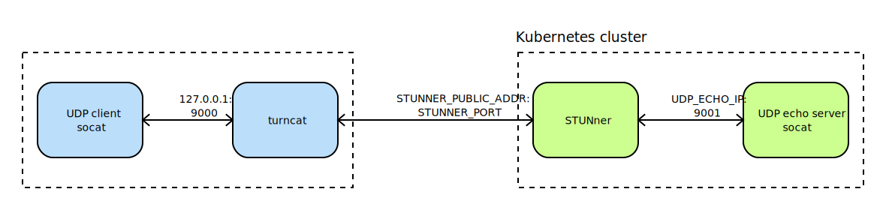

# STUNner: A Kubernetes ingress gateway for WebRTC

**(WORK IN PROGRESS)**

Ever wondered how to [deploy your WebRTC infrastructure into the
cloud](https://webrtchacks.com/webrtc-media-servers-in-the-cloud)? Frightened away by the
complexities of Kubernetes container networking, and the surprising ways in which it may interact
with your UDP/RTP media? Tried to read through the endless stream of [Stack
Overflow](https://stackoverflow.com/search?q=kubernetes+webrtc)
[questions](https://stackoverflow.com/questions/61140228/kubernetes-loadbalancer-open-a-wide-range-thousands-of-port)
[asking](https://stackoverflow.com/questions/64232853/how-to-use-webrtc-with-rtcpeerconnection-on-kubernetes)
[how](https://stackoverflow.com/questions/68339856/webrtc-on-kubernetes-cluster/68352515#68352515)
[to](https://stackoverflow.com/questions/52929955/akskubernetes-service-with-udp-and-tcp)
[scale](https://stackoverflow.com/questions/62088089/scaling-down-video-conference-software-in-kubernetes)
WebRTC services with Kubernetes, just to get (mostly) insufficient answers?  Puzzled by the
security and financial implications of the whole WebRTC industry relying on a handful of
third-party STUN/TURN services?

Worry no more! STUNner allows you to deploy _any_ WebRTC service into Kubernetes, smoothly
integrating it into the [cloud-native ecosystem](https://landscape.cncf.io), and enjoy the
convenience of the management, security and observability features provided by a cloud-based
deployment.  STUNner exposes a standards-compliant STUN/TURN server for clients to access your
virtualized WebRTC infrastructure, maintaining full browser compatibility and requiring minimal or
no modification to your existing WebRTC codebase.

## Table of Contents
1. [Description](#description)
2. [Features](#features)
3. [Getting started](#getting-started)
4. [Demo](#demo)
5. [Security](#security)
6. [Caveats](#caveats)
7. [Milestones](#milestones)

## Description

Currently [WebRTC](https://stackoverflow.com/search?q=kubernetes+webrtc)
[lacks](https://stackoverflow.com/questions/61140228/kubernetes-loadbalancer-open-a-wide-range-thousands-of-port)
[a](https://stackoverflow.com/questions/64232853/how-to-use-webrtc-with-rtcpeerconnection-on-kubernetes)
[vitualization](https://stackoverflow.com/questions/68339856/webrtc-on-kubernetes-cluster/68352515#68352515)
[story](https://stackoverflow.com/questions/52929955/akskubernetes-service-with-udp-and-tcp): there
is no easy way to deploy a WebRTC backend service into Kubernetes to benefit from the
[resiliency](https://developer.mozilla.org/en-US/docs/Web/API/RTCPeerConnection/restartIce),
[scalability](https://stackoverflow.com/questions/62088089/scaling-down-video-conference-software-in-kubernetes),
and [high
availability](https://blog.cloudflare.com/announcing-our-real-time-communications-platform)
features we have come to expect from modern network services. Worse yet, the entire industry relies
on a handful of [public](https://bloggeek.me/google-free-turn-server/) [STUN
servers](https://www.npmjs.com/package/freeice) and [hosted TURN
services](https://bloggeek.me/managed-webrtc-turn-speed) to connect clients behind a firewall,
which may create a useless dependency on externally operated services, introduce a bottleneck,
raise security concerns, and come with a non-trivial price tag.

The main goal of STUNner is to allow *anyone* to deploy their own WebRTC infrastructure into
Kubernetes, without relying on any external service other than the cloud-provider's standard hosted
Kubernetes offering. This is achieved by STUNner acting as a gateway for ingesting WebRTC media
traffic into a Kubernetes cluster, exposing a public-facing STUN/TURN server that WebRTC clients
can use to open a transport relay connection to the media servers running *inside* the Kubernetes
cluster. This makes it possible to deploy WebRTC application servers and media servers into
ordinary Kubernetes pods, taking advantage of Kubernetes's excellent tooling to manage, scale,
monitor and troubleshoot the WebRTC infrastructure like any other cloud-bound workload.


Don't worry about the performance implications of processing all your media through a TURN server:
STUNner is written in [Go](https://go.dev) so it is extremely fast, it is co-located with your
media server pool so you don't pay the round-trip time to a far-away public STUN/TURN server, and
STUNner can be easily scaled up if needed, just like any other "normal" Kubernetes service.

## Features

Kubernetes has been designed and optimized for the typical HTTP/TCP Web workload, which makes
streaming workloads, and especially UDP/RTP based WebRTC media, feel like a foreign citizen.
STUNner aims to change this state-of-the-art, by exposing a single public STUN/TURN server port for
ingesting *all* media traffic into a Kubernetes cluster in a controlled and standards-compliant
way.

* **Seamless integration with Kubernetes.** STUNner can be deployed into any Kubernetes cluster,
  even into restricted ones like GKE Autopilot, using a single command. Manage your HTTP/HTTPS
  application servers with your favorite [service mesh](https://istio.io), and STUNner will take
  care of all UDP/RTP based media.

* **Expose a WebRTC media server on a single external UDP port.** Get rid of the Kubernetes
  [hacks](https://kubernetes.io/docs/concepts/configuration/overview) like privileged pods and
  `hostNetwork`/`hostPort` services typically required to containerize your WebRTC media plane.
  Using STUNner a WebRTC deployment needs only two public-facing ports, one HTTPS port for the
  application server and a *single* UDP port for *all* your media.

* **No reliance on external services for NAT traversal.** Can't afford a decent [hosted TURN
  service](https://bloggeek.me/webrtc-turn) for client-side NAT traversal? Can't get good
  audio/video quality because the TURN service poses a bottleneck? STUNner can be deployed into the
  same cluster as the rest of your WebRTC infrastructure, and any WebRTC client can connect to it
  directly, without the use of *any* external STUN/TURN service apart from STUNner itself.

* **Easily scale your WebRTC infrastructure.** Tired of manually provisioning your WebRTC media
  servers?  STUNner lets you deploy your entire WebRTC infrastructure into ordinary Kubernetes
  pods, thus scaling the media plane is as easy as issuing a `kubectl scale` command. STUNner
  itself can be scaled with similar ease, completely separately from the media servers.

* **Secure perimeter defense.** No need to open thousands of UDP/TCP ports on your media server for
  potentially malicious access; with STUNner all media is received through a single ingress port
  that you can tightly monitor and control. STUNner stores all STUN/TURN credentials and DTLS keys
  in secure Kubernetes vaults, and uses standard Kubernetes Access Control Lists (ACLs) to lock
  down network access between your application servers and the media plane.

* **Simple code and extremely small size.** Written in pure Go using the battle-tested
  [pion/webrtc](https://github.com/pion/webrtc) framework, STUNner is just a couple of hundred
  lines of fully open-source code. The server is extremely lightweight: the typical STUNner
  container image size is only about 2.5 Mbytes.

## Getting Started

STUNner comes with prefab deployment manifests to fire up a fully functional STUNner-based WebRTC
media gateway in minutes. Note that the default deployment does not contain an application server
and a media server: STUNner in itself is not a WebRTC backend, it is just an *enabler* for you to
deploy your *own* WebRTC infrastructure into Kubernetes and make sure your media servers are still
reachable for WebRTC clients, despite running with a private IP address inside a Kubernetes pod.

The below installation instructions require an operational cluster running a supported version of
Kubernetes (>1.20). You can use any supported platform, for example
[Minikube](https://kubernetes.io/docs/tasks/tools/install-minikube) or any
[hosted](https://cloud.google.com/kubernetes-engine) or private Kubernetes cluster, but make sure
that the cluster comes with a functional [load-balancer
integration](https://kubernetes.io/docs/concepts/services-networking/service/#loadbalancer) (all
major hosted Kubernetes services should support this, and even Minikube
[provides](https://minikube.sigs.k8s.io/docs/handbook/accessing) standard `LoadBalancer` service
access). Otherwise, STUNner will not be able to allocate a public IP address for clients to reach
your WebRTC infra. In addition, in order to control the part of the workload reachable to STUNner
the Kubernetes CNI must support the ACLs (i.e., `NetorkPolicy`). For setting port ranges in the
ACLs the CNI must also support the `endPort` feature in network policies, which is available from
Kubernetes 1.22.

### Configuration

STUNner depends on the below Kubernetes resources configured and deployed in order to run:
1. a `ConfigMap` that stores STUNner local configuration,
2. a `Deployment` running one or more STUNner replicas,
3. a `LoadBalancer` service to expose the STUNner deployment on a public IP address and UDP port
   (by default, the port is UDP 3478), and finally
4. an ACL/firewall policy to control network communication from STUNner to the rest of the cluster.

The installation scripts packaged with STUNner will use hard-coded configuration defaults. Make
sure to customize the defaults before deploying STUNner; in particular, make absolutely sure to
customize the access tokens (`STUNNER_REALM`, `STUNNER_USERNAME` and `STUNNER_PASSWORD`), otherwise
STUNner will use hard-coded STUN/TURN credentials. This should not pose a major security risk (see
the [security notes](#security) below), but it is still safer to customize the access tokens before
exposing STUNner to the Internet.

The STUNner configuration parameters to customize are as follows:
* `STUNNER_PUBLIC_ADDR` (no default): The public IP address clients can use to reach STUNner. By
  default, the public IP address will be dynamically assigned by the Kubernetes LoadBalancer
  service.  The Helm installation script takes care of updating the configuration with the correct
  value. However, if installing from the static manifests then the external IP must be set
  manually, see [details](#learning-the-external-ip-and-port) below.
* `STUNNER_PUBLIC_PORT` (default: 3478): The public port used by clients to reach STUNner. It is
  important that applications use the public port as found in the configuration, since the Helm
  installation scripts may overwrite this configuration. This occurs when the installation falls
  back to a NodePort service (i.e., when STUNner fails to obtain an external IP from the
  load-balancer), see [details](#learning-the-external-ip-and-port) below.
* `STUNNER_PORT` (default: 3478): The internal port used by STUNner for communication inside the
  cluster. It is safe to set this to the public port.
<!-- * `STUNNER_AUTH` (default: `static`): The STUN/TURN [authentication](#authentication) mechanism -->
<!--   used by STUNner.  -->
* `STUNNER_REALM` (default `stunner.l7mp.io`): the
  [`REALM`](https://www.rfc-editor.org/rfc/rfc8489.html#section-14.9) used to guide the user agent
  in selection of a username and password for the STUN/TURN [long-term
  credential](https://www.rfc-editor.org/rfc/rfc8489.html#section-9.2) mechanism.
* `STUNNER_USERNAME` (default: `user`): the
  [`USERNAME`](https://www.rfc-editor.org/rfc/rfc8489.html#section-14.3) attribute clients can use
  the authenticate with STUNner via the the STUN/TURN [long-term
  credential](https://www.rfc-editor.org/rfc/rfc8489.html#section-9.2) mechanism. Make sure to
  customize!
* `STUNNER_PASSWORD` (default: `pass`): the password clients can use to authenticate with STUNner
  via the the STUN/TURN [long-term
  credential](https://www.rfc-editor.org/rfc/rfc8489.html#section-9.2) mechanism. Make sure to
  customize!
* `STUNNER_LOGLEVEL` (default: `all:WARN`): the default log level used by the STUNner daemons.
* `STUNNER_MIN_PORT` (default: 10000): smallest relay transport port assigned by STUNner. 
* `STUNNER_MAX_PORT` (default: 20000): highest relay transport port assigned by STUNner. 

The default configurations can be overridden by setting custom command line arguments when
launching the STUNner pods.

### Install STUNner

STUNner support two installation options: a self-contained and easy-to-use Helm chart and a manaul
installation method using static Kubernetes manifests.

The simplest way to deploy STUNner is through Helm. In this case, all STUNner configuration
parameters are available for customization as [Helm
Values](https://helm.sh/docs/chart_template_guide/values_files).

TODO

If Helm is not an option, you can install STUNner using the static Kubernetes manifests packaged
with STUNner. This mode is not recommended for general use however, since the static Kubernetes
manifests do not provide the same flexibility and automatization as the Helm charts.

First, clone the STUNner repository.

```console
$ git clone https://github.com/l7mp/stunner.git
$ cd stunner
```

Then, customize the default STUNner settings, available via the `ConfigMap` named `stunner-config`
in the default namespace, and deploy the STUNner service [manifest](kubernetes/stunner.yaml).

```console
$ kubectl apply -f kubernetes/stunner.yaml
```
By default, all resources are created in the `default` namespace.

### Learning the external IP and port

There are two ways to expose the STUN/TURN ingress gateway service with STUNner: through a standard
Kubernetes [`LoadBalancer`
service](https://kubernetes.io/docs/concepts/services-networking/service/#loadbalancer) (the
default), or a [`NodePort`
service](https://kubernetes.io/docs/concepts/services-networking/service/#type-nodeport), used as a
fallback if an ingress load-balancer is not available. In both cases the external IP address and
port that WebRTC clients can use to reach STUNner from the Internet may be set dynamically by
Kubernetes. (Of course, Kubernetes lets you use your own [fix IP address and domain
name](https://kubernetes.io/docs/concepts/services-networking/service/#choosing-your-own-ip-address),
but the default installation scripts do not support this.) WebRTC clients will need to learn the
external IP and port somehow; this is outside the scope of STUNner, but see our [Kurento
demo](#demo) for a way to communicate the STUN/TURN address and port back to WebRTC clients during
user registration.

In order to simplify the integration of STUNner with the rest of the WebRTC application, STUNner
stores the dynamic IP address/port assigned by Kubernetes into the `ConfigMap` named
`stunner-config` under the key `STUNNER_PUBLIC_IP` and `STUNNER_PUBLIC_PORT`. The Helm installation
scripts take care of this automatically, however, when using the manual installation option the
external IP address and port will need to be handled manually during installation. The below
instructions simplify this process.

After a successful installation, you should see something similar to the below:

```console
$ kubectl get all
NAME                           READY   STATUS    RESTARTS   AGE
pod/stunner-XXXXXXXXXX-YYYYY   1/1     Running   0          64s

NAME                 TYPE           CLUSTER-IP     EXTERNAL-IP    PORT(S)          AGE
service/kubernetes   ClusterIP      10.120.0.1     <none>         443/TCP          15d
service/stunner      LoadBalancer   10.120.15.44   A.B.C.D        3478:31351/UDP   64s

NAME                      READY   UP-TO-DATE   AVAILABLE   AGE
deployment.apps/stunner   1/1     1            1           65s

NAME                                 DESIRED   CURRENT   READY   AGE
replicaset.apps/stunner-XXXXXXXXXX   1         1         1       64s
```

Note the external IP address allocated by Kubernetes for the `stunner` service (`EXTERNAL-IP`
marked with a placeholder `A.B.C.D` in the above): this will be the public STUN/TURN access point
that your WebRTC clients will need to use in order to access the WebRTC media service through
STUNner.

Wait until Kubernetes assigns a valid external IP to STUNner.

```console
$ until [ -n "$(kubectl get svc -n default stunner -o jsonpath='{.status.loadBalancer.ingress[0].ip}')" ]; do sleep 1; done
```

If this hangs for minutes, then your load-balancer integration is not working. If using
[Minikube](https://github.com/kubernetes/minikube), make sure `minikube tunnel` is
[running](https://minikube.sigs.k8s.io/docs/handbook/accessing). In this case, skip the next step
and proceed to configure STUNner external reachability using the `NodePort` service. Otherwise,
query the public IP address and port used by STUNner from Kubernetes.

```console
$ export STUNNER_PUBLIC_ADDR=$(kubectl get svc stunner -n default -o jsonpath='{.status.loadBalancer.ingress[0].ip}')
$ export STUNNER_PUBLIC_PORT=$(kubectl get svc stunner -n default -o jsonpath='{.spec.ports[0].port}')
```

If the Kubernetes cluster fails to assign an external IP address for the `stunner` service, the
service would still be reachable externally via the `NodePort` automatically assigned by
Kubernetes. In this case (but only in this case!), set the IP address and port from the NodePort:

```console
$ export STUNNER_PUBLIC_ADDR=$(kubectl get nodes -o jsonpath='{.items[0].status.addresses[?(@.type=="ExternalIP")].address}')
$ export STUNNER_PUBLIC_PORT=$(kubectl get svc stunner -n default -o jsonpath='{.spec.ports[0].nodePort}')
```

Check that the external IP address `$STUNNER_PUBLIC_ADDR` is reachable by your WebRTC clients: some
Kubernetes clusters (like GKE Autopilot) are installed with private node IP addresses.

If all goes well, your STUNner service is now exposed on the IP address `$STUNNER_PUBLIC_ADDR` and
UDP port `$STUNNER_PUBLIC_PORT`. Finally, store back the public IP address and port into STUNner's
configuration, so that the WebRTC application server can learn this information in a simple way.

```console
$ kubectl patch configmap/stunner-config -n default --type merge \
  -p "{\"data\":{\"STUNNER_PUBLIC_ADDR\":\"${STUNNER_PUBLIC_ADDR}\",\"STUNNER_PUBLIC_PORT\":\"${STUNNER_PUBLIC_PORT}\"}}"
```

### Configuring WebRTC clients to reach STUNner

The below JavaScript snippet will direct your WebRTC clients to use STUNner; make sure to
substitute the placeholders below (like `<STUNNER_PUBLIC_ADDR>`) with the correct configuration
from the above. For more information, see the [Kurento demo](#demo).

```js
var ICE_config = {
  'iceServers': [
    {
      'url': "turn:<STUNNER_PUBLIC_ADDR>:<STUNNER_PUBLIC_PORT>?transport=udp',
      'username': <STUNNER_USERNAME>,
      'credential': <STUNNER_PASSWORD>,
    },
  ]
};
var pc = new RTCPeerConnection(ICE_config);
```

### Testing

STUNner comes with a simple STUN/TURN client called [`turncat`](utils/turncat) that can be used to
check your installation. The `turncat` client will open a UDP tunnel through STUNner into your
Kubernetes cluster, which can be used to access any UDP service running inside the cluster. Note
that your WebRTC clients will not need `turncat` to reach the cluster, since all WebRTC clients,
including all major browsers, come with a STUN/TURN client included; `turncat` here is merely just
used to simulate what a WebRTC client would do when trying to reach STUNner. For more info, see the
`turncat` [documentation](utils/turncat).

We test the STUNner installation by deploying a UDP echo server into the cluster and exposing it
for external access via STUNner.



First, we create a `Deployment` called `udp-echo`, currently containing only a single pod, make
this pod available over the UDP port 9001 as a cluster-internal service with the same name, and use
everyone's favorite network debugging tool, [`socat(1)`](https://linux.die.net/man/1/socat), to
deploy a simple UDP echo server into the pod.

```console
$ kubectl create deployment udp-echo --image=l7mp/net-debug:0.5.3
$ kubectl expose deployment udp-echo --name=udp-echo --type=ClusterIP --protocol=UDP --port=9001
$ kubectl exec -it $(kubectl get pod -l app=udp-echo -o jsonpath="{.items[0].metadata.name}") -- \
    socat -d -d udp-l:9001,fork EXEC:cat
```

Next, store the STUN/TURN credentials for later use.

```console
$ export STUNNER_REALM=$(kubectl get cm stunner-config -n default -o jsonpath='{.data.STUNNER_REALM}')
$ export STUNNER_USERNAME=$(kubectl get cm stunner-config -n default -o jsonpath='{.data.STUNNER_USERNAME}')
$ export STUNNER_PASSWORD=$(kubectl get cm stunner-config -n default -o jsonpath='{.data.STUNNER_PASSWORD}')
```

Learn the virtual IP address (`ClusterIP`) assigned by Kubernetes to the `udp-echo` service:

```console
$ export UDP_ECHO_IP=$(kubectl get svc udp-echo -o jsonpath='{.spec.clusterIP}')
```

Observe that the result is a private IP address: indeed, the `udp-echo` service is not available to
external services at this point. We shall use STUNner to expose the service to the Internet.

The default installation scripts install an ACL into Kubernetes that blocks *all* communication
from STUNner to the rest of the workload. This is to minimize the risk of an improperly configured
STUNner gateway to [expose sensitive services to the external world](#security). In order to allow
STUNner to open transport relay connections to the `udp-echo` service, we have to explicitly open
up this ACL first.

```console
$ kubectl apply -f - <<EOF
apiVersion: networking.k8s.io/v1
kind: NetworkPolicy
metadata:
  name: stunner-network-policy
spec:
  podSelector:
    matchLabels:
      app: stunner
  policyTypes:
  - Egress
  egress:
  - to:
    - podSelector:
        matchLabels:
          app: udp-echo
    ports:
    - protocol: UDP
      port: 9001
EOF
```

And finally fire up `turncat` locally; this will open a UDP server port on `localhost:9000` and
tunnel all packets to the `udp-echo` service in your Kubernetes cluster through STUNner.

```console
$ cd stunner
$ go run utils/turncat/main.go --realm $STUNNER_REALM --user ${STUNNER_USERNAME}=${STUNNER_PASSWORD} \
  --log=all:TRACE udp:127.0.0.1:9000 turn:${STUNNER_PUBLIC_ADDR}:${STUNNER_PORT} udp:${UDP_ECHO_IP}:9001
```

Now, in another terminal open a UDP connection through the tunnel opened by `turncat` to STUNner,
to reach the UDP echo server running inside the cluster. 

```console
$ socat -d -d - udp:localhost:9000
```

If all goes well, you should see the text entered into the `socat` client to be echoed back from
the cluster.

## Demo

STUNner comes with a demo to show how to use it to deploy a WebRTC application into Kubernetes. The
demo has been adopted from the [Kurento](https://www.kurento.org/) [one-to-one video call
tutorial](https://doc-kurento.readthedocs.io/en/latest/tutorials/node/tutorial-one2one.html), with
minimal
[modifications](https://github.com/l7mp/kurento-tutorial-node/tree/master/kurento-one2one-call) to
deploy it into Kubernetes and integrate it with STUNner. The demo contains a
[Node.js](https://nodejs.org) application server for creating browser-based two-party WebRTC
video-calls, plus the Kurento media server deployed behind STUNner for media exchange and,
potentially, automatic audio/video transcoding.

### Installation

The simplest way to deploy the demo is to use the [manifest](kubernetes/kurento-webrtc.yaml)
packaged with STUNner. Note: you need to have the STUNner git repository cloned locally for the
demo to work, and STUNner must be running with the default configuration.

```console
$ kubectl apply -f kubernetes/kurento-webrtc.yaml
```

The demo exposes a publicly available HTTPS web service on port 8443. Again, Kubernetes assigns an
ephemeral public IP address to the web service, so first we need to learn the external IP.

```console
$ kubectl get service webrtc-server -n default -o jsonpath='{.status.loadBalancer.ingress[0].ip}'
```

The result should be a valid IP address in the form `A.B.C.D`. If no IP address is returned, wait a
bit more until Kubernetes successfully assigns the external IP. Then, direct your browser to the
URL `https://<A.B.C.D>:8443` (of course, make sure substitute the previous IP address), accept the
self-signed certificate, register some user name, and you can immediately start to video-chat with
anyone registered at the service. To try it out, open another browser tab, repeat the above
registration steps and enjoy a nice video-call with yourself.

### Understanding what's happening

The [Kurento
docs](https://doc-kurento.readthedocs.io/en/latest/tutorials/node/tutorial-one2one.html) cover all
the WebRTC related information, below we just summarize the changes we have made to the Kurento
demo code to make it work with STUNner and Kubernetes.

1. Store the TLS certificate in a Kubernetes `Secret` (called `webrtc-server-secret`) and map the
   keys into the file system of the application server pod. This allows easy and dynamic
   customization of the TLS certificates used with the demo.
2. Deploy the Kurento media server into a `Deployment` (called `kms`). Observe that Kurento has
   been configured with *no STUN and TURN servers* and *no external IP addresses*, and it runs in
   an ordinary Kubernetes pod at an ephemeral private IP address which is not available from
   browsers directly. Here is where the *magic* happens: STUNner makes sure that WebRTC media just
   keeps flowing between clients and the media server, without *any* of the two being directly
   accessible via a public IP.
3. Expose the media server pool, i.e., the Kurento media server deployment, over the Kubernetes
   service `kms-control` over the TCP port 8888. This assigns a virtual IP address (a `ClusterIP`)
   that the application server can use to configure the WebRTC endpoints and media pipelines in
   Kurento. Note that this address is private and it is not reachable from outside the cluster.
4. [Modify](https://github.com/l7mp/kurento-tutorial-node/commit/54289c2c6592d9237f3b465a0e10fa425b8ade8b#diff-70406ec94adfebba544257cb82e2aed222a8941c8b8db766aee488272446f1acR26)
   the WebRTC application server to (1)
   [store](https://github.com/l7mp/kurento-tutorial-node/blob/54289c2c6592d9237f3b465a0e10fa425b8ade8b/kurento-one2one-call/server.js#L26)
   the STUNner configuration parameters available in the environment variables
   `STUNNER_PUBLIC_ADDR`, `STUNNER_PORT`, `STUNNER_USERNAME`, and `STUNNER_PASSWORD` (see below) in
   an appropriate WebRTC [ICE server
   configuration](https://developer.mozilla.org/en-US/docs/Web/API/RTCIceServer) and (2)
   [return](https://github.com/l7mp/kurento-tutorial-node/blob/54289c2c6592d9237f3b465a0e10fa425b8ade8b/kurento-one2one-call/server.js#L442)
   the ICE configuration to the WebRTC clients in the `registerResponse` messages indicating a
   successful user registration.
5. [Modify](https://github.com/l7mp/kurento-tutorial-node/commit/54289c2c6592d9237f3b465a0e10fa425b8ade8b#diff-70406ec94adfebba544257cb82e2aed222a8941c8b8db766aee488272446f1acR26)
   the [JavaScript
   code](https://github.com/l7mp/kurento-tutorial-node/blob/master/kurento-one2one-call/static/js/index.js)
   served to clients to (1)
   [store](https://github.com/l7mp/kurento-tutorial-node/blob/54289c2c6592d9237f3b465a0e10fa425b8ade8b/kurento-one2one-call/static/js/index.js#L134)
   the ICE server configuration returned from the application server, and (2) set up the WebRTC
   PeerConnections at both the
   [caller](https://github.com/l7mp/kurento-tutorial-node/blob/54289c2c6592d9237f3b465a0e10fa425b8ade8b/kurento-one2one-call/static/js/index.js#L255)
   and the
   [callee](https://github.com/l7mp/kurento-tutorial-node/blob/54289c2c6592d9237f3b465a0e10fa425b8ade8b/kurento-one2one-call/static/js/index.js#L186)
   to use STUNner's public address and port with the correct STUN/TURN credentials.
6. Use the
   [Dockerfile](https://github.com/l7mp/kurento-tutorial-node/blob/master/kurento-one2one-call/Dockerfile)
   packaged with STUNner to build the modified WebRTC application server container image or deploy
   the [prebuilt image](https://hub.docker.com/repository/docker/l7mp/kurento-webrtc-server).
7. Start the modified WebRTC application server in a Kubernetes `Deployment` (called
   `webrtc-server`). Note that the STUNner configuration is made available to the application
   server in environment variables taken from STUNner's default Kubernetes `ConfigMap` and the TLS
   keys are taken from the Kubernetes `Secret` configured above.
8. Expose the application server on a Kubernetes `LoadBalancer` service so that external clients
   can reach it via the TCP port 8443.
9. And finally, as a critical step, make sure that STUNner is permitted to forward UDP/RTP media
   packets to the media servers. Recall, by default all internal access from STUNner is locked down
   by a Kubernetes `NetworkPolicy`. The demo installation script opens this ACL up so that STUNner
   can reach all WebRTC endpoints configured on the Kurento media servers, but just the WebRTC
   ports and *nothing else* (but see the below [security notice](#access-control) on access
   control). This makes sure that the [trick](#testing) to query the Kubernetes DNS service
   externally through STUNner will not work; external STUN/TURN clients can reach only the UDP
   ports exposed on the media server through STUNner and nothing else.

And that's all. We added only 32 lines of code to the Kurento demo to make it work with Kubernetes,
with most of the changes needed to return the ephemeral public STUN/TURN URI and credentials to the
clients. If you allocate STUNner to a stable IP or DNS name, you don't even need to modify
*anything* in the demo and it will just work.

### Scaling

Suppose that the single STUNner instance fired up by the default installation script is no longer
sufficient; e.g., due to concerns related to performance or availability.  In a "conventional"
privately hosted setup, you would need to provision a new physical STUN/TURN server instance,
allocate a public IP, add the new server to your STUN/TURN server pool, and monitor the liveliness
of the new server continuously. This takes a lot of manual effort and considerable time. In
Kubernetes, however, you can use a single command to *scale STUNner to an arbitrary number of
replicas*. Kubernetes will potentially add new nodes to the cluster if needed, and the new replicas
will be *automatically* added to the STUN/TURN server pool accessible behind the (single) public IP
address/port pair (`<STUNNER_PUBLIC_ADDR>:<STUNNER_PORT>`), with UDP/RTP streams conveniently being
load-balanced across STUNner replicas.

For instance, the below command will fire up 15 STUNner replicas, usually in a matter of seconds.

```console
$ kubectl scale deployment stunner --replicas=15
```
You can even use Kubernetes
[autoscaling](https://kubernetes.io/docs/tasks/run-application/horizontal-pod-autoscale) to adapt
the size of the STUNner pool to the actual demand.

Notably, the media server pool can likewise be (auto-)scaled with Kubernetes
effortlessly. Conventional WebRTC media servers are unique snowflakes: tied to a public IP address
and managed by hand. With STUNner the entire WebRTC infrastructure can be deployed into
Kubernetes. As media servers are now ephemeral and disposable, running in ordinary Kubernetes pods,
it is easy to replicate and scale the media plane with automated tools.

The below command will scale the media server pool in the [Kurento demo](#demo) deployment to 20
instances and again, automatic health-checks and load-balancing should just work as expected.

```console
$ kubectl scale deployment kms --replicas=20
```

## Security

Before deploying STUNner, it is worth evaluating the potential [security
risks](https://www.rtcsec.com/article/slack-webrtc-turn-compromise-and-bug-bounty) a poorly
configured public STUN/TURN server poses.

Like any conventional gateway service, an improperly configured STUNner service may easily end up
exposing sensitive services to the Internet. To demonstrate the risks, below we shall use `turncat`
to reach the Kubernetes DNS service through a misconfigured STUNner gateway.

As usual, first store the STUNner configuration for later use.

```console
$ export STUNNER_PUBLIC_ADDR=$(kubectl get service stunner -n default -o jsonpath='{.status.loadBalancer.ingress[0].ip}')
$ export STUNNER_PORT=$(kubectl get cm stunner-config -n default -o jsonpath='{.data.STUNNER_PORT}')
$ export STUNNER_REALM=$(kubectl get cm stunner-config -n default -o jsonpath='{.data.STUNNER_REALM}')
$ export STUNNER_USERNAME=$(kubectl get cm stunner-config -n default -o jsonpath='{.data.STUNNER_USERNAME}')
$ export STUNNER_PASSWORD=$(kubectl get cm stunner-config -n default -o jsonpath='{.data.STUNNER_PASSWORD}')
```

Next, learn the virtual IP address (`ClusterIP`) assigned by Kubernetes to the cluster DNS service:

```console
$ export KUBE_DNS_IP=$(kubectl get svc -n kube-system -l k8s-app=kube-dns -o jsonpath='{.items[0].spec.clusterIP}')
```

Fire up `turncat` locally; this will open a UDP server port on `localhost:5000` and forward all
received packets to the cluster DNS service through STUNner.

```console
$ cd stunner
$ go run utils/turncat/main.go --realm $STUNNER_REALM --user ${STUNNER_USERNAME}=${STUNNER_PASSWORD} \
  --log=all:TRACE udp:127.0.0.1:5000 turn:${STUNNER_PUBLIC_ADDR}:${STUNNER_PORT} udp:${KUBE_DNS_IP}:53
```

Now, in another terminal try to query the Kubernetes DNS service through the `turncat` tunnel for
the internal service address allocated by Kubernetes for STUNner:

```console
$ dig +short @127.0.0.1 -p 5000 stunner.default.svc.cluster.local
```

If all goes well, this should hang until `dig` times out. Recall, the default installation scripts
block *all* communication from STUNner to the rest of the workload, and the default-deny ACL needs
to be explicitly opened up for STUNner to be able to reach a specific service. To demonstrate the
risk of an improperly configured STUNner gateway, we temporarily allow STUNner to access the Kube
DNS service.

```console
$ kubectl apply -f - <<EOF
apiVersion: networking.k8s.io/v1
kind: NetworkPolicy
metadata:
  name: stunner-network-policy
spec:
  podSelector:
    matchLabels:
      app: stunner
  policyTypes:
  - Egress
  egress:
  - to:
    - namespaceSelector:
        matchLabels: {}
      podSelector:
        matchLabels:
          k8s-app: kube-dns
    ports:
    - protocol: UDP
      port: 53
EOF
```

Repeating the DNS query should now return the `ClusterIP` assigned to the `stunner` service:

```console
$ dig +short  @127.0.0.1 -p 5000  stunner.default.svc.cluster.local
10.120.4.153
```

After testing, make sure to revert the default-deny ACL (but see the below [security
notice](#access-control) on access control).

```console
$ kubectl apply -f - <<EOF
apiVersion: networking.k8s.io/v1
kind: NetworkPolicy
metadata:
  name: stunner-network-policy
spec:
  podSelector:
    matchLabels:
      app: stunner
  policyTypes:
  - Egress
EOF
```

Repeating the DNS query should again time out, as before.

In summary, unless properly locked down, STUNner may be used hostilely to open a UDP tunnel to any
UDP service running inside a Kubernetes cluster. Accordingly, it is critical to tightly control the
pods and services inside a cluster exposed via STUNner. This can be done conveniently with an ACL,
implemented in Kubernetes with a `NetworkPolicy`.

The below security considerations will greatly reduce the attack surface associated by
STUNner. Overall, **a properly configured STUNner deployment will present exactly the same attack
surface as a WebRTC infrastructure hosted on a public IP address** (possibly behind a firewall). In
any case, use STUNner at your own risk.

### Authentication

For the initial release, STUNner uses a single statically set username/password pair for all
clients and the password is available in plain text at the clients. Anyone with access to the
static STUNner credentials can open a UDP tunnel to any service inside the Kubernetes cluster,
unless [blocked](#access-control) by a properly configured Kubernetes `NetworkPolicy`.

In order to mitigate the risk, it is a good security practice to reset the username/password pair
every once in a while.  Suppose you want to set the STUN/TURN username to `my_user` and the
password to `my_pass`. To do this simply modify the STUNner `ConfigMap` and restart STUNner to
enforce the new access tokens:

```console
$ kubectl patch configmap/stunner-config -n default --type merge \
    -p "{\"data\":{\"STUNNER_USERNAME\":\"my_user\",\"STUNNER_PASSWORD\":\"my_pass\"}}"
$ kubectl rollout restart deployment/stunner
```

You can even set up a [cron
job](https://kubernetes.io/docs/concepts/workloads/controllers/cron-jobs) to automate this. Note
that if the WebRTC application server uses [dynamic STUN/TURN credentials](#demo), then it may need
to be restarted as well to learn the new credentials.

### Access control

The ultimate condition for a secure STUNner deployment is correctly configured access control that
restricts external users to open transport relay connections inside the cluster. The ACL must make
sure that only the media servers, and only on a limited set of UDP ports, can be reached
externally. The STUNner installation comes with a default `NetworkPolicy` that locks down *all*
access from STUNner to the rest of the workload (not even Kube DNS is allowed). This is to enforce
the security best practice that the access permissions of STUNner be carefully customized before
deployment.

It is a good practice to configure the ACL so that STUNner can access only the media server ports
used by WebRTC media connection endpoints, and *nothing else*. Thanks to the versatility of
Kubernetes, this is very
[simple](https://kubernetes.io/docs/concepts/services-networking/network-policies) to do with a
`NetworkPolicy`. For instance, in our [Kurento demo](#demo), STUNner is deployed into the `default`
namespace and all STUNner pods are labeled as `app=stunner`, and the media server runs in the same
namaspace using the label `app=kms`. In addition, WebRTC endpoints on the Kurento server are
assigned from the UDP port range [10000:20000]. Then, the below `NetworkPolicy` ensures that all
access from any STUNner pod to any media server pod is allowed over any UDP port between 10000 and
20000, and all other network access is denied.

```yaml
apiVersion: networking.k8s.io/v1
kind: NetworkPolicy
metadata:
  name: stunner-network-policy
spec:
# Choose the STUNner pods as source
  podSelector:
    matchLabels:
      app: stunner
  policyTypes:
  - Egress
  egress:
  # Allow only this rule, everything else is denied
  - to:
    # Choose the media server pods as destination
    - podSelector:
        matchLabels:
          app: kms
    ports:
    # Only UDP ports 10000-20000 are allowed between 
    #   the source-destination pairs
    - protocol: UDP
      port: 10000
      endPort: 20000
```

WARNING: Some Kubernetes CNIs do not support network policies, or support only a subset of what
STUNner needs. We tested STUNner with [Calico](https://www.tigera.io/project-calico) and the
standard GKE data plane, but your [mileage may vary](https://cilium.io).  In particular, only
Kubernetes versions >1.22 support [ACLs with port
ranges](https://kubernetes.io/docs/concepts/services-networking/network-policies/#targeting-a-range-of-ports)
(i.e., the `endPort` field). Furthermore, certain Kubernetes CNIs (like the GKE data plane v2),
even if accepting the `endPort` parameter, will fail to correctly enforce it. For such cases the
below `NetworkPolicy` will allow STUNner to access _all_ UDP ports on the media server; this is
less secure, but still restricts malicious users to access any service except the media server via
STUNner.

```yaml
$ kubectl apply -f - <<EOF
apiVersion: networking.k8s.io/v1
kind: NetworkPolicy
metadata:
  name: stunner-network-policy
spec:
  podSelector:
    matchLabels:
      app: stunner
  policyTypes:
  - Egress
  egress:
  - to:
    - podSelector:
        matchLabels:
          app: kms
    ports:
    - protocol: UDP
EOF
```

In any case, [test your ACLs](https://banzaicloud.com/blog/network-policy) before exposing STUNner
publicly; e.g., the [`turncat` utility](utils/turncat) packaged with STUNner can be used
conveniently for this [purpose](#testing).

### Exposing internal IP addresses

The trick in STUNner is that both the TURN relay transport address and the media server address are
internal pod IP addresses, and pods in Kubernetes are always guaranteed to be able connect
[directly](https://sookocheff.com/post/kubernetes/understanding-kubernetes-networking-model/#kubernetes-networking-model),
without the involvement of a NAT. This makes it possible to host the entire WebRTC infrastructure
over the private internal pod network and still allow external clients to make connections to the
media servers via STUNner.  At the same time, this also has the bitter consequence that internal IP
addresses are now be exposed to the WebRTC clients in ICE candidates.

The threat model is that with STUNner an attacker can scan the *private* IP address of all STUNner
pods and all media server pods. This should not pose a major security risk though: remember, none
of these private IP addresses can be reached externally. Nevertheless, if worried about information
exposure then STUNner may not be the best option for you.

## Caveats

STUNner is a work-in-progress. Some features are missing, others may not work as expected. The
notable limitations at this point are as follows.

* STUNner is not intended to be used as a public STUN/TURN server (there are much better
  [alternatives](https://github.com/coturn/coturn) for this). Thus, it will not be able to identify
  the public IP address of a client sending a STUN binding request to it, and the TURN transport
  relay connections opened by STUNner will not be reachable externally. This is intended: STUNner
  is a Kubernetes ingress gateway which happens to expose a STUN/TURN compatible server to WebRTC
  clients for compatibility.
* Only simple plain-text username/password authentication is implemented. Support for the standard
  STUN/TURN [long term credential
  mechanism](https://datatracker.ietf.org/doc/html/rfc8489#section-9.2) is on the top of our TODO
  list, please bear with us for now.
* Access through STUNner to the rest of the cluster *must* be locked down with a Kubernetes
  `NetworkPolicy`. Otherwise, certain internal Kubernetes services would become available
  externally; see the [notes on access control](#access-control).
* STUNner supports arbitrary scale-up without dropping active calls, but scale-down might
  disconnect calls established through the STUNner and/or media servers being removed from the
  load-balancing pool. Note that this problem is
  [universal](https://webrtchacks.com/webrtc-media-servers-in-the-cloud) in WebRTC, but we plan to
  do something about it in a later STUNner release so stay tuned.
* [TURN over TCP](https://www.rfc-editor.org/rfc/rfc6062.txt) and the WebRTC DataChannel API are
  not supported at the moment.

## Milestones

* v0.1: Basic connectivity: STUNner + helm chart + simple use cases (Kurento demo).
* v0.2: Security: per-session long-term STUN/TURN credentials.
* v0.3: Performance: eBPF STUN/TURN acceleration.
* v0.4: Observability: Prometheus + Grafana dashboard.
* v0.5: Ubiquity: implement [TURN over TCP](https://www.rfc-editor.org/rfc/rfc6062.txt) and make
  STUNner work with Jitsi, Janus, mediasoup and pion-SFU.
* v1.0: GA
* v2.0: Service mesh: adaptive scaling & resiliency

## Help

STUNner development is coordinated in Discord, send [us](AUTHORS) an email to ask an invitation.

## License

Copyright 2021-2022 by its authors. Some rights reserved. See [AUTHORS](AUTHORS).

MIT License - see [LICENSE](LICENSE) for full text.

## Acknowledgments

Initial code adopted from [pion/stun](https://github.com/pion/stun) and
[pion/turn](https://github.com/pion/turn).
