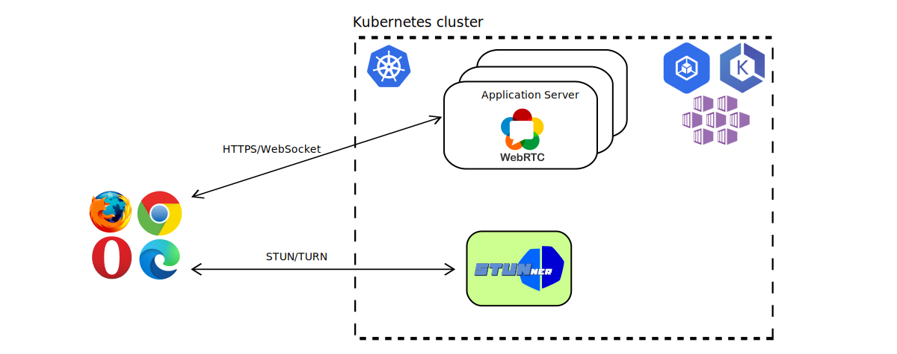

# STUNner: A Kubernetes ingress gateway for WebRTC

Ever wondered how to [deploy your WebRTC infrastructure into the
cloud](https://webrtchacks.com/webrtc-media-servers-in-the-cloud)? Frightened away by the
complexities of Kubernetes container networking, and the surprising ways in which it may interact
with your UDP/RTP media? Tried to read through the endless stream of [Stack
Overflow](https://stackoverflow.com/search?q=kubernetes+webrtc)
[questions](https://stackoverflow.com/questions/61140228/kubernetes-loadbalancer-open-a-wide-range-thousands-of-port)
[asking](https://stackoverflow.com/questions/64232853/how-to-use-webrtc-with-rtcpeerconnection-on-kubernetes)
[how](https://stackoverflow.com/questions/68339856/webrtc-on-kubernetes-cluster/68352515#68352515)
[to](https://stackoverflow.com/questions/52929955/akskubernetes-service-with-udp-and-tcp)
[scale](https://stackoverflow.com/questions/62088089/scaling-down-video-conference-software-in-kubernetes)
WebRTC services with Kubernetes, just to get (mostly) insufficient answers?  Want to safely connect
your users behind a NAT, without relying on expensive [third-party TURN
services](https://bloggeek.me/managed-webrtc-turn-speed)?

Worry no more! STUNner allows you to deploy *any* WebRTC service into Kubernetes, smoothly
integrating it into the [cloud-native ecosystem](https://landscape.cncf.io).  STUNner exposes a
standards-compliant STUN/TURN gateway for clients to access your virtualized WebRTC infrastructure
running in Kubernetes, maintaining full browser compatibility and requiring minimal or no
modification to your existing WebRTC codebase.

## Table of Contents
1. [Description](#description)
2. [Features](#features)
3. [Getting started](#getting-started)
4. [Tutorials](#tutorials)
5. [Documentation](#documentation)
6. [Caveats](#caveats)
7. [Milestones](#milestones)

## Description

Currently [WebRTC](https://stackoverflow.com/search?q=kubernetes+webrtc)
[lacks](https://stackoverflow.com/questions/61140228/kubernetes-loadbalancer-open-a-wide-range-thousands-of-port)
[a](https://stackoverflow.com/questions/64232853/how-to-use-webrtc-with-rtcpeerconnection-on-kubernetes)
[vitualization](https://stackoverflow.com/questions/68339856/webrtc-on-kubernetes-cluster/68352515#68352515)
[story](https://stackoverflow.com/questions/52929955/akskubernetes-service-with-udp-and-tcp): there
is no easy way to deploy a WebRTC media service into Kubernetes to benefit from the
[resiliency](https://developer.mozilla.org/en-US/docs/Web/API/RTCPeerConnection/restartIce),
[scalability](https://stackoverflow.com/questions/62088089/scaling-down-video-conference-software-in-kubernetes),
and [high
availability](https://blog.cloudflare.com/announcing-our-real-time-communications-platform)
features we have come to expect from modern network services. Worse yet, the entire industry relies
on a handful of [public](https://bloggeek.me/google-free-turn-server/) [STUN
servers](https://www.npmjs.com/package/freeice) and [hosted TURN
services](https://bloggeek.me/managed-webrtc-turn-speed) to connect clients behind a NAT/firewall,
which may create a useless dependency on externally operated services, introduce a bottleneck,
raise security concerns, and come with a non-trivial price tag.

The main goal of STUNner is to allow *anyone* to deploy their own WebRTC infrastructure into
Kubernetes, without relying on any external service other than the cloud-provider's standard hosted
Kubernetes offering. This is achieved by STUNner acting as a gateway for ingesting WebRTC media
traffic into the Kubernetes cluster, exposing a public-facing STUN/TURN server that WebRTC clients
can connect to.

In the *headless deployment model* STUNner acts as a simple scalable STUN/TURN server that WebRTC
clients can use as a NAT traversal facility for establishing a media connection. This is not that
much different from a standard public STUN/TURN server setup, but in this case the STUN/TURN
servers are deployed into Kubernetes, which makes lifecycle management, scaling and cost
optimization infinitely simpler.



In the fully fledged *media-plane deployment model* STUNner implements a STUN/TURN ingress gateway
service that WebRTC clients can use to open a transport relay connection to the media servers
running *inside* the Kubernetes cluster. This makes it possible to deploy WebRTC application
servers and media servers into ordinary Kubernetes pods, taking advantage of Kubernetes's excellent
tooling to manage, scale, monitor and troubleshoot the WebRTC infrastructure like any other
cloud-bound workload.


Don't worry about the performance implications of processing all your media through a TURN server:
STUNner is written in [Go](https://go.dev) so it is extremely fast, it is co-located with your
media server pool so you don't pay the round-trip time to a far-away public STUN/TURN server, and
STUNner can be easily scaled up if needed, just like any other "normal" Kubernetes service.

The recommended way to configure STUNner is via the standard [Kubernetes Gateway
API](https://gateway-api.sigs.k8s.io): you specify the way you want to expose your WebRTC services
in the familiar YAML-engineering style and the [STUNner gateway
operator](https://github.com/l7mp/stunner-gateway-operator) reconciles the dataplane, updates
STUN/TURN credentials, and exposes your STUNner
[Gateways](https://gateway-api.sigs.k8s.io/references/spec/#gateway.networking.k8s.io/v1alpha2.Gateway)
in LoadBalancer services, and all this happens automatically.

## Features

Kubernetes has been designed and optimized for the typical HTTP/TCP Web workload, which makes
streaming workloads, and especially UDP/RTP based WebRTC media, feel like a foreign citizen.
STUNner aims to change this state-of-the-art, by exposing a single public STUN/TURN server port for
ingesting *all* media traffic into a Kubernetes cluster in a controlled and standards-compliant
way.

* **Seamless integration with Kubernetes.** STUNner can be deployed into any Kubernetes cluster,
  even into restricted ones like GKE Autopilot, using a single command. Manage your HTTP/HTTPS
  application servers with your favorite [service mesh](https://istio.io), and STUNner takes care
  of all UDP/RTP media. STUNner implements the [Kubernetes Gateway
  API](https://gateway-api.sigs.k8s.io) so you configure it in exactly the same way as
  [the](https://doc.traefik.io/traefik/routing/providers/kubernetes-gateway)
  [rest](https://istio.io/latest/docs/tasks/traffic-management/ingress/gateway-api)
  [of](https://projectcontour.io/guides/gateway-api)
  [your](https://docs.konghq.com/kubernetes-ingress-controller/latest/guides/using-gateway-api)
  [workload](https://github.com/nginxinc/nginx-kubernetes-gateway), using easy-to-use YAML
  manifests.

* **Expose a WebRTC media server on a single external UDP port.** Get rid of the Kubernetes
  [hacks](https://kubernetes.io/docs/concepts/configuration/overview), like privileged pods and
  `hostNetwork`/`hostPort` services, typically recommended as a prerequisite to containerizing your
  WebRTC media plane.  Using STUNner a WebRTC deployment needs only two public-facing ports, one
  HTTPS port for the application server and a *single* UDP port for *all* your media.

* **No reliance on external services for NAT traversal.** Can't afford a decent [hosted TURN
  service](https://bloggeek.me/webrtc-turn) for client-side NAT traversal? Can't get a decent
  audio/video quality because the third-party TURN service poses a bottleneck? STUNner can be
  deployed into the same cluster as the rest of your WebRTC infrastructure, and any WebRTC client
  can connect to it directly without the use of *any* external STUN/TURN service apart from STUNner
  itself.

* **Easily scale your WebRTC infrastructure.** Tired of manually provisioning your WebRTC media
  servers?  STUNner lets you deploy the entire WebRTC infrastructure into ordinary Kubernetes pods,
  thus scaling the media plane is as easy as issuing a `kubectl scale` command. STUNner itself can
  be scaled with similar ease, completely separately from the media servers.

* **Secure perimeter defense.** No need to open thousands of UDP/TCP ports on your media server for
  potentially malicious access; with STUNner *all* media is received through a single ingress port
  that you can tightly monitor and control. 

<!-- STUNner stores all STUN/TURN credentials and DTLS keys -->
<!--   in secure Kubernetes vaults. -->

* **Simple code and extremely small size.** Written in pure Go using the battle-tested
  [pion/webrtc](https://github.com/pion/webrtc) framework, STUNner is just a couple of hundred
  lines of fully open-source code. The server is extremely lightweight: the typical STUNner
  container image size is only about 5 Mbytes.

## Getting Started

STUNner comes with a helm chart to fire up a fully functional STUNner-based WebRTC media gateway in
minutes. Note that the default installation does not contain an application server and a media
server: STUNner in itself is not a WebRTC media server, it is just an *enabler* for you to deploy
your *own* WebRTC infrastructure into Kubernetes. Once installed, STUNner makes sure that your
media servers are readily reachable to WebRTC clients, despite running with a private IP address
inside a Kubernetes pod.

With a minimal understanding of WebRTC and Kubernetes, deploying STUNner should take less than 5
minutes.

* [Customize STUNner and deploy it](#installation) into your Kubernetes cluster.
* Optionally [deploy a WebRTC media server](examples/kurento-one2one-call) into Kubernetes as well.
* [Set STUNner as the ICE server](#configuring-webrtc-clients-to-reach-stunner) in your WebRTC
  clients.
* ...
* Profit!!

### Installation

The simplest way to deploy STUNner is through [Helm](https://helm.sh). STUNner configuration
parameters are available for customization as [Helm
Values](https://helm.sh/docs/chart_template_guide/values_files).

```console
helm repo add stunner https://l7mp.io/stunner
helm repo update
helm install stunner-gateway-operator --set stunner.namespace=stunner
helm install stunner-gateway-operator stunner/stunner-gateway-operator
```

### Configuration

The standard way to interact with STUNner is via Kubernetes, using the [Kubernetes Gateway
  API](https://gateway-api.sigs.k8s.io). This is much akin to the way you configure _all_
  Kubernetes workloads: specify your intents in YAML files and issue a `kubectl apply`, and the
  [STUNner gateway operator](https://github.com/l7mp/stunner-gateway-operator) will automatically
  reconcile the STUNner dataplane for the new configuration.

1. Given a fresh STUNner install, the first step is to register STUNner with the Kubernetes Gateway
   API. This amounts to creating a
   [GatewayClass](https://gateway-api.sigs.k8s.io/references/spec/#gateway.networking.k8s.io/v1alpha2.GatewayClass),
   which serves as the root level configuration for your STUNner deployment. The GatewayClass
   specifies of controller that will manage STUNner Gateway objects (this must be
   `stunner.l7mp.io/gateway-operator` for the STUNner gateway operator to pick up your
   GatewayClass) and refers to the another Kubernetes resource, a GatewayConfig to be specified
   below, that will define the general configuration for the STUNner dataplane. Note that this step
   is necessary only once per STUNner deployment: from this point Kubernetes will remember that all
   Gateways and UDPRoutes created under this GatewayClass are registered with STUNner.

   ``` console
   kubectl apply -f - <<EOF
   apiVersion: gateway.networking.k8s.io/v1alpha2
   kind: GatewayClass
   metadata:
     name: stunner-gatewayclass
   spec:
     controllerName: "stunner.l7mp.io/gateway-operator"
     parametersRef:
       group: "stunner.l7mp.io"
       kind: GatewayConfig
       name: stunner-gatewayconfig
       namespace: stunner
     description: "STUNner is a WebRTC ingress gateway for Kubernetes"
   EOF
   ```

1. The next step is to set some general configuration for STUNner, especially the STUN/TURN
   authentication [credentials](https://github.com/l7mp/stunner/blob/main/doc/AUTH.md) clients can
   use to reach STUNner. This requires loading a GatewayConfig custom resource into
   Kubernetes. 

   ```console
   kubectl apply -f - <<EOF
   apiVersion: stunner.l7mp.io/v1alpha1
   kind: GatewayConfig
   metadata:
     name: stunner-gatewayconfig
     namespace: stunner
   spec:
     realm: stunner.l7mp.io
     authType: plaintext
     userName: "user-1"
     password: "pass-1"
   EOF
   ```

1. Now, we are ready to expose STUNner to clients! This occurs by loading a STUNner
   [Gateway](https://gateway-api.sigs.k8s.io/references/spec/#gateway.networking.k8s.io/v1alpha2.Gateway)
   into Kubernetes, specifying a STUN/TURN listener service for clients to reach STUNner. Below, we
   expose STUNner on the UDP listener port 3478.  STUnner will await clients to connect to this
   listener port and, once authenticated, let them connect to the services running inside the
   Kubernetes cluster.

   ```console
   kubectl apply -f - <<EOF
   apiVersion: gateway.networking.k8s.io/v1alpha2
   kind: Gateway
   metadata:
     name: udp-gateway
     namespace: stunner
   spec:
     gatewayClassName: stunner-gatewayclass
     listeners:
       - name: udp-listener
         port: 3478
         protocol: UDP
   EOF
   ```

1. Finally, we need to tell STUNner what to do with client connections. In the [media-plane
   deployment model](#description) we will want to route client connections to a [WebRTC media
   server](examples/kurento-one2one-call), but we may also let connections to [loop back to STUNner
   itself](examples//direct-one2one-call), realizing STUNner's [headless deployment
   model](#description). Below we use the first model: client connections received on STUNner's
   `udp-gateway` will be routed to the WebRTC servers wrapped by the Kubernetes Service called
   `media-plane` in the `default` namespace. This happens by attaching a
   [UDPRoute](https://gateway-api.sigs.k8s.io/references/spec/#gateway.networking.k8s.io/v1alpha2.UDPROute)
   to our Gateway.

   ```console
   kubectl apply -f - <<EOF
   apiVersion: gateway.networking.k8s.io/v1alpha2
   kind: UDPRoute
   metadata:
     name: media-plane
     namespace: stunner
   spec:
     parentRefs:
       - name: udp-gateway
     rules:
       - backendRefs:
           - name: media-plane
             namespace: default
   EOF
   ```

And that's all: STUNner will make all this happen automatically, and you don't need to worry about
client-side NAT traversal and request routing because STUNner has you covered! Even better, every
time you change a STUNner resource in Kubernetes, say, you update the GatewayConfig to reset your
STUN/TURN credentials, the [STUNner gateway
operator](https://github.com/l7mp/stunner-gateway-operator) will automatically update the dataplane
for the new configuration in a matter of milliseconds. Kubernetes is beautiful, isn't it?

### Testing

To test STUNner, we will need to deploy an actual [WebRTC media
server](examples/kurento-one2one-call) into Kubernetes. Below we use a a quick and dirty UDP
greeter service just to test STUNner instead, see the [tutorials](#tutorials) on how to use STUNner
with actual WebRTC media servers.

```console
kubectl apply -f examples/simple-tunnel/udp-greeter.yaml
```

Next, [build](/cmd/turncat/README.md#installation) the handy STUN/TURN client called
[`turncat`](/cmd/turncat) packaged with STUNner: we will use this small utility to send some input
to the greeter service via STUNner.

```console
cd stunner
go build -o turncat cmd/turncat/main.go
```

Query the ClusterIP assigned by Kubernetes to the `media-plane` service (recall, this service is the
backend service specified in the UDPRoute so STUNner will route every connection it receives in the
`udp-gateway` to this backend service), fire up `turncat` and send any input: pressing Enter you
should see a nice greeting:

```console
export PEER_IP=$(kubectl get svc media-plane -o jsonpath='{.spec.clusterIP}')
./turncat - k8s://stunner/stunnerd-config:udp-listener udp://${PEER_IP}:9001
Hello STUNner
Greetings from STUNner!
```

## Configuring WebRTC clients to reach STUNner

Real WebRTC clients will need a valid ICE server configuration to use STUNner as the TURN
server. STUNner is compatible with all client-side [TURN auto-discovery
mechanisms](https://datatracker.ietf.org/doc/html/rfc8155). When no auto-discovery mechanism is
available, clients will need to be manually configured to stream audio/video media over STUNner.

The below JavaScript snippet will direct a WebRTC client to use STUNner; make sure to substitute
the placeholders (like `<STUNNER_PUBLIC_ADDR>`) with the correct configuration from the running
STUNner config.

```js
var ICE_config = {
  'iceServers': [
    {
      'url': "turn:<STUNNER_PUBLIC_ADDR>:<STUNNER_PUBLIC_PORT>?transport=udp',
      'username': <STUNNER_USERNAME>,
      'credential': <STUNNER_PASSWORD>,
    },
  ],
};
var pc = new RTCPeerConnection(ICE_config);
```

Note that STUNner comes with a [small Node.js
library](https://www.npmjs.com/package/@l7mp/stunner-auth-lib) that simplifies generating ICE
configurations and STUNner credentials in the application server.

## Tutorials

STUNner comes with several tutorials that show how to use it to deploy different WebRTC
applications into Kubernetes.

* [Opening a UDP tunnel via STUNner](examples/simple-tunnel): This introductory tutorial shows how
  to tunnel an external connection via STUNner to a UDP service deployed into Kubernetes. The demo
  can be used to quickly check a STUNner installation.
* [Direct one to one video call via STUNner](examples/direct-one2one-call): This tutorial showcases
  the [headless deployment model](#description) of STUNner, that is, when WebRTC clients connect to
  each other directly via STUNner using it as a TURN server but without the mediation of a WebRTC
  media server.
* [One to one video call with Kurento via STUNner](examples/kurento-one2one-call): This tutorial
  extends the previous demo to showcase the [media-plane deployment model](#description), that is,
  when WebRTC clients connect to each other via a media server deployed into Kubernetes. This time,
  the media server is provided by [Kurento](https://www.kurento.org), but you can easily substitute
  your favorite media server instead of Kurento. STUNner then acts an ingress gateway, conveniently
  ingesting WebRTC media into the Kubernetes cluster and routing it to Kurento, and all this
  happens *without* modifying the media server code in any way, just by adding 5-10 lines of
  straightforward JavaScript to the application server to configure clients to use STUNner as the
  TURN server.
* [Media-plane mode: Magic mirror via STUNner](examples/kurento-magic-mirror/README.md): This
  tutorial has been adopted from the [Kurento](https://www.kurento.org) [magic
  mirror](https://doc-kurento.readthedocs.io/en/stable/tutorials/node/tutorial-magicmirror.html)
  demo. The demo shows a basic WebRTC loopback server with some media processing added: the
  application uses computer vision and augmented reality techniques to add a funny hat on top of
  faces. The computer vision functionality is again provided by the [Kurento media
  server](https://www.kurento.org), being exposed to the clients via a STUNner gateway.
* [Cloud-gaming with STUNner](examples/cloudretro/README.md): If this was still not enough from the
  fun, this tutorial lets you play Super Mario or Street Fighter in your browser, courtesy of the
  amazing [CloudRetro](https://cloudretro.io) team and of course STUNner. The tutorial shows how to
  deploy CloudRetro into Kubernetes, expose the media port via STUnner, and have endless
  retro-gaming fun!

## Documentation

See further documentation [here](doc/README.md).

## Caveats

STUNner is a work-in-progress. Some features are missing, others may not work as expected. The
notable limitations at this point are as follows.

* *STUNner is not intended to be used as a public STUN/TURN server.* The intended use of STUNner is
  as a Kubernetes ingress gateway for WebRTC. Being deployed into a Kubernetes service, STUNner
  will not be able to identify the public IP address of a client sending a STUN binding request to
  it (without special
  [hacks](https://kubernetes.io/docs/tasks/access-application-cluster/create-external-load-balancer/#preserving-the-client-source-ip)),
  and the TURN transport relay connection opened by a WebRTC client via STUNner is reachable only
  to clients configured to use the same STUNner service (again, without further
  [hacks](https://kubernetes.io/docs/concepts/security/pod-security-policy/#host-namespaces)). This
  is intended: STUNner is a Kubernetes ingress gateway which happens to expose a STUN/TURN
  compatible service to WebRTC clients, and not a public TURN service.
* STUNner supports arbitrary scale-up without dropping active calls, but *scale-down might
  disconnect calls* established through the STUNner pods and/or media server replicas being removed
  from the load-balancing pool. Note that this problem is
  [universal](https://webrtchacks.com/webrtc-media-servers-in-the-cloud) in WebRTC, but we plan to
  do something about it in a later STUNner release so stay tuned.
* The WebRTC DataChannel API is not supported at the moment.

## Milestones

* v0.9: First public release: STUNner basic UDP/TURN connectivity + helm chart + tutorials
* v0.10: Onboarding: long-term STUN/TURN credentials and [STUN/TURN over
  TCP/TLS/DTLS](https://www.rfc-editor.org/rfc/rfc6062.txt).
* v0.11: Day-2 operations: STUNner Kubernetes operator.
* v0.12: Observability: Prometheus + Grafana dashboard.
- v0.13: Performance: eBPF acceleration
- v1.0: GA (this fall)
- v2.0: Service mesh: adaptive scaling & resiliency

## Help

STUNner development is coordinated in Discord, send [us](/AUTHORS) an email to ask an invitation.

## License

Copyright 2021-2022 by its authors. Some rights reserved. See [AUTHORS](/AUTHORS).

MIT License - see [LICENSE](/LICENSE) for full text.

## Acknowledgments

Initial code adopted from [pion/stun](https://github.com/pion/stun) and
[pion/turn](https://github.com/pion/turn).
