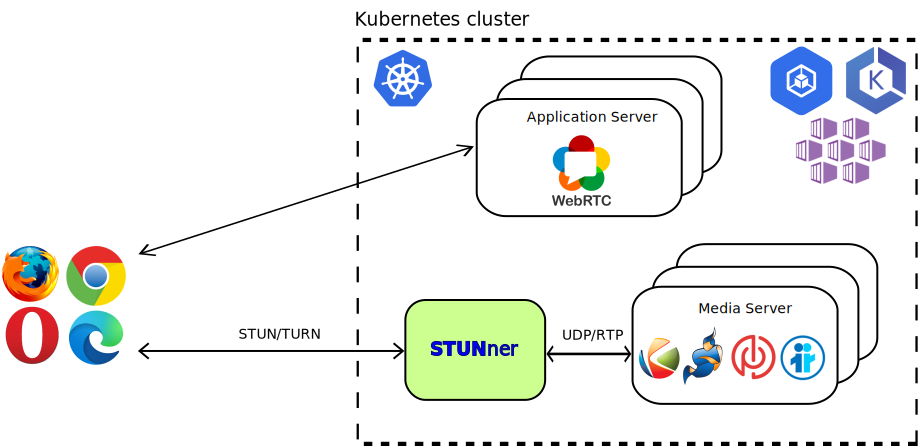

<p align="center">
  </br>
  <a href="https://discord.gg/DyPgEsbwzc" alt="Discord">
    </a>
  <a href="https://go.dev/doc/go1.17" alt="Go">
    </a>
  <a href="https://pkg.go.dev/github.com/l7mp/stunner">
    </a>
  <a href="https://hub.docker.com/repository/docker/l7mp/stunnerd/tags?page=1&ordering=last_updated" alt="Docker version">
    </a>
  <a href="https://github.com/l7mp/stunner/stargazers" alt="Github stars">
    </a>
  <a href="https://github.com/l7mp/stunner/network/members" alt="Github Forks">
    </a>
  <a href="https://github.com/l7mp/stunner/blob/main/LICENSE" alt="MIT">
    </a>
  <a href="https://github.com/l7mp/stunner/pulls?q=is%3Apr+is%3Aclosed" alt="PRs closed">
    </a>
  <a href="https://github.com/l7mp/stunner/pulls?q=is%3Aopen+is%3Apr" alt="PRs open">
    </a>
  <a href="https://github.com/l7mp/stunner/issues?q=is%3Aissue+is%3Aclosed" alt="Issues closed">
    </a>
  <a href="https://github.com/l7mp/stunner/issues?q=is%3Aopen+is%3Aissue" alt="Issues open">
    </a>
  <a href="https://hub.docker.com/repository/docker/l7mp/stunnerd" alt="Docker pulls">
    </a>
  <a href="https://github.com/l7mp/stunner/actions/workflows/test.yml" alt="Tests">
    </a>
  <a href="https://github.com/l7mp/stunner/actions/workflows/publish.yml" alt="Release">
    </a>
  <a href="https://coveralls.io/github/l7mp/stunner" alt="coverage">
    </a>
</p>

# STUNner: A Kubernetes media gateway for WebRTC

Ever wondered how to [deploy your WebRTC infrastructure into the
cloud](https://webrtchacks.com/webrtc-media-servers-in-the-cloud)? Frightened away by the
complexities of Kubernetes container networking, and the surprising ways in which it may interact
with your UDP/RTP media? Tried to read through the endless stream of [Stack
Overflow](https://stackoverflow.com/search?q=kubernetes+webrtc)
[questions](https://stackoverflow.com/questions/61140228/kubernetes-loadbalancer-open-a-wide-range-thousands-of-port)
[asking](https://stackoverflow.com/questions/64232853/how-to-use-webrtc-with-rtcpeerconnection-on-kubernetes)
[how](https://stackoverflow.com/questions/68339856/webrtc-on-kubernetes-cluster/68352515#68352515)
[to](https://stackoverflow.com/questions/52929955/akskubernetes-service-with-udp-and-tcp)
[scale](https://stackoverflow.com/questions/62088089/scaling-down-video-conference-software-in-kubernetes)
WebRTC services with Kubernetes, just to get (mostly) insufficient answers?  Want to safely connect
your users behind a NAT, without relying on expensive [third-party TURN
services](https://bloggeek.me/managed-webrtc-turn-speed)?

Worry no more! STUNner allows you to deploy *any* WebRTC service into Kubernetes, smoothly
integrating it into the [cloud-native ecosystem](https://landscape.cncf.io).  STUNner exposes a
standards-compliant STUN/TURN gateway for clients to access your virtualized WebRTC infrastructure
running in Kubernetes, maintaining full browser compatibility and requiring minimal or no
modification to your existing WebRTC codebase.  STUNner implements the standard [Kubernetes Gateway
API](https://gateway-api.sigs.k8s.io) so you can configure it in the familiar YAML-engineering
style via Kubernetes manifests.

See the full documentation [here](/doc/README.md).

## Table of Contents
1. [Description](#description)
1. [Features](#features)
1. [Getting started](#getting-started)
1. [Tutorials](#tutorials)
1. [Caveats](#caveats)
1. [Milestones](#milestones)

## Description

Currently [WebRTC](https://stackoverflow.com/search?q=kubernetes+webrtc)
[lacks](https://stackoverflow.com/questions/61140228/kubernetes-loadbalancer-open-a-wide-range-thousands-of-port)
[a](https://stackoverflow.com/questions/64232853/how-to-use-webrtc-with-rtcpeerconnection-on-kubernetes)
[virtualization](https://stackoverflow.com/questions/68339856/webrtc-on-kubernetes-cluster/68352515#68352515)
[story](https://stackoverflow.com/questions/52929955/akskubernetes-service-with-udp-and-tcp): there
is no easy way to deploy a WebRTC media service into Kubernetes to benefit from the
[resiliency](https://developer.mozilla.org/en-US/docs/Web/API/RTCPeerConnection/restartIce),
[scalability](https://stackoverflow.com/questions/62088089/scaling-down-video-conference-software-in-kubernetes),
and [high
availability](https://blog.cloudflare.com/announcing-our-real-time-communications-platform)
features we have come to expect from modern network services. Worse yet, the entire industry relies
on a handful of [public](https://bloggeek.me/google-free-turn-server/) [STUN
servers](https://www.npmjs.com/package/freeice) and [hosted TURN
services](https://bloggeek.me/managed-webrtc-turn-speed) to connect clients behind a NAT/firewall,
which may create a useless dependency on externally operated services, introduce a bottleneck,
raise security concerns, and come with a non-trivial price tag.

The main goal of STUNner is to allow *anyone* to deploy their own WebRTC infrastructure into
Kubernetes, without relying on any external service other than the cloud-provider's standard hosted
Kubernetes offering. This is achieved by STUNner acting as a gateway for ingesting WebRTC media
traffic into the Kubernetes cluster, exposing a public-facing STUN/TURN server that WebRTC clients
can connect to.

STUNner can act as a STUN/TURN server that WebRTC clients can use as a scalable NAT traversal
facility (headless model), or it can serve as a fully-fledged ingress gateway for clients to reach
a media server deployed behind STUNner (media-plane model). This makes it possible to deploy WebRTC
application servers and media servers into ordinary Kubernetes pods, taking advantage of
Kubernetes's excellent tooling to manage, scale, monitor and troubleshoot the WebRTC infrastructure
like any other cloud-bound workload.



Don't worry about the performance implications of processing all your media through a TURN server:
STUNner is written in [Go](https://go.dev) so it is extremely fast, it is co-located with your
media server pool so you don't pay the round-trip time to a far-away public STUN/TURN server, and
STUNner can be easily scaled up if needed, just like any other "normal" Kubernetes service.

## Features

Kubernetes has been designed and optimized for the typical HTTP/TCP Web workload, which makes
streaming workloads, and especially UDP/RTP based WebRTC media, feel like a foreign citizen.
STUNner aims to change this state-of-the-art, by exposing a single public STUN/TURN server port for
ingesting *all* media traffic into a Kubernetes cluster in a controlled and standards-compliant
way.

* **Seamless integration with Kubernetes.** STUNner can be deployed into any Kubernetes cluster,
  even into restricted ones like GKE Autopilot, using a single command. Manage your HTTP/HTTPS
  application servers with your favorite [service mesh](https://istio.io), and STUNner takes care
  of all UDP/RTP media. STUNner implements the [Kubernetes Gateway
  API](https://gateway-api.sigs.k8s.io) so you configure it in exactly the same way as
  [the](https://doc.traefik.io/traefik/routing/providers/kubernetes-gateway)
  [rest](https://istio.io/latest/docs/tasks/traffic-management/ingress/gateway-api)
  [of](https://projectcontour.io/guides/gateway-api)
  [your](https://docs.konghq.com/kubernetes-ingress-controller/latest/guides/using-gateway-api)
  [workload](https://github.com/nginxinc/nginx-kubernetes-gateway) through easy-to-use YAML
  manifests.

* **Expose a WebRTC media server on a single external UDP port.** Get rid of the Kubernetes
  [hacks](https://kubernetes.io/docs/concepts/configuration/overview), like privileged pods and
  `hostNetwork`/`hostPort` services, typically recommended as a prerequisite to containerizing your
  WebRTC media plane.  Using STUNner a WebRTC deployment needs only two public-facing ports, one
  HTTPS port for the application server and a *single* UDP port for *all* your media.

* **No reliance on external services for NAT traversal.** Can't afford a decent [hosted TURN
  service](https://bloggeek.me/webrtc-turn) for client-side NAT traversal? Can't get a decent
  audio/video quality because the third-party TURN service poses a bottleneck? STUNner can be
  deployed into the same cluster as the rest of your WebRTC infrastructure, and any WebRTC client
  can connect to it directly without the use of *any* external STUN/TURN service whatsoever, apart
  from STUNner itself.

* **Easily scale your WebRTC infrastructure.** Tired of manually provisioning your WebRTC media
  servers?  STUNner lets you deploy the entire WebRTC infrastructure into ordinary Kubernetes pods,
  thus scaling the media plane is as easy as issuing a `kubectl scale` command. STUNner itself can
  be scaled with similar ease, completely separately from the media servers.

* **Secure perimeter defense.** No need to open thousands of UDP/TCP ports on your media server for
  potentially malicious access; with STUNner *all* media is received through a single ingress port
  that you can tightly monitor and control.

<!-- STUNner stores all STUN/TURN credentials and DTLS keys -->
<!--   in secure Kubernetes vaults. -->

* **Simple code and extremely small size.** Written in pure Go using the battle-tested
  [pion/webrtc](https://github.com/pion/webrtc) framework, STUNner is just a couple of hundred
  lines of fully open-source code. The server is extremely lightweight: the typical STUNner
  container image size is only about 5 Mbytes.

## Getting Started

STUNner comes with a [Helm](https://helm.sh) chart to fire up a fully functional STUNner-based
WebRTC media gateway in minutes. Note that the default installation does not contain an application
server and a media server: STUNner in itself is not a WebRTC service, it is merely an *enabler* for
you to deploy your *own* WebRTC infrastructure into Kubernetes. Once installed, STUNner makes sure
that your media servers are readily reachable to WebRTC clients, despite running with a private IP
address inside a Kubernetes pod. See the [tutorials](#tutorials) for some ideas on how to deploy an
actual WebRTC application behind STUNner.

With a minimal understanding of WebRTC and Kubernetes, deploying STUNner should take less than 5
minutes.

* [Customize STUNner and deploy it](#installation) into your Kubernetes cluster.
* Optionally [deploy a WebRTC media server](examples/kurento-one2one-call).
* [Set STUNner as the ICE server](#configuring-webrtc-clients) in your WebRTC clients.
* ...
* Profit!!

### Installation

The simplest way to deploy STUNner is through [Helm](https://helm.sh). STUNner configuration
parameters are available for customization as [Helm
Values](https://helm.sh/docs/chart_template_guide/values_files). We recommend deploying STUNner
into a separate namespace and we usually name this namespace as `stunner`, so as to isolate it from
the rest of the workload.

```console
helm repo add stunner https://l7mp.io/stunner
helm repo update
helm install stunner-gateway-operator stunner/stunner-gateway-operator --create-namespace --namespace=<your-namespace>
helm install stunner stunner/stunner --create-namespace --namespace=<your-namespace>
```

Find out more about the charts in the [STUNner-helm repository](https://github.com/l7mp/stunner-helm).

### Configuration

The standard way to interact with STUNner is via Kubernetes via the standard [Gateway
  API](https://gateway-api.sigs.k8s.io) version
  [v1alpha2](https://gateway-api.sigs.k8s.io/v1alpha2/references/spec). This is akin to the way you
  configure _all_ Kubernetes workloads: specify your intents in YAML files and issue a `kubectl
  apply`, and the [STUNner gateway operator](https://github.com/l7mp/stunner-gateway-operator) will
  automatically reconcile the STUNner dataplane for the new configuration.

1. Given a fresh STUNner install, the first step is to register STUNner with the Kubernetes Gateway
   API. This amounts to creating a
   [GatewayClass](https://gateway-api.sigs.k8s.io/references/spec/#gateway.networking.k8s.io/v1alpha2.GatewayClass),
   which serves as the root level configuration for your STUNner deployment.

   Each GatewayClass must specify a controller that will manage the Gateway objects created under
   the class hierarchy. In our case this must be set to `stunner.l7mp.io/gateway-operator` for
   STUNner to pick up the GatewayClass. In addition, a GatewayClass can refer to further
   implementation-specific configuration via a `parametersRef`; in our case, this will be a
   GatewayConfig object to be specified next.

   ``` console
   kubectl apply -f - <<EOF
   apiVersion: gateway.networking.k8s.io/v1alpha2
   kind: GatewayClass
   metadata:
     name: stunner-gatewayclass
   spec:
     controllerName: "stunner.l7mp.io/gateway-operator"
     parametersRef:
       group: "stunner.l7mp.io"
       kind: GatewayConfig
       name: stunner-gatewayconfig
       namespace: stunner
     description: "STUNner is a WebRTC media gateway for Kubernetes"
   EOF
   ```

1. The next step is to set some general configuration for STUNner, most importantly the STUN/TURN
   authentication [credentials](/doc/AUTH.md). This requires loading a GatewayConfig custom
   resource into Kubernetes.

   Below we set the [`plaintext` authentication](/doc/AUTH.md) mechanism for STUNner, using the
   username/password pair `user-1/pass-1`, and the authentication realm `stunner.l7mp.io`. See the
   package [docs](https://pkg.go.dev/github.com/l7mp/stunner-gateway-operator) for further
   configuration options available via GatewayConfigs.

   ```console
   kubectl apply -f - <<EOF
   apiVersion: stunner.l7mp.io/v1alpha1
   kind: GatewayConfig
   metadata:
     name: stunner-gatewayconfig
     namespace: stunner
   spec:
     realm: stunner.l7mp.io
     authType: plaintext
     userName: "user-1"
     password: "pass-1"
   EOF
   ```

   Note that these two steps are required only once per STUNner installation.

1. At this point, we are ready to expose STUNner to clients! This occurs by loading a
   [Gateway](https://gateway-api.sigs.k8s.io/references/spec/#gateway.networking.k8s.io/v1alpha2.Gateway)
   resource into Kubernetes.

   In the below example, we open a STUN/TURN listener service on the UDP listener port 3478.
   STUNner will automatically expose this listener on a public IP address and port (by creating a
   [LoadBalancer
   service](https://kubernetes.io/docs/concepts/services-networking/service/#loadbalancer) for each
   Gateway), await clients to connect to this listener and, once authenticated, forward client
   connections to an arbitrary service backend *inside* the cluster. Note that we set the
   `gatewayClassName` to the name of the above GatewayClass; this is the way STUNner will know
   which class hierarchy the Gateway belongs to so that it can set up the corresponding STUN/TURN
   credentials for the new listener.

   ```console
   kubectl apply -f - <<EOF
   apiVersion: gateway.networking.k8s.io/v1alpha2
   kind: Gateway
   metadata:
     name: udp-gateway
     namespace: stunner
   spec:
     gatewayClassName: stunner-gatewayclass
     listeners:
       - name: udp-listener
         port: 3478
         protocol: UDP
   EOF
   ```

1. The final step is to tell STUNner what to do with the client connections received on the
   Gateway. This occurs by attaching a
   [UDPRoute](https://gateway-api.sigs.k8s.io/references/spec/#gateway.networking.k8s.io/v1alpha2.UDPRoute)
   resource to the Gateway and specifying the target service in the `backendRef`. A UDPRoute can be
   attached to any Gateway by setting the `parentRef` to the Gateway's name, there is just one
   rule: the Gateway and the UDPRoute must both live in the same Kubernetes namespace.

   The below UDPRoute will configure STUNner to route client connections received on the Gateway
   called `udp-gateway` to the WebRTC media server pool identified by the Kubernetes service
   `media-plane` in the `default` namespace.

   ```console
   kubectl apply -f - <<EOF
   apiVersion: gateway.networking.k8s.io/v1alpha2
   kind: UDPRoute
   metadata:
     name: media-plane
     namespace: stunner
   spec:
     parentRefs:
       - name: udp-gateway
     rules:
       - backendRefs:
           - name: media-plane
             namespace: default
   EOF
   ```

And that's all: once configured, STUNner will make all this happen automatically, and you don't
need to worry about client-side NAT traversal and request routing because STUNner has you covered!
Even better, every time you change a Gateway API resource in Kubernetes, say, you update the
GatewayConfig to reset your STUN/TURN credentials or change the protocol or port in one of your
Gateways, the [STUNner gateway operator](https://github.com/l7mp/stunner-gateway-operator) will
automatically pick up your modifications and update the underlying dataplane in a matter of
milliseconds. Kubernetes is beautiful, isn't it?

### Check your config

The current STUNner dataplane configuration is always made available in a convenient ConfigMap
called `stunnerd-config` (you can choose the name in the GatewayConfig). The STUNner dataplane pods
themselves will use the very same ConfigMap to reconcile their internal state, so you can consider
its content to be the ground truth.

STUNner comes with a small utility to dump the running configuration in human readable format (you
must have [`jq`](https://stedolan.github.io/jq) installed in your PATH to be able to use it). Chdir
into the main STUNner directory and issue.

```console
cmd/stunnerctl/stunnerctl running-config stunner/stunnerd-config
STUN/TURN authentication type:	plaintext
STUN/TURN username:		user-1
STUN/TURN password:		pass-1
Listener:	udp-listener
Protocol:	UDP
Public address:	34.118.36.108
Public port:	3478
```

As it turns out, STUNner has successfully assigned a public IP and port to our Gateway and set the
STUN/TURN credentials based on the GatewayConfig. You can use the below to dump the entire running
configuration; `jq` is there just to pretty-print JSON.

```console
kubectl get cm -n stunner stunnerd-config -o jsonpath="{.data.stunnerd\.conf}" | jq .
```

### Testing

We have successfully configured STUNner to route client connections to the `media-plane` service
but at the moment there is no backend that would respond. Below we will use a simplistic UDP
greeter service for testing: every time you send some input, the greeter service will respond with
a heartwarming welcome message.

1. Fire up the UDP greeter service.

   The below manifest spawns the service in the `default` namespace and wraps it in a Kubernetes
   service called `media-plane` (recall, this is the target service STUNner will route connections
   to!). Note that the type of the `media-plane` service is `ClusterIP`, which means that
   Kubernetes will not expose the service to the Internet: the only way for clients to obtain a
   response is via STUNner.

   ```console
   kubectl apply -f deploy/manifests/udp-greeter.yaml
   ```

1. We also need the ClusterIP assigned by Kubernetes to the `media-plane` service.

   ```console
   export PEER_IP=$(kubectl get svc media-plane -o jsonpath='{.spec.clusterIP}')
   ```

1. We also need a STUN/TURN client to actually initiate a connection. STUNner comes with a handy
   STUN/TURN client called [`turncat`](cmd/turncat/README.md) that we can use for this
   purpose. Once [built](cmd/turncat/README.md#installation), we can fire up `turncat` to listen
   on the standard input and send everything it receives to STUNner. Type any input and press
   Enter, and you should see a nice greeting from your cluster!

   ```console
   ./turncat - k8s://stunner/stunnerd-config:udp-listener udp://${PEER_IP}:9001
   Hello STUNner
   Greetings from STUNner!
   ```

Observe that we haven't specified the STUNner public IP address and port for `turncat`: it is
clever enough to read the [running configuration](#check-your-config) from Kubernetes
directly. Just specify the special STUNner URI `k8s://stunner/stunnerd-config:udp-listener`,
identifying the namespace and the name for the STUNner ConfigMap and the name of the listener to
connect to, and `turncat` will do the heavy lifting.

Note that your actual WebRTC clients will not need to use `turncat` to reach the cluster: all
modern Web browsers and WebRTC clients come with a STUN/TURN client included. Here, `turncat` is
used only to *simulate* what a real WebRTC client would do when trying to reach STUNner.

### Reconcile

Any time you see fit, you can update the STUNner configuration through the Gateway API: STUNner
will automatically reconcile the underlying dataplane for the new configuration.

For instance, you may decide to open up your WebRTC infrastructure on TCP as well; say, because an
enterprise NAT on the client network path has gone berserk and started to actively filter UDP/TURN
traffic. The below steps will do just that: open another gateway on STUNner, this time on the TCP
port 3478, and reattach the UDPRoute to both Gateways so that no matter which protocol a client may
choose the connection will be routed to the `media-plane` service (i.e., the UDP greeter) by
STUNner.

1. Add the new TCP Gateway.

   ```console
   kubectl apply -f - <<EOF
   apiVersion: gateway.networking.k8s.io/v1alpha2
   kind: Gateway
   metadata:
     name: tcp-gateway
     namespace: stunner
   spec:
     gatewayClassName: stunner-gatewayclass
     listeners:
       - name: tcp-listener
         port: 3478
         protocol: TCP
   EOF
   ```

1. Update the UDPRoute so that it attaches to both Gateways.

   ```console
   kubectl apply -f - <<EOF
   apiVersion: gateway.networking.k8s.io/v1alpha2
   kind: UDPRoute
   metadata:
     name: media-plane
     namespace: stunner
   spec:
     parentRefs:
       - name: udp-gateway
       - name: tcp-gateway
     rules:
       - backendRefs:
           - name: media-plane
             namespace: default
   EOF
   ```

1. Fire up `turncat` again, but this time let it connect through TCP. This is achieved
   by specifying the name of the TCP listener (`tcp-listener`) in the STUNner URI.
   ```console
   ./turncat -l all:INFO - k8s://stunner/stunnerd-config:tcp-listener udp://${PEER_IP}:9001
   [...] turncat INFO: Turncat client listening on -, TURN server: TCP://34.118.18.210:3478, peer: udp://10.120.0.127:9001
   [...]
   Hello STUNner
   Greetings from STUNner!
   ```

   We have set the `turncat` loglevel to INFO to learn that this time `turncat` has connected via
   the TURN server `TCP://34.118.18.210:3478`. And that's it: STUNner automatically routes the
   incoming TCP connection to the UDP greeter service, silently converting from TCP to UDP in the
   background and back again on return.

### Configuring WebRTC clients

Real WebRTC clients will need a valid ICE server configuration to use STUNner as the TURN
server. STUNner is compatible with all client-side [TURN auto-discovery
mechanisms](https://datatracker.ietf.org/doc/html/rfc8155). When no auto-discovery mechanism is
available, clients will need to be manually configured to stream audio/video media over STUNner.

The below JavaScript snippet will direct a WebRTC client to use STUNner as the TURN server.  Make
sure to substitute the placeholders (like `<STUNNER_PUBLIC_ADDR>`) with the correct configuration
from the running STUNner config; don't forget that `stunnerctl` is always there for you to help.

```js
var ICE_config = {
  iceServers: [
    {
      url: 'turn:<STUNNER_PUBLIC_ADDR>:<STUNNER_PUBLIC_PORT>?transport=udp',
      username: <STUNNER_USERNAME>,
      credential: <STUNNER_PASSWORD>,
    },
  ],
};
var pc = new RTCPeerConnection(ICE_config);
```

Note that STUNner comes with a [small Node.js
library](https://www.npmjs.com/package/@l7mp/stunner-auth-lib) that simplifies generating ICE
configurations and STUNner credentials in the application server.

## Tutorials

STUNner comes with a series of tutorials to demonstrate its use to deploy different WebRTC
applications into Kubernetes.

### Basics

* [Opening a UDP tunnel via STUNner](/examples/simple-tunnel/README.md): This introductory tutorial
  shows how to tunnel an external connection via STUNner to a UDP service deployed into
  Kubernetes. The demo can be used to quickly check and benchmark a STUNner installation.
  
### Headless deployment mode

* [Direct one to one video call via STUNner](/examples/direct-one2one-call/README.md): This
  tutorial showcases STUNner acting as a TURN server for two WebRTC clients to establish
  connections between themselves, without the mediation of a media server.
   
### Media-plane deployment model

* [One to one video call with Kurento](/examples/kurento-one2one-call/README.md): This tutorial
  shows how to use STUNner to connect WebRTC clients to a media server deployed into Kubernetes
  behind STUNner in the [media-plane deployment model](/doc/DEPLOYMENT.md). All this happens
  *without* modifying the media server code in any way, just by adding 5-10 lines of
  straightforward JavaScript to configure clients to use STUNner as the TURN server.
* [Magic mirror with Kurento](/examples/kurento-magic-mirror/README.md): This tutorial has been
  adopted from the [Kurento](https://www.kurento.org) [magic
  mirror](https://doc-kurento.readthedocs.io/en/stable/tutorials/node/tutorial-magicmirror.html)
  demo, deploying a basic WebRTC loopback server behind STUNner with some media processing
  added. In particular, the application uses computer vision and augmented reality techniques to
  add a funny hat on top of faces.
* [Video-conferencing with LiveKit](/examples/livekit/README.md): This tutorial helps you deploy
  the [LiveKit](https://livekit.io) WebRTC media server behind STUNner. The docs also show how to
  obtain a valid TLS certificate to secure your signaling connections, courtesy of the wonderful
  [cert-manager](https://cert-manager.io) project, [nip.io](https://nip.io) and [Let's
  Encrypt](https://letsencrypt.org).
* [Cloud-gaming with Cloudretro](/examples/cloudretro/README.md): This tutorial lets you play Super
  Mario or Street Fighter in your browser, courtesy of the amazing
  [CloudRetro](https://cloudretro.io) project and, of course, STUNner. The demo also presents a
  simple multi-cluster setup, where clients can reach the game-servers in their geographical
  locality to minimize latency.
* [Remote desktop access with Neko](/examples/neko/README.md): This demo showcases STUNner
  providing an ingress gateway service to a remote desktop application. We use
  [neko.io](https://neko.m1k1o.net) to run a browser in a secure container inside the Kubernetes
  cluster, and stream the desktop to clients via STUNner.

## Documentation

See the full documentation [here](/doc/README.md).

## Caveats

STUNner is a work-in-progress. Some features are missing, others may not work as expected. The
notable limitations at this point are as follows.

* STUNner targets only a *partial implementation of the Kubernetes Gateway API.* In particular,
  only GatewayClass, Gateway and UDPRoute resources are supported. This is intended: STUNner
  deliberately ignores some unnecessary complexity in the [Gateway
  API](https://gateway-api.sigs.k8s.io) and deviates from the prescribed behavior in some cases,
  all in the name of simplifying the configuration process. The [STUNner Kubernetes gateway
  operator](https://github.com/l7mp/stunner-gateway-operator) docs contain a [detailed
  list](https://github.com/l7mp/stunner-gateway-operator/README.md#caveats) on the differences.
* Certain Kubernetes control plane operations will *trigger a STUN/TURN server restart in STUNner*,
  which leads to dropping all active client connections. In particular, adding, removing or
  modifying Gateways currently requires a full server restart. Modifications to a GatewayConfig or
  UDPRoute however are reconciled seamlessly. We plan to remove this restriction in a later
  release; for now it is best to refrain from intrusive changes on live STUNner deployments.
* STUNner supports arbitrary scale-up without dropping active calls, but *scale-down might
  disconnect calls* established through the STUNner pods and/or media server replicas being removed
  from the load-balancing pool. Note that this problem is
  [universal](https://webrtchacks.com/webrtc-media-servers-in-the-cloud) in WebRTC, but we plan to
  do something about it in a later STUNner release so stay tuned.
* STUNner supports *multiple parallel GatewayClass hierarchies*, each deployed into a separate
  namespace with a separate GatewayClass an a separate dataplane. This mode can be useful for
  testing new STUNner versions or canary-upgrades and A/B testing of a new media server version. At
  the moment, however, this mode is not supported: it should work but we don' test it.
* Currently TURN over TLS/DTLS is supported only in the [standalone mode](/doc/OBSOLETE.md); we
  will remove this restriction in the next release.

## Milestones

* v0.9: Demo release: STUNner basic UDP/TURN connectivity + helm chart + tutorials
* v0.10: Dataplane: Long-term STUN/TURN credentials and [STUN/TURN over
  TCP/TLS/DTLS](https://www.rfc-editor.org/rfc/rfc6062.txt) in standalone mode.
* v0.11: Control plane: Kubernetes gateway operator and dataplane reconciliation.
* v0.12: Security: Hide plain text credentials in the Gateway API and expose TLS/DTLS.
* v0.13: Observability: Prometheus + Grafana dashboard.
* v1.0: GA
* v1.2: Performance: eBPF acceleration
* v2.0: Service mesh: adaptive scaling & resiliency

## Help

STUNner development is coordinated in Discord, feel free to [join](https://discord.gg/DyPgEsbwzc).

## License

Copyright 2021-2022 by its authors. Some rights reserved. See [AUTHORS](AUTHORS).

MIT License - see [LICENSE](LICENSE) for full text.

## Acknowledgments

Initial code adopted from [pion/stun](https://github.com/pion/stun) and
[pion/turn](https://github.com/pion/turn).
