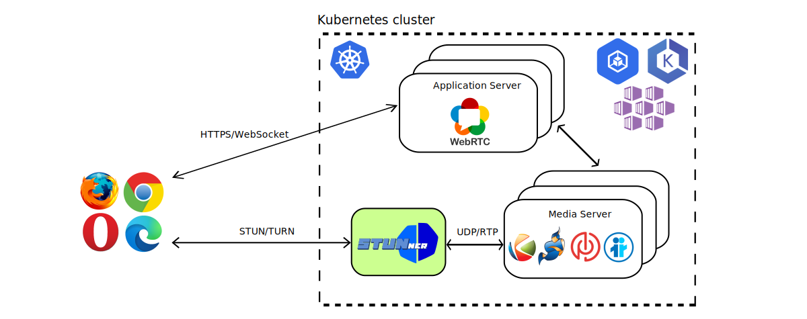

<p align="center">
  </br>
  <a href="https://discord.gg/DyPgEsbwzc" alt="Discord">
    </a>
  <a href="https://go.dev/doc/go1.17" alt="Go">
    </a>
  <a href="https://pkg.go.dev/github.com/l7mp/stunner">
    </a>
  <a href="https://hub.docker.com/repository/docker/l7mp/stunnerd/tags?page=1&ordering=last_updated" alt="Docker version">
    </a>
  <a href="https://github.com/l7mp/stunner/stargazers" alt="Github stars">
    </a>
  <a href="https://github.com/l7mp/stunner/network/members" alt="Github Forks">
    </a>
  <a href="https://github.com/l7mp/stunner/blob/main/LICENSE" alt="MIT">
    </a>
  <a href="https://github.com/l7mp/stunner/pulls?q=is%3Apr+is%3Aclosed" alt="PRs closed">
    </a>
  <a href="https://github.com/l7mp/stunner/pulls?q=is%3Aopen+is%3Apr" alt="PRs open">
    </a>
  <a href="https://github.com/l7mp/stunner/issues?q=is%3Aissue+is%3Aclosed" alt="Issues closed">
    </a>
  <a href="https://github.com/l7mp/stunner/issues?q=is%3Aopen+is%3Aissue" alt="Issues open">
    </a>
  <a href="https://hub.docker.com/repository/docker/l7mp/stunnerd" alt="Docker pulls">
    </a>
  <a href="https://stunner.readthedocs.io/en/latest/" alt="Read the Docs">
    </a>
  <a href="https://github.com/l7mp/stunner/actions/workflows/test.yml" alt="Tests">
    </a>
  <a href="https://coveralls.io/github/l7mp/stunner" alt="coverage">
    </a>
</p>

# STUNner: A Kubernetes media gateway for WebRTC

Ever wondered how to [deploy your WebRTC infrastructure into the
cloud](https://webrtchacks.com/webrtc-media-servers-in-the-cloud)? Frightened away by the
complexities of Kubernetes container networking, and the surprising ways in which it may interact
with your UDP/RTP media? Read through the endless stream of [Stack
Overflow](https://stackoverflow.com/search?q=kubernetes+webrtc)
[questions](https://stackoverflow.com/questions/61140228/kubernetes-loadbalancer-open-a-wide-range-thousands-of-port)
[asking](https://stackoverflow.com/questions/64232853/how-to-use-webrtc-with-rtcpeerconnection-on-kubernetes)
[how](https://stackoverflow.com/questions/68339856/webrtc-on-kubernetes-cluster/68352515#68352515)
[to](https://stackoverflow.com/questions/52929955/akskubernetes-service-with-udp-and-tcp)
[scale](https://stackoverflow.com/questions/62088089/scaling-down-video-conference-software-in-kubernetes)
WebRTC services with Kubernetes, just to get (mostly) insufficient answers?  Want to safely connect
your users behind a NAT, without relying on expensive [third-party TURN
services](https://bloggeek.me/managed-webrtc-turn-speed)?

Worry no more! STUNner allows you to deploy *any* WebRTC service into Kubernetes, smoothly
integrating it into the [cloud-native ecosystem](https://landscape.cncf.io).  STUNner exposes a
standards-compliant STUN/TURN gateway for clients to access your virtualized WebRTC infrastructure
running in Kubernetes, maintaining full browser compatibility and requiring minimal or no
modification to your existing WebRTC codebase.  STUNner supports the [Kubernetes Gateway
API](https://gateway-api.sigs.k8s.io) so you can configure it in the familiar YAML-engineering
style via Kubernetes manifests.

## Table of Contents
1. [Description](#description)
1. [Features](#features)
1. [Getting started](#getting-started)
1. [Usage](#usage)
1. [Documentation](#documentation)
1. [Milestones](#milestones)

## Description

Currently [WebRTC](https://stackoverflow.com/search?q=kubernetes+webrtc)
[lacks](https://stackoverflow.com/questions/61140228/kubernetes-loadbalancer-open-a-wide-range-thousands-of-port)
[a](https://stackoverflow.com/questions/64232853/how-to-use-webrtc-with-rtcpeerconnection-on-kubernetes)
[virtualization](https://stackoverflow.com/questions/68339856/webrtc-on-kubernetes-cluster/68352515#68352515)
[story](https://stackoverflow.com/questions/52929955/akskubernetes-service-with-udp-and-tcp): there
is no easy way to deploy a WebRTC media service into Kubernetes to benefit from the
[resiliency](https://developer.mozilla.org/en-US/docs/Web/API/RTCPeerConnection/restartIce),
[scalability](https://stackoverflow.com/questions/62088089/scaling-down-video-conference-software-in-kubernetes),
and [high
availability](https://blog.cloudflare.com/announcing-our-real-time-communications-platform)
features we have come to expect from modern network services. Worse yet, the entire industry relies
on a handful of [public](https://bloggeek.me/google-free-turn-server/) [STUN
servers](https://www.npmjs.com/package/freeice) and [hosted TURN
services](https://bloggeek.me/managed-webrtc-turn-speed) to connect clients behind a NAT/firewall,
which may create a useless dependency on externally operated services, introduce a performance
bottleneck, raise security concerns, and come with a non-trivial price tag.

The main goal of STUNner is to allow *anyone* to deploy their own WebRTC infrastructure into
Kubernetes, without relying on any external service other than the cloud-provider's standard hosted
Kubernetes offering. STUNner can act as a standalone STUN/TURN server that WebRTC clients and media
servers can use as a scalable NAT traversal facility (headless model), or it can act as a gateway
for ingesting WebRTC media traffic into the Kubernetes cluster by exposing a public-facing
STUN/TURN server that WebRTC clients can connect to (media-plane model). This makes it possible to
deploy WebRTC application servers and media servers into ordinary Kubernetes pods, taking advantage
of the full cloud native feature set to manage, scale, monitor and troubleshoot the WebRTC
infrastructure like any other Kubernetes workload.



Don't worry about the performance implications of processing all your media through a TURN server:
STUNner is written in [Go](https://go.dev) so it is extremely fast, it is co-located with your
media server pool so you don't pay the round-trip time to a far-away public STUN/TURN server, and
STUNner can be easily scaled up if needed just like any other "normal" Kubernetes service.

## Features

Kubernetes has been designed and optimized for the typical HTTP/TCP Web workload, which makes
streaming workloads, and especially UDP/RTP based WebRTC media, feel like a foreign citizen.
STUNner aims to change this state-of-the-art, by exposing a single public STUN/TURN server port for
ingesting *all* media traffic into a Kubernetes cluster in a controlled and standards-compliant
way.

* **Seamless integration with Kubernetes.** STUNner can be deployed into any Kubernetes cluster,
  even into restricted ones like GKE Autopilot, using a single command. Manage your HTTP/HTTPS
  application servers with your favorite [service mesh](https://istio.io), and STUNner takes care
  of all UDP/RTP media. STUNner implements the [Kubernetes Gateway
  API](https://gateway-api.sigs.k8s.io) so you configure it in exactly the same way as
  [the](https://doc.traefik.io/traefik/routing/providers/kubernetes-gateway)
  [rest](https://istio.io/latest/docs/tasks/traffic-management/ingress/gateway-api)
  [of](https://projectcontour.io/guides/gateway-api)
  [your](https://docs.konghq.com/kubernetes-ingress-controller/latest/guides/using-gateway-api)
  [workload](https://github.com/nginxinc/nginx-kubernetes-gateway) through easy-to-use YAML
  manifests.

* **Expose a WebRTC media server on a single external UDP port.** Get rid of the Kubernetes
  [hacks](https://kubernetes.io/docs/concepts/configuration/overview), like privileged pods and
  `hostNetwork`/`hostPort` services, typically recommended as a prerequisite to containerizing your
  WebRTC media plane.  Using STUNner a WebRTC deployment needs only two public-facing ports, one
  HTTPS port for signaling and a *single* UDP port for *all* your media.

* **No reliance on external services for NAT traversal.** Can't afford a [hosted TURN
  service](https://bloggeek.me/webrtc-turn) for client-side NAT traversal? Can't get decent
  audio/video quality because the third-party TURN service poses a bottleneck? STUNner can be
  deployed into the same cluster as the rest of your WebRTC infrastructure, and any WebRTC client
  can connect to it directly without the use of *any* external STUN/TURN service whatsoever, apart
  from STUNner itself.

* **Scale your WebRTC infrastructure.** Tired of manually provisioning your WebRTC media servers?
  STUNner lets you deploy the entire WebRTC infrastructure into ordinary Kubernetes pods, thus
  [scaling the media plane](docs/SCALING.md) is as easy as issuing a `kubectl scale` command. Or
  you can use the built in Kubernetes horizontal autoscaler to *automatically* resize your workload
  based on demand.

* **Minimal client-side configuration.** STUNner comes with a built-in [authentication
  service](https://github.com/l7mp/stunner-auth-service) that can be used to generate time-windowed
  per-user TURN credentials through a [standards
  compliant](https://datatracker.ietf.org/doc/html/draft-uberti-behave-turn-rest-00) HTTP [REST
  API](/docs/AUTH.md). Just set the generated [ICE
  configuration](https://developer.mozilla.org/en-US/docs/Web/API/RTCPeerConnection/RTCPeerConnection#configuration)
  in the [`PeerConnection` JavaScript
  API](https://developer.mozilla.org/en-US/docs/Web/API/RTCPeerConnection/RTCPeerConnection) and
  your clients will readily start using your Kubernetes-based WebRTC service via STUNner.

* **Secure perimeter defense.** No need to open thousands of UDP/TCP ports on your media server for
  potentially malicious access; with STUNner *all* media is received through a single ingress port
  that you can tightly monitor and control.

* **Simple code and extremely small size.** Written in pure Go using the battle-tested
  [pion/webrtc](https://github.com/pion/webrtc) framework, STUNner is just a couple of hundred
  lines of fully open-source code. The server is extremely lightweight: the typical STUNner
  container image size is only 15 Mbytes.

The main uses of STUNner are [hosting a scalable STUN server
pool](https://medium.com/l7mp-technologies/deploying-a-scalable-stun-service-in-kubernetes-c7b9726fa41d)
in Kubernetes, as a public Kubernetes-based [TURN
service](https://github.com/l7mp/stunner/blob/main/docs/DEPLOYMENT.md#headless-deployment-model),
or as a fully-fledged [gateway
service](https://github.com/l7mp/stunner/blob/main/docs/DEPLOYMENT.md#media-plane-deployment-model)
for ingesting and load-balancing clients' media connections across a pool of WebRTC media servers
hosted in ordinary Kubernetes pods.

## Getting Started

With a minimal understanding of WebRTC and Kubernetes, deploying STUNner should take less than 5
minutes, in five simple steps.

* [Customize STUNner and deploy it](/docs/INSTALL.md) into your Kubernetes cluster.
* Optionally [deploy a WebRTC media server](/docs/README.md#media-plane-deployment-model).
* [Set STUNner as the ICE server](/docs/AUTH.md) in your WebRTC clients.
* ...
* Profit!!

Note that the default installation does not contain an application server and a media server:
STUNner is not a WebRTC service in itself, it is merely an *enabler* for you to deploy your *own*
WebRTC infrastructure into Kubernetes.

The simplest way to deploy STUNner is through [Helm](https://helm.sh). STUNner configuration
parameters are available for customization as [Helm
Values](https://helm.sh/docs/chart_template_guide/values_files).

```console
helm repo add stunner https://l7mp.io/stunner
helm repo update
helm install stunner-gateway-operator stunner/stunner-gateway-operator --create-namespace \
    --namespace=stunner-system
```

Find out more about the charts in the [STUNner-helm repository](https://github.com/l7mp/stunner-helm).

## Usage

STUNner comes with a wide selection of tutorials and demos that teach you how to deploy all kinds
of WebRTC services into Kubernetes. The first couple of tutorials present the basic concepts,
especially the use of the [Kubernetes Gateway API](https://gateway-api.sigs.k8s.io) to configure
STUNner and the [`turncat`](/docs/cmd/turncat.md) utility to test it. Each subsequent demo
showcases a specific WebRTC application, from desktop streaming and video-conferencing to
cloud-gaming, and goes from a clean Kubernetes cluster to a working and usable publicly available
WebRTC service in 5-10 minutes using a purely declarative configuration.

* [Deploying a UDP echo service behind STUNner](/docs/examples/udp-echo/README.md): This
  introductory tutorial shows how to deploy a simple UDP echo service into Kubernetes and expose it
  via STUNner. If you read just one STUNner tutorial, this should be it.
* [Opening a UDP tunnel via STUNner](/docs/examples/simple-tunnel/README.md): This tutorial shows
  how to tunnel an external UDP client via STUNner to a standard iperf server deployed into
  Kubernetes. The demo can be used to benchmark your STUNner installation.
* [Direct one to one video call via STUNner](/docs/examples/direct-one2one-call/README.md): This
  tutorial showcases STUNner acting as a TURN server for two WebRTC clients to establish
  connections between themselves, without the mediation of a media server.
* [Video-conferencing with LiveKit](/docs/examples/livekit/README.md): This tutorial helps you deploy
  the [LiveKit](https://livekit.io) WebRTC media server behind STUNner. The docs also show how to
  obtain a valid TLS certificate to secure your signaling connections, courtesy of the
  [cert-manager](https://cert-manager.io) project, [nip.io](https://nip.io) and [Let's
  Encrypt](https://letsencrypt.org).
* [Video-conferencing with Janus](/docs/examples/janus/README.md): This tutorial helps you deploy a
  fully fledged [Janus](https://janus.conf.meetecho.com/) video-conferencing service into Kubernetes
  behind STUNner. The docs also show how to obtain a valid TLS certificate to secure your signaling
  connections, using [cert-manager](https://cert-manager.io), [nip.io](https://nip.io) and [Let's
  Encrypt](https://letsencrypt.org).
* [Video-conferencing with Elixir WebRTC](/docs/examples/elixir-webrtc/README.md): This tutorial helps
  you deploy a fully fledged [Elixir WebRTC](https://elixir-webrtc.org/) video-conferencing room called
  [Nexus](https://github.com/elixir-webrtc/apps/tree/master/nexus) into Kubernetes
  behind STUNner. The docs also show how to obtain a valid TLS certificate to secure your signaling
  connections, using [cert-manager](https://cert-manager.io), [nip.io](https://nip.io) and [Let's
  Encrypt](https://letsencrypt.org).
* [Video-conferencing with Jitsi](/docs/examples/jitsi/README.md): This tutorial helps you deploy a
  fully fledged [Jitsi](https://jitsi.org) video-conferencing service into Kubernetes behind
  STUNner. The docs also show how to obtain a valid TLS certificate to secure your signaling
  connections, using [cert-manager](https://cert-manager.io), [nip.io](https://nip.io) and [Let's
  Encrypt](https://letsencrypt.org).
* [Video-conferencing with mediasoup](/docs/examples/mediasoup/README.md): This tutorial helps you
  deploy the [mediasoup](https://mediasoup.org/) WebRTC media server behind STUNner. The docs also
  show how to obtain a valid TLS certificate to secure your signaling connections, courtesy of the
  [cert-manager](https://cert-manager.io) project, [nip.io](https://nip.io) and [Let's
  Encrypt](https://letsencrypt.org).
* [Cloud-gaming with Cloudretro](/docs/examples/cloudretro/README.md): This tutorial lets you play
  Super Mario or Street Fighter in your browser, courtesy of the amazing
  [CloudRetro](https://cloudretro.io) project and, of course, STUNner. The demo also presents a
  simple multi-cluster setup, where clients can reach the game-servers in their geographical
  locality to minimize latency.
* [Remote desktop access with Neko](/docs/examples/neko/README.md): This demo showcases STUNner
  providing an ingress gateway service to a remote desktop application. We use
  [neko.io](https://neko.m1k1o.net) to run a browser in a secure container inside the Kubernetes
  cluster, and stream the desktop to clients via STUNner.
* [One to one video call with Kurento](/docs/examples/kurento-one2one-call/README.md): This tutorial
  shows how to use STUNner to connect WebRTC clients to a media server deployed into Kubernetes
  behind STUNner in the [media-plane deployment model](/docs/DEPLOYMENT.md). All this happens
  *without* modifying the media server code in any way, just by adding 5-10 lines of
  straightforward JavaScript to configure clients to use STUNner as the TURN server.
* [Magic mirror with Kurento](/docs/examples/kurento-magic-mirror/README.md): This tutorial has been
  adopted from the [Kurento](https://www.kurento.org) [magic
  mirror](https://doc-kurento.readthedocs.io/en/stable/tutorials/node/tutorial-magicmirror.html)
  demo, deploying a basic WebRTC loopback server behind STUNner with some media processing
  added. In particular, the application uses computer vision and augmented reality techniques to
  add a funny hat on top of faces.

## Documentation

The documentation of the stable release can be found [here](https://docs.l7mp.io/en/stable). The
documentation for the latest development release can be found [here](/docs/README.md).

## Milestones

* v0.9: Demo release: STUNner basic UDP/TURN connectivity + helm chart + tutorials.
* v0.10: Dataplane: Long-term STUN/TURN credentials and [STUN/TURN over TCP/TLS/DTLS](https://www.rfc-editor.org/rfc/rfc6062.txt) in standalone mode.
* v0.11: Control plane: Kubernetes gateway operator and dataplane reconciliation.
* v0.12: Security: Expose TLS/DTLS settings via the Gateway API.
* v0.13: Observability: Prometheus + Grafana dashboard.
* v0.15: Performance: Per-allocation CPU load-balancing for UDP
* v0.16: Management: Managed STUNner dataplane.
* v0.17: First release candidate: All Gateway and STUNner APIs move to v1.
* v0.18: Stabilization: Second release candidate.
* v0.19: The missing pieces: Third release candidate.
* v0.20: Final stabilization: Fourth stable release candidate
* v0.21: Towards v1: Fifth stable release candidate
* v1.0: STUNner goes GA!

## Help

STUNner development is coordinated in Discord, feel free to [join](https://discord.gg/DyPgEsbwzc).

## License

Copyright 2021-2023 by its authors. Some rights reserved. See [AUTHORS](AUTHORS).

MIT License - see [LICENSE](LICENSE) for full text.

## Acknowledgments

Initial code adopted from [pion/stun](https://github.com/pion/stun) and
[pion/turn](https://github.com/pion/turn).
