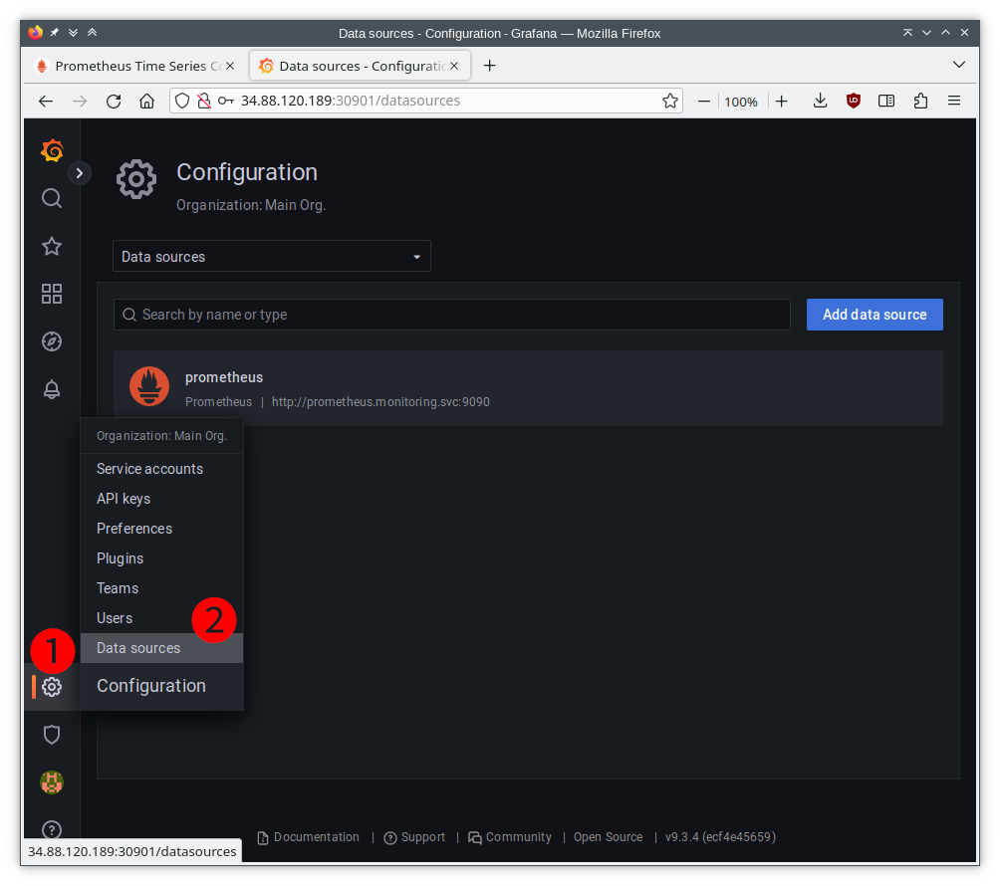
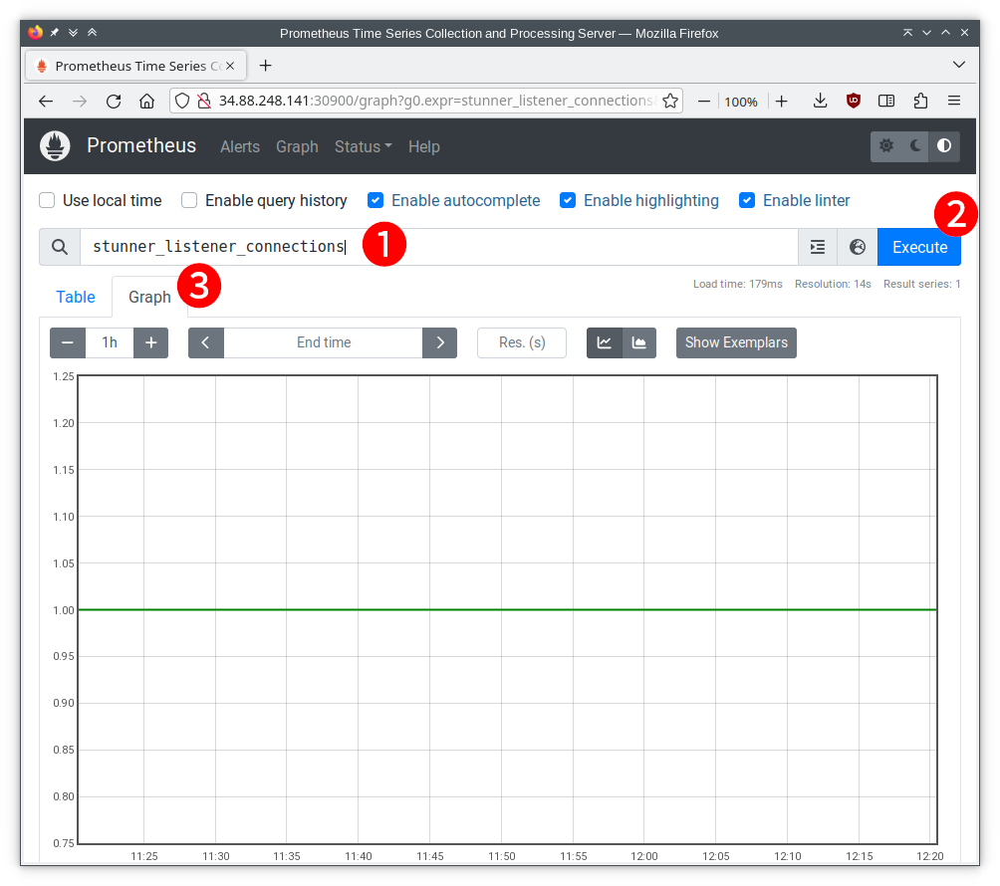

# Monitoring

STUNner can export various statistics into an external timeseries database like
[Prometheus](https://prometheus.io). This allows one to observe the state of the STUNner media
gateway instances, like CPU or memory use, as well as the amount of data received and sent, in
quasi-real-time. These statistics can then be presented to the operator in easy-to-use monitoring
dashboards in [Grafana](https://grafana.com).

## Configuration

Metrics collection is *not* enabled in the default installation. In order to open the
metrics-collection endpoint for a [gateway hierarchy](/doc/GATEWAY.md#overview), configure an
appropriate HTTP URL in the `metricsEndpoint` field of corresponding the
[GatewayConfig](/doc/GATEWAY.md#gatewayconfig) resource.

For instance, the below GatewayConfig will expose the metrics-collection server on the URL
`http://:8080/metrics` in all the STUNner media gateway instances of the current gateway hierarchy.

```yaml
apiVersion: stunner.l7mp.io/v1alpha1
kind: GatewayConfig
metadata:
  name: stunner-gatewayconfig
  namespace: stunner
spec:
  userName: "my-user"
  password: "my-password"
  metricsEndpoint: "http://:8080/metrics"
```

## Metrics

STUNner exports two types of metrics: the *Go collector metrics* describe the state of the Go
runtime, while the *Connection statistics* expose traffic monitoring data.

### Go collector metrics

Each STUNner gateway instance exports a number of standard metrics that describe the state of the
current Go process runtime. Some notable metrics as listed below, see more in the
[documentation](https://github.com/prometheus/client_golang).

| Metric | Description |
| :--- | :--- |
| `process_cpu_seconds_total` | Total user and system CPU time spent in seconds.|
| `go_memstats_alloc_bytes` | Number of bytes allocated and still in use. |
| `go_goroutines` | Number of goroutines that currently exist. |
| `go_threads`  | Number of OS threads created. |
| `process_open_fds` | Number of open file descriptors.|
| `process_virtual_memory_bytes` | Virtual memory size in bytes. |

### Connection statistics

STUNner provides deep visibility into the amount of traffic sent and received on each listener
(downstream connections) and cluster (upstream connections). The particular metrics are as follows.

| Metric | Description | Type | Labels |
| :--- | :--- | :--- | :--- |
| `stunner_listener_connections` | Number of *active* downstream connections at a listener. | gauge | `name=<listener-name>` |
| `stunner_listener_connections_total` | Number of downstream connections at a listener. | counter | `name=<listener-name>` |
| `stunner_listener_packets_total` | Number of datagrams sent or received at a listener. Unreliable for listeners running on a connection-oriented a protocol (TCP/TLS).  | counter | `direction=<rx\|tx>`, `name=<listener-name>`|
| `stunner_listener_bytes_total` | Number of bytes sent or received at a listener. | counter | `direction=<rx\|tx>`, `name=<listener-name>` |
| `stunner_cluster_connections` | Number of *active* upstream connections on behalf of a listener. | gauge | `name=<listener-name>` |
| `stunner_cluster_connections_total` | Number of upstream connections on behalf of a listener. | counter | `name=<listener-name>` |
| `stunner_cluster_packets_total` | Number of datagrams sent to backends or received from backends on behalf of a listener.  Unreliable for clusters running on a connection-oriented a protocol (TCP/TLS).| counter | `direction=<rx\|tx>`, `name=<listener-name>` |
| `stunner_cluster_bytes_total` | Number of bytes sent to backends or received from backends on behalf of a listener. | counter | `direction=<rx\|tx>`, `name=<listener-name>` |

## Integration with Prometheus and Grafana

### Installation

For fresh deployments, we give a full-fledged Prometheus+Grafana chart for monitoring STUNner deployments. Refer to [stunner-prometheus helm chart](#stunner-prometheus-helm-chart).

**Installation steps:**

1. Setup STUNner

- Deploy STUNner with monitoring enabled
```console
helm install stunner stunner/stunner --create-namespace --namespace=stunner --set stunner.deployment.monitoring.enabled=true
```
- Enable the STUNner metrics endpoint
```console
kubectl -n stunner patch gatewayconfigs.stunner.l7mp.io stunner-gatewayconfig --patch '{"spec": {"metricsEndpoint": "http://0.0.0.0:8080/metrics" }}' --type=merge
```

2. Install the Prometheus+Grafana chart
```console
helm repo add stunner https://l7mp.io/stunner
helm repo update

helm install prometheus stunner/stunner-prometheus
```

The chart will create `monitoring` namespace and installs Prometheus along with the prometheus-operator, and Grafana. The chart installs a PodMonitor resource for monitoring STUNner pods, and configures Prometheus as a datasource for Grafana.

### Configuration

#### Setup Grafana dashboard

Grafana enables visualizing STUNner metrics.

The Grafana dashboard is available at the `grafana` service IP and port 80.

This one-liner creates a clickable link to the Grafana dashboard:
```console
echo -n "http://$(kubectl get svc -n monitoring grafana -o custom-columns=:.spec.clusterIP --no-headers)"
```

#### Configure Prometheus data source

Note: The helm chart configures Prometheus as a data source.

To configure/check the Prometheus data source in Grafana, first click on *Configuration* (1), then *Data sources* (2), as shown here:



This will open up the datasources page. Scroll down to the bottom, click button *Save & test* (1), and observe the datasource is working (2):


#### Visualize STUNner metrics

As an example, we plot the  STUNner metric `stunner_listener_connections`. First, we create a new panel.

Click on *Add panel* (1), then *Add a new panel* (2):


This will open a panel configuration window.

1. Set the datasource: prometheus
2. Choose a metric. In this example, this is the `stunner_listener_connections`.
3. Click on *Run queries* (this will update the figure)
4. Fine-tune plot parameters. For example, set the title.
5. Click *Apply*


The expected outcome is a Grafana dashboard with the new panel showing `stunner_listener_connections`:


### Test

### Observe metrics on the Prometheus dashboard
By default the Prometheus dashboard is not accessible outside of the cluster. No worries if that is the case -- metrics are still observable in [Grafana](#integration-with-grafana).

In certain deployments (e.g., a local minikube), the Prometheus dashboard is reachable at `prometheus` service IP and port `9090`.  For example, if the `prometheus` service cluster-IP is `10.103.67.2`, the URL is `http://10.103.67.2:9090`.

To aid reaching the Prometheus dashboard, this one-liner creates a clickable link:
```console
echo -n "http://$(kubectl get svc -n monitoring prometheus -o custom-columns=:.spec.clusterIP --no-headers):9090"
```

On the Prometheus dashboard, observe the `stunner_listener_connections` metrics as:

1. Write `stunner_listener_connections` to the marked field (next to the looking glass icon)
2. Click on the `Execute` button
3. Switch to `Graph` view tab.




## Help

STUNner development is coordinated in Discord, feel free to [join](https://discord.gg/DyPgEsbwzc).

## License

Copyright 2021-2022 by its authors. Some rights reserved. See [AUTHORS](../AUTHORS).

MIT License - see [LICENSE](../LICENSE) for full text.

## Acknowledgments

Initial code adopted from [pion/stun](https://github.com/pion/stun) and
[pion/turn](https://github.com/pion/turn).
