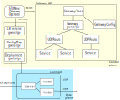

# Concepts

This guide describes STUNner's architecture and the most important components of an operational installation.

## Architecture

A STUNner installation consists of two parts, a *control plane* and a *data plane*. The control plane consists of declarative policies specifying the way STUNner should route WebRTC media traffic to the media servers, plus a gateway operator that renders the high-level policies into an actual dataplane configuration. The data plane in turn comprises one or more `stunnerd` pods, which are responsible for actually ingesting media traffic into the cluster. The dataplane pods are automatically provisioned by the gateway operator so they should come and go as you add and remove STUNner gateways.

## Control plane

The STUNner control plane consists of the following components:

* **Gateway API resources:** The high-level STUNner configuration is a collection of [Gateway API](https://gateway-api.sigs.k8s.io) resources that together describe the way media traffic should enter the cluster. The anchor of the configuration hierarchy is the GatewayClass object, and the rest of the resources form a complete hierarchy underneath it: the GatewayConfig describes general STUNner configuration, Gateways define the port and transport protocol per each TURN server listener, and UDPRoutes point to the backend services client traffic should be forwarded to. See [here](GATEWAY.md) for a full reference.

* **Gateway operator:** The main purpose of the gateway operator is to watch Gateway API resources and, once a Gateway API resource is added or modified by the user, update the dataplane accordingly (see below).

* **STUNner authentication service** (not shown on the figure): The auth service is an ancillary service that can be used to generate TURN credentials and complete [ICE server configurations](https://developer.mozilla.org/en-US/docs/Web/API/RTCPeerConnection/RTCPeerConnection#iceservers) to bootstrap clients. See more info [here](AUTH.md).

## Dataplane

The STUNner dataplane is comprised of a fleet of `stunnerd` pods implementing the TURN servers that can be used by clients to create WebRTC connections, plus some additional configuration to expose the TURN services to clients. The complete dataplane configuration per each Gateway is as follows:

* **`stunnerd` Deployment:** Once you create a new Gateway the gateway operator will spawn a new dataplane for the Gateway automatically. For each Gateway there will be `stunnerd` Deployment with the same name and namespace. The `stunnerd` daemon itself is a TURN server implemented on top of the [pion/turn](https://github.com/pion/turn) Go WebRTC framework. The daemon will instantiate a separate *TURN listener* for each Gateway listener in the gateway configuration to terminate clients' TURN sessions, a *cluster* per each UDPRoute to forward packets to the backend services (e.g., to the media servers), with some ancillary administrative and authentication mechanisms in place to check client credentials, logging, etc.  Whenever you modify a Gateway (UDPRoute), the gateway operator renders a new dataplane configuration with the modified listener (cluster, respectively) specs and downloads it to the `stunnerd` pods, which in turn reconcile their internal state with respect the new configuration.  You are free to scale the dataplane to as many `stunnerd` pods as you wish: Kubernetes will make sure that new client connections are distributed evenly over the scaled-out STUNner dataplane.

* **LoadBalancer Service:** STUNner creates a separate LoadBalancer Service per each Gateway to expose the TURN listeners of the `stunnerd` pods to the outside world. Similarly to the case of the `stunnerd` Deployment, there will be a separate LoadBalancer Service per each Gateway with the same name and namespace. 

* **STUNner ConfigMap**: In order to simplify troubleshooting a STUNner setup, the dataplane configuration of each Gateway is always made available in a ConfigMap for human inspection. Again, the name and namespace of the ConfigMap is the same as those of the corresponding Gateway. Note that this ConfigMap is no longer used by the dataplane for reconciliation, it is there only fo debugging purposes and may be silently removed in a later release. You can use STUNner's own [Config Discovery Service client](https://pkg.go.dev/github.com/l7mp/stunner@v0.16.2/pkg/config/client) to obtain dataplane configuration right from the gateway operator instead.
