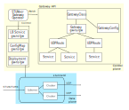

# Concepts

In this guide we describe STUNner's architecture and the most important components of an operational STUNner installation.

## Architecture

A STUNner installation consists of two parts, a *control plane* and a *dataplane*. The control plane consists of declarative policies specifying the way STUNner should route WebRTC media traffic to the media servers, plus a gateway operator that renders the high-level policies into an actual dataplane configuration. The dataplane in turn comprises one or more `stunnerd` pods, responsible for actually ingesting media traffic into the cluster through a STUN/TURN server. 

The unit of the STUNner configuration is a [designated Kubernetes namespace](https://kubernetes.io/docs/concepts/overview/working-with-objects/namespaces) that holds the control plane configuration and the dataplane pods. You can run multiple STUNner deployments side-by-side by installing a separate dataplane into a each namespace and defining a distinct gateway hierarchy to configure each dataplane separately. 

### Control plane

The STUNner control plane consists of the following components:

* **Gateway hierarchy:** A gateway hierarchy is a collection of [Kubernetes Custom Resources](https://kubernetes.io/docs/concepts/extend-kubernetes/api-extension/custom-resources) that together describe the way media traffic should enter the cluster, including public IP addresses and ports clients can use to reach STUNner, TURN credentials, forwarding rules, etc. The anchor of the gateway hierarchy is the GatewayClass object, and the rest of the resources form a complete hierarchy underneath it: the GatewayConfig describes general STUNner configuration, Gateways define the port and transport protocol for each TURN server listener, and UDPRoutes point to the backend services client traffic should be forwarded to. See [here](GATEWAY.md) for a full reference.

* **Gateway operator:** The main purpose of the gateway operator is to watch gateway hierarchies for change and, once a custom resource is added or modified by the user, render a new dataplane configuration. This configuration is then mapped into the filesystem of the `stunnerd` pods running in the same namespace, so that each `stunnerd` instance will use the most recent configuration. The STUNner Helm chart [automatically installs](INSTALL.md) the gateway operator; more information can be found [here](https://github.com/l7mp/stunner-gateway-operator).

* **STUNner ConfigMap:** The STUNner ConfigMap contains the running dataplane configuration. Of course, we could let the `stunnerd` pods themselves to watch the control plane for changes, but this would run into scalability limitations for large deployments. Instead, we separate the control plane and the dataplane, which brings cool [benefits](https://en.wikipedia.org/wiki/Software-defined_networking). The STUNner ConfigMap is usually named as `stunnerd-config`, but you can override this from the GatewayConfig.

## Dataplane

The STUNner dataplane is comprised of a fleet of `stunnerd` pods. These pods actually implement the TURN server, using the configuration available in the STUNner ConfigMap which is mapped into the pods' filesystem dynamically. Then, `stunnerd` will watch for changes in the config file and, once a change is detected, it [reconciles](https://kubernetes.io/docs/concepts/architecture/controller) the dataplane to match the new user policies.

The `stunnerd` daemon itself is essentially a simple TURN server on top of [pion/turn](https://github.com/pion/turn) written in Go. The daemon will instantiate a separate *TURN listener* for each Gateway listener in the gateway hierarchy to terminate clients' TURN sessions, a *cluster* per each UDPRoute to forward packets to the backend services (e.g., to the media servers), with some ancillary administrative and authentication mechanisms in place to check client credentials before admitting traffic into the cluster, logging, etc.  There is a one-to-one mapping between the control-plane Gateway listeners and the `stunnerd` TURN listeners, as well as between the UDPRoute resources and `stunnerd`'s clusters. Whenever you modify a Gateway (UDPRoute), the gateway operator renders a new dataplane configuration with the modified listener (cluster, respectively) specs and the `stunnerd` pods reconcile their internal state to the new configuration.  You are free to scale the dataplane to as many `stunnerd` pods as you like: Kubernetes will make sure that new client connections are distributed evenly over the scaled-out STUNner dataplane.
