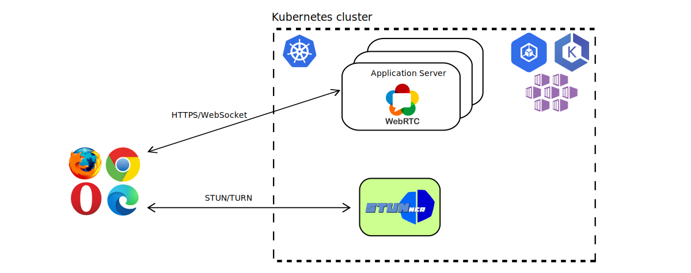
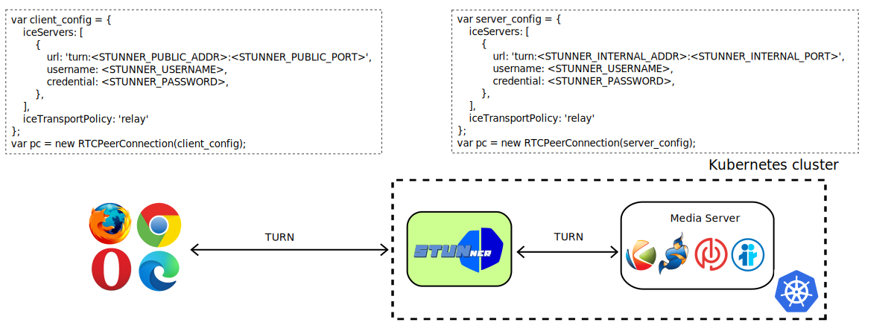

# Deployment models

STUNner supports various deployment models. First, it supports multiple [architectural
models](#architectural-models) where it can act either as a simple headless STUN/TURN server or a
fully fledged ingress gateway in front of an entire Kubernetes-based media server pool. Second,
when STUNner is configured as an ingress gateway then there are multiple [ICE models](#ice-models),
based on whether only the client connects via STUNner or both clients and media servers use STUNner
to set up the media-plane connection. Third, STUNner can run in one of two [control plane
models](#control-plane-models), based on whether the user manually supplies STUNner configuration or
there is a separate STUNner control plane that automatically reconciles the dataplane state based
on a high-level [declarative API](https://gateway-api.sigs.k8s.io).

## Architectural models

STUNner supports two architectural models, depending on whether it is used as a simple STUN/TURN
service or it is functioning as an actual ingress gateway service to feed traffic into a media
server pool deployed *behind* STUNner.

### Headless deployment model

In the *headless deployment model* STUNner acts as a simple scalable STUN/TURN server that WebRTC
clients can use as a NAT traversal facility for establishing media connections between
themselves. This is not that much different from a standard public STUN/TURN server setup, but in
this case the STUN/TURN servers are deployed into Kubernetes.

Note that for STUNner to be able to connect two or more WebRTC clients in the headless model *all*
the clients *must* use STUNner as the TURN server. This is because STUNner opens the transport
relay connections *inside* the cluster, on a private IP address, and this address is reachable only
to STUNner itself, but not for external STUN/TURN servers.

### Media-plane deployment model

In the fully fledged *media-plane deployment model*, STUNner implements a STUN/TURN ingress gateway
service that WebRTC clients can use to open a transport relay connection to the media servers
running *inside* the Kubernetes cluster. This makes it possible to deploy WebRTC application
servers and media servers into ordinary Kubernetes pods, taking advantage of Kubernetes's excellent
tooling to manage, scale, monitor and troubleshoot the WebRTC infrastructure like any other
cloud-bound workload.

There is no limitation as to how many gateway and media server pods can be opened in this model,
which theoretically means limitless scalability. Furthermore, by creating connection-tracking state
for each client session STUNner supports the dynamic scale-out of the media server pool without
dropping active client connections. Whether scaling STUNner itself causes client connection drops
depend on the cloud provider's load-balancer service: if the load-balancer creates conntrack state
for clients' UDP transport streams then STUNner can be scaled freely, otherwise scaling STUNner may
result the [disconnection of a small number of client
connections](https://cilium.io/blog/2020/11/10/cilium-19/#maglev).

#### Asymmetric ICE mode

The standard mode to supply an ICE server configuration for clients and media servers in the
media-plane deployment model of STUNner is the *asymmetric ICE mode*. In this model the client is
configured with STUNner as the TURN server and media servers run with no STUN or TURN servers
whatsoever.

In this model, the client is configured with STUNner as the TURN server so at a certain point in
the ICE conversation it opens a TURN transport relay connection via STUNner. The IP address of the
resultant ICE [relay
candidate](https://developer.mozilla.org/en-US/docs/Web/API/RTCIceCandidate/type) is a private pod
IP address, namely the IP address of the `stunnerd` pod that happens to receive the client
connection. In contrast, servers run without any STUN/TURN server whatsoever, so they generate
[host ICE candidates](https://developer.mozilla.org/en-US/docs/Web/API/RTCIceCandidate/type)
only. Due to servers being deployed into ordinary Kubernetes pods, the server's host candidate will
likewise contain a private pod IP address. Then, since in the Kubernetes networking model ["pods
can communicate with all other pods on any other node without a
NAT"](https://kubernetes.io/docs/concepts/services-networking), the clients relay candidate and the
servers' host candidate will have direct connectivity in the Kubernetes private container network
and the ICE connectivity check will succeed. See more explanation
[here](examples/kurento-one2one-call/README.md#what-is-going-on-here).

A word of warning here: when using STUNner refrain from configuring additional public STUN/TURN
servers, apart from STUNner itself. The rules to follow in setting the [ICE server
configuration](https://github.com/l7mp/stunner#configuring-webrtc-clients) in asymmetric ICE mode are as below:

- on the client, set STUNner as the *only* TURN server and configure *no* STUN servers, whereas
- on the server do *not* configure *any* STUN or TURN servers at all.

Note that deviating from the above rules *might* work in certain cases, but may have uncanny and
hard-to-debug side-effects. For instance, configuring clients and servers with public STUN servers
in certain unlucky situations may allow them to connect via server-reflexive ICE candidates,
completely circumventing STUNner. This is on the one hand extremely fragile and, on the other hand,
a security vulnerability; remember, STUNner should be the *only* external access point to your
media plane. It is a good advice to set the `iceTransportPolicy` to `relay` on the clients to avoid
side-effects: this will prevent clients from generating host and server-reflexive ICE candidates,
leaving STUNner as the only option to obtain an ICE candidate from.

#### Symmetric ICE mode

In the symmetric ICE mode both the client and the server obtain an ICE [relay
candidate](https://developer.mozilla.org/en-US/docs/Web/API/RTCIceCandidate/type) from STUNner and
the connection occurs directly via STUNner.

In the symmetric mode the following rules apply for setting the [ICE server
configuration](https://github.com/l7mp/stunner#configuring-webrtc-clients):

- on both the clients and the server set STUNner as the *only* TURN server and configure *no* STUN
  servers, and
- set the `iceTransportPolicy` to `relay` on both sides.

Note that the `iceTransportPolicy: relay` setting is mandatory in this case, otherwise the
connection falls back to the asymmetric mode (this is a consequence of the way [ICE assigns
priorities](https://www.ietf.org/rfc/rfc5245.txt) to different connection types).  Furthermore, it
is a good practice to configure the STUNner TURN URI in the server-side ICE server configuration
with the *internal* IP address and port used by STUNner (i.e., the ClusterIP of the `stunner`
Kubernetes service and the corresponding port), otherwise the server might connect via the external
LoadBalancer IP causing an unnecessary roundtrip.

The symmetric mode means more overhead compared to the asymmetric mode, since STUNner now performs
TURN encapsulation/decapsulation for both sides. However, the symmetric mode comes with certain
operational advantages. Namely, this is the only ICE mode that would allow STUNner to obscure the
internal IP addresses in the ICE candidates from attackers; note that this is not implemented yet,
but feel free to open an issue if [exposing internal IP addresses](SECURITY.md) is blocking
you from adopting STUNner.

## Control plane models

STUNner can run in one of two modes: in the default mode STUNner configuration is controlled by a
*gateway-operator* component based on high-level intent encoded in [Kubernetes Gateway API
resources](https://gateway-api.sigs.k8s.io), while in the *standalone model* the user configures
STUNner manually. The standalone mode provides perfect control over the way STUNner ingests media,
but at the same time it requires users to deal with the subtleties of internal STUNner APIs that
are subject to change between subsequent releases. As of v0.14, STUNner's operator-ful mode is
feature complete and the standalone model is considered obsolete. If still interested,
comprehensive documentation for the standalone can be found [here](OBSOLETE.md), but this mode
is no longer supported.

