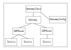

# Reference

The [STUNner gateway operator](https://github.com/l7mp/stunner-gateway-operator) exposes the control plane configuration using the standard [Kubernetes Gateway API](https://gateway-api.sigs.k8s.io). This allows to configure STUNner in the familiar YAML-engineering style via Kubernetes manifests. The below reference gives a quick overview of the Gateway API. Note that STUNner implements only a subset of the full [spec](GATEWAY.md), see [here](https://github.com/l7mp/stunner-gateway-operator#caveats) for a list of the most important simplifications.

## Overview

The main unit of the control plane configuration is the *gateway hierarchy*. Here, a Gateway hierarchy is a collection of [Kubernetes Custom Resources](https://kubernetes.io/docs/concepts/extend-kubernetes/api-extension/custom-resources) that together describe the way media traffic should enter the cluster via STUNner, including public IP addresses and ports clients can use to reach STUNner, TURN credentials, routing rules, etc. The anchor of the gateway hierarchy is the GatewayClass object, and the rest of the resources form a complete hierarchy underneath it.



In general, the scope of a gateway hierarchy is a single namespace, but this is not strictly enforced: e.g., the GatewayClass is [cluster-scoped](https://kubernetes.io/docs/tasks/extend-kubernetes/custom-resources/custom-resource-definitions) so it is outside the namespace, GatewayClasses can refer to GatewayConfigs across namespaces, Routes can attach to Gateways across a namespace boundary (if the Gateway allows this), etc. Still, it is a good practice to keep all control plane configuration, plus the actual dataplane pods, in a single namespace as much as possible.

## GatewayClass

The GatewayClass resource provides the root of the gateway hierarchy. GatewayClass resources are cluster-scoped, so they can be attached to from any namespace, and we usually assume that each namespaced gateway hierarchy will have a separate global GatewayClass as the anchor.

Below is a sample GatewayClass resource. Each GatewayClass must specify a controller that will manage the Gateway objects created under the hierarchy; this must be set to `stunner.l7mp.io/gateway-operator` for the STUNner gateway operator to pick up the GatewayClass. In addition, a GatewayClass can refer to further implementation-specific configuration via a `parametersRef`; in the case of STUNner this will always be a GatewayConfig object (see [below](#gatewayconfig)).

```yaml
apiVersion: gateway.networking.k8s.io/v1alpha2
kind: GatewayClass
metadata:
  name: stunner-gatewayclass
spec:
  controllerName: "stunner.l7mp.io/gateway-operator"
  parametersRef:
    group: "stunner.l7mp.io"
    kind: GatewayConfig
    name: stunner-gatewayconfig
    namespace: stunner
  description: "STUNner is a WebRTC ingress gateway for Kubernetes"
```

Below is a quick reference of the most important fields of the GatewayClass [`spec`](https://kubernetes.io/docs/concepts/overview/working-with-objects/kubernetes-objects)

| Field | Type | Description | Required |
| :--- | :---: | :--- | :---: |
| `controllerName` | `string` | Reference to the controller that is managing the Gateways of this class. The value of this field MUST be specified as `stunner.l7mp.io/gateway-operator`. | Yes |
| `parametersRef` | `object` | Reference to a GatewayConfig resource, identified by the `name` and `namespace`, for general STUNner configuration. The settings `group: "stunner.l7mp.io"` and `kind: GatewayConfig` are default and can be omitted, any other group or kind is an error. | Yes |
| `description` | `string` | Description helps describe a GatewayClass with more details. | No |

## GatewayConfig

The GatewayConfig resource provides general configuration for STUNner, most importantly the STUN/TURN authentication [credentials](AUTH.md) clients can use to connect to STUNner. GatewayClass resources attach a STUNner configuration to the hierarchy by specifying a particular GatewayConfig in the GatewayClass `parametersRef`.  GatewayConfig resources are namespaced, and every hierarchy can contain at most one GatewayConfig. Failing to specify a GatewayConfig is an error because the authentication credentials cannot be learned by the dataplane otherwise.

The following example takes the [STUNner authentication settings](AUTH.md) from the Secret called `stunner-auth-secret` in the `stunner` namespace, sets the authentication realm to `stunner.l7mp.io`, sets the dataplane loglevel to `all:DEBUG,turn:INFO` (this will set all loggers to `DEBUG` level except the TURN protocol machinery's logger which is set to `INFO`), and sets the default URL for metric scraping.

```yaml
apiVersion: stunner.l7mp.io/v1alpha1
kind: GatewayConfig
metadata:
  name: stunner-gatewayconfig
  namespace: stunner
spec:
  logLevel: "all:DEBUG,turn:INFO"
  realm: stunner.l7mp.io
  authRef: 
    name: stunner-auth-secret
    namespace: stunner
  metricsEndpoint: "http://0.0.0.0:8080/metrics"
```

Below is a quick reference of the most important fields of the GatewayConfig [`spec`](https://kubernetes.io/docs/concepts/overview/working-with-objects/kubernetes-objects)

| Field | Type | Description | Required |
| :--- | :---: | :--- | :---: |
| `stunnerConfig` | `string` | The name of the ConfigMap into which the operator renders the `stunnerd` running configuration. Default: `stunnerd-config`. | No |
| `logLevel` | `string` | Logging level for the dataplane daemon pods (`stunnerd`). Default: `all:INFO`. | No |
| `realm` | `string` | The STUN/TURN authentication realm to be used for clients to authenticate with STUNner. The realm must consist of lower case alphanumeric characters or `-` and `-`, and must start and end with an alphanumeric character. Default: `stunner.l7mp.io`. | No |
| `authRef` | `reference` | Reference to a Secret (`namespace` and `name`) that defines the STUN/TURN authentication mechanism and the credentials. | No |
| `authType` | `string` | Type of the STUN/TURN authentication mechanism. Valid only if `authRef` is not set. Default: `static`. | No |
| `username` | `string` | The username for [`static` authentication](AUTH.md). Valid only if `authRef` is not set. | No |
| `password` | `string` | The password for [`static` authentication](AUTH.md). Valid only if `authRef` is not set. | No |
| `sharedSecret` | `string` | The shared secret for [`ephemeral` authentication](AUTH.md). Valid only if `authRef` is not set. | No |
| `metricsEndpoint` | `string` | The metrics server (Prometheus) endpoint URL for the `stunnerd` pods.| No |
| `healthCheckEndpoint` | `string` | HTTP health-check endpoint exposed by `stunnerd`. Liveness check will be available on path `/live` and readiness check on path `/ready`. Default is to enable health-checking on `http://0.0.0.0:8086/ready` and `http://0.0.0.0:8086/live`, use an empty string to disable.| No |
| `authLifetime` | `int` | The lifetime of [`ephemeral` authentication](AUTH.md) credentials in seconds. Not used by STUNner.| No |
| `loadBalancerServiceAnnotations` | `map[string]string` | A list of annotations that will go into the LoadBalancer services created automatically by STUNner to obtain a public IP addresses. See more detail [here](https://github.com/l7mp/stunner/issues/32). | No |

> **Warning**  
At least a valid username/password pair *must* be supplied for `static` authentication, or a `sharedSecret` for the `ephemeral` mode, either via an external Secret or inline in the GatewayConfig. External authentication settings override inline settings. Missing both is an error.

Except the TURN authentication realm, all GatewayConfig resources are safe for modification. That is, the `stunnerd` daemons know how to reconcile a change in the GatewayConfig without restarting listeners/TURN servers. Changing the realm, however, induces a *full* TURN server restart (see below).

## Gateway

Gateways describe the STUN/TURN server listeners exposed to clients.

The below Gateway will configure STUNner to open a STUN/TURN listener on the UDP port 3478 and automatically expose it on a public IP address and port by creating a [LoadBalancer service](https://kubernetes.io/docs/concepts/services-networking/service/#loadbalancer). The name and namespace of the automatically provisioned service are the same as those of the Gateway, and the service is automatically updated if the Gateway changes (e.g., a port changes).

```yaml
apiVersion: gateway.networking.k8s.io/v1alpha2
kind: Gateway
metadata:
  name: udp-gateway
  namespace: stunner
spec:
  gatewayClassName: stunner-gatewayclass
  listeners:
    - name: udp-listener
      port: 3478
      protocol: UDP
```

The below more complex example defines two TURN listeners: a UDP listener at port 3478 that accepts routes from any namespace, and a TLS/TCP listener at port 443 that accepts routes from all namespaces labeled as `app:dev`.

```yaml
apiVersion: gateway.networking.k8s.io/v1alpha2
kind: Gateway
metadata:
  name: complex-gateway
  namespace: stunner
  annotations:
    stunner.l7mp.io/service-type: NodePort
    stunner.l7mp.io/enable-mixed-protocol-lb: true
    service.beta.kubernetes.io/do-loadbalancer-healthcheck-port: "8086"
    service.beta.kubernetes.io/do-loadbalancer-healthcheck-protocol: "http"
    service.beta.kubernetes.io/do-loadbalancer-healthcheck-path: "/live"
spec:
  gatewayClassName: stunner-gatewayclass
  listeners:
    - name: udp-listener
      port: 3478
      protocol: UDP
      allowedRoutes:
        namespaces:
          from: All
    - name: tls-listener
      port: 443
      protocol: TLS
      tls:
        mode: Terminate
        certificateRefs:
          - kind: Secret
            namespace: stunner
            name: tls-secret
      allowedRoutes:
        namespaces:
          from: Selector
          selector:
            matchLabels:
              app: dev
```

Below is a quick reference of the most important fields of the Gateway [`spec`](https://kubernetes.io/docs/concepts/overview/working-with-objects/kubernetes-objects).

| Field | Type | Description | Required |
| :--- | :---: | :--- | :---: |
| `gatewayClassName` | `string` | The name of the GatewayClass that provides the root of the hierarchy the Gateway is attached to. | Yes |
| `listeners` | `list` | The list of TURN listeners. | Yes |
| `addresses` | `list` | The list of manually hinted external IP addresses for the rendered service (only the first one is used). | No |

Each TURN `listener` is defined by a unique name, a transport protocol and a port. In addition, a
`tls` configuration is required for TLS and DTLS listeners.

| Field | Type | Description | Required |
| :--- | :---: | :--- | :---: |
| `name` | `string` | Name of the TURN listener. | Yes |
| `port` | `int` | Network port for the TURN listener. | Yes |
| `protocol` | `string` | Transport protocol for the TURN listener. Either UDP, TCP, TLS or DTLS. | Yes |
| `tls` | `object` | [TLS configuration](https://gateway-api.sigs.k8s.io/references/spec/#gateway.networking.k8s.io%2fv1beta1.GatewayTLSConfig).| Yes (for TLS/DTLS) |
| `allowedRoutes.from` | `object` | [Route attachment policy](https://gateway-api.sigs.k8s.io/references/spec/#gateway.networking.k8s.io/v1beta1.AllowedRoutes), either `All`, `Selector`, or `Same` (default is `Same`) | No | 

For TLS/DTLS listeners, `tls.mode` must be set to `Terminate` or omitted (`Passthrough` does not make sense for TURN), and `tls.certificateRefs` must be a [reference to a Kubernetes Secret](https://gateway-api.sigs.k8s.io/references/spec/#gateway.networking.k8s.io%2fv1beta1.GatewayTLSConfig) of type `tls` or `opaque` with exactly two keys: `tls.crt` must hold the TLS PEM certificate and `tls.key` must hold the TLS PEM key.

STUNner will automatically generate a Kubernetes LoadBalancer service to expose each Gateway to
clients. All TURN listeners specified in the Gateway are wrapped by a single Service and will be
assigned a single externally reachable IP address. If you want multiple TURN listeners on different
public IPs, create multiple Gateways. TURN listeners on UDP and DTLS protocols are exposed as UDP
services, TCP and TLS listeners are exposed as TCP.

Manually hinted external address describes an address that can be bound to a Gateway. It is defined by an address type and an address value. Note that only the first address is used. Setting the `spec.addresses` field in the Gateway, will result in the rendered Service's [loadBalancerIP](https://kubernetes.io/docs/reference/generated/kubernetes-api/v1.27/#service-v1-core:~:text=non%20%27LoadBalancer%27%20type.-,loadBalancerIP,-string) and [externalIPs](https://kubernetes.io/docs/reference/generated/kubernetes-api/v1.27/#service-v1-core:~:text=and%2Dservice%2Dproxies-,externalIPs,-string%20array) fields to be set.
> **Warning**  
Since Kubernetes v1.24 the `loadBalancerIP` field is deprecated, thus will be ignored if the cloud-provider or your Kubernetes install does not support the feature. Also the `externalIPs` field is denied by some cloud-providers and will fail the resource creation. Be thorough when using this feature.

| Field | Type | Description | Required |
| :--- | :---: | :--- | :---: |
| `type` | `string` | Type of the address. Currently we only support IPAddress. | Yes |
| `value` | `string` | Address that should be bound to the Gateway's service. | Yes |

Mixed multi-protocol Gateways are supported: this means if you want to expose a UDP and a TCP port on the same LoadBalancer service you can do it with a single Gateway. By default, the STUNner gateway-operator disables the use of mixed-protocol LBs for compatibility reasons. However, it can be enabled by annotating a Gateway with the `stunner.l7mp.io/enable-mixed-protocol-lb: true` key-value pair. The below Gateway will expose both ports with their respective protocols.

```yaml
apiVersion: gateway.networking.k8s.io/v1alpha2
kind: Gateway
metadata:
  name: mixed-protocol-gateway
  annotations:
    stunner.l7mp.io/enable-mixed-protocol-lb: true
spec:
  gatewayClassName: stunner-gatewayclass
  listeners:
    - name: udp-listener
      port: 3478
      protocol: UDP
    - name: tcp-listener
      port: 3479
      protocol: TCP
```

> **Warning**  
> Note that the mixed-protocol LB feature might not be supported in your Kubernetes version.

STUNner implements two ways to customize the automatically created Service, both involving setting certain [annotations](https://kubernetes.io/docs/concepts/overview/working-with-objects/annotations) to the Service. First, if any annotation is set in the GatewayConfig `loadBalancerServiceAnnotations` object then those will be copied verbatim into the Service. Note that `loadBalancerServiceAnnotations` affect *all* LoadBalancer Services created by STUNner. Second, Service annotations can be customized on a per-Gateway basis as well by adding the annotations to Gateway resources. STUNner then copies all annotations from the Gateway verbatim into the Service, overwriting the annotations specified in the GatewayConfig on conflict. This is useful to, e.g., specify health-check settings for the Kubernetes load-balancer controller. The special annotation `stunner.l7mp.io/service-type` can be used to customize the type of the Service created by STUNner. Value can be either `ClusterIP`, `NodePort`, or `LoadBalancer` (this is the default); for instance, setting `stunner.l7mp.io/service-type: ClusterIP` will prevent STUNner from exposing a Gateway publicly (useful for testing).

> **Warning**  
Gateway resources are *not* safe for modification. This means that certain changes to a Gateway will restart the underlying TURN server listener, causing all active client sessions to terminate.  The particular rules are as follows:
> - adding or removing a listener will start/stop *only* the TURN server to be started/stopped, without affecting the rest of the listeners;
> - changing the transport protocol, port or TLS keys/certs of an *existing* listener will restart the TURN listener but leave the rest of the listeners intact;
> - changing the TURN authentication realm will restart *all* TURN listeners.

## UDPRoute

UDPRoute resources can be attached to Gateways in order to specify the backend services permitted to be reached via the Gateway. Multiple UDPRoutes can attach to the same Gateway, and each UDPRoute can specify multiple backend services; in this case access to *all* backends in *each* of the attached UDPRoutes is allowed. An UDPRoute can be attached only to a Gateway in any namespace by setting the `parentRef` to the Gateway's name and namespace. This is, however, contingent on whether the Gateway accepts routes from the given namespace: customize the `allowedRoutes` for each Gateway listener to control which namespaces the listener accepts routes from.

The below UDPRoute will configure STUNner to route client connections received on the Gateway called `udp-gateway` to the media server pool identified by the Kubernetes service `media-server-pool` in the `media-plane` namespace.

```yaml
apiVersion: gateway.networking.k8s.io/v1alpha2
kind: UDPRoute
metadata:
  name: media-plane-route
  namespace: stunner
spec:
  parentRefs:
    - name: udp-gateway
  rules:
    - backendRefs:
        - name: media-server-pool
          namespace: media-plane
```

Below is a quick reference of the most important fields of the UDPRoute [`spec`](https://kubernetes.io/docs/concepts/overview/working-with-objects/kubernetes-objects).

| Field | Type | Description | Required |
| :--- | :---: | :--- | :---: |
| `parentRefs` | `list` | Name/namespace of the Gateways to attach the route to. If no namespace is given, then the Gateway will be searched in the UDPRoute's namespace. | Yes |
| `rules.backendRefs` | `list` | A list of `name`/`namespace` pairs specifying the backend Service(s) reachable through the UDPRoute. It is allowed to specify a service from a namespace other than the UDPRoute's own namespace. | No |

UDPRoute resources are safe for modification: `stunnerd` knows how to reconcile modified routes without restarting any listeners/TURN servers.

## StaticService

When the target backend of a UDPRoute is running *inside* Kubernetes then the backend is always a proper Kubernetes Service. However, when the target is deployed *outside* Kubernetes then there is no Kubernetes Service that could be configured as a backend. This is particularly important when STUNner is used as a public TURN service. The StaticService resource provides a way to assign a routable IP address range to a UDPRoute for these cases.

The below StaticService represents a hypothetical Kubernetes Service backing a set of pods with IP
addresses in the range `192.0.2.0/24` or `198.51.100.0/24`.

```yaml
apiVersion: stunner.l7mp.io/v1alpha1
kind: StaticService
metadata:
  name: static-svc
  namespace: stunner
spec:
  prefixes:
    - "192.0.2.0/24"
    - "198.51.100.0/24"
```

Assigning this StaticService to a UDPRoute will make sure allows access to *any* IP address in the specified ranges.

```yaml
apiVersion: gateway.networking.k8s.io/v1alpha2
kind: UDPRoute
metadata:
  name: media-plane-route
  namespace: stunner
spec:
  parentRefs:
    - name: udp-gateway
  rules:
    - backendRefs:
        - group: stunner.l7mp.io
          kind: StaticService
          name: static-svc
```

The StaticService `spec.prefixes` must be a list of proper IPv4 prefixes: any IP address in any of the listed prefixes will be whitelisted. Use the single prefix `0.0.0.0/0` to provide wildcard access via an UDPRoute.

> **Warning**  
Never use StaticServices to access Services running *inside* Kubernetes, this may open up an unintended backdoor to your cluster. Use StaticServices only with *external* target backends.

## Status

Most Kubernetes resources contain a `status` subresource that describes the current state of the resource, supplied and updated by the Kubernetes system and its components. The Kubernetes control plane continually and actively manages every object's actual state to match the desired state you supplied and updates the status field to indicate whether any error was encountered during the reconciliation process.

If you are not sure about whether the STUNner gateway operator successfully picked up your Gateways or UDPRoutes, it is worth checking the status to see what went wrong.

```console
kubectl get <resource> -n <namespace> <name> -o jsonpath='{.status}'
```

