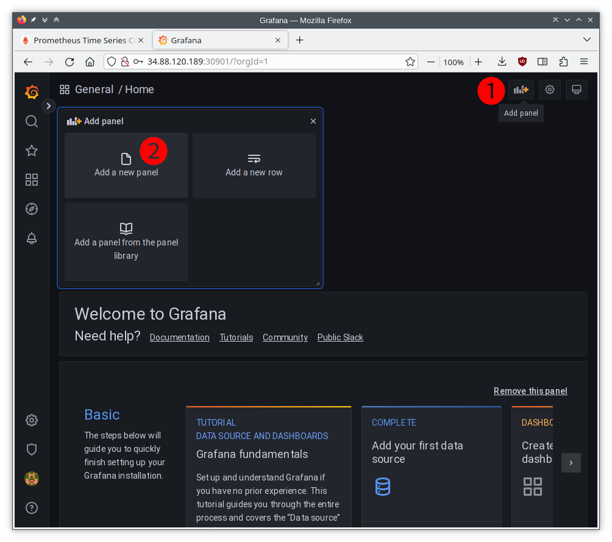
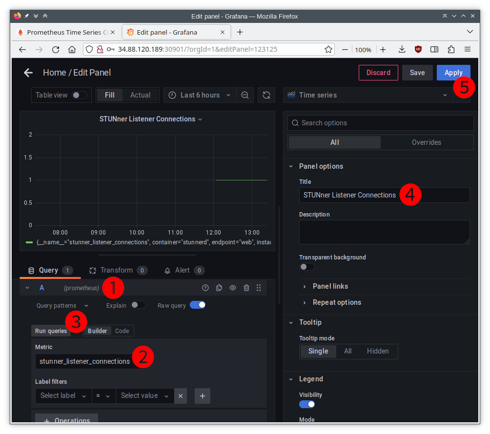
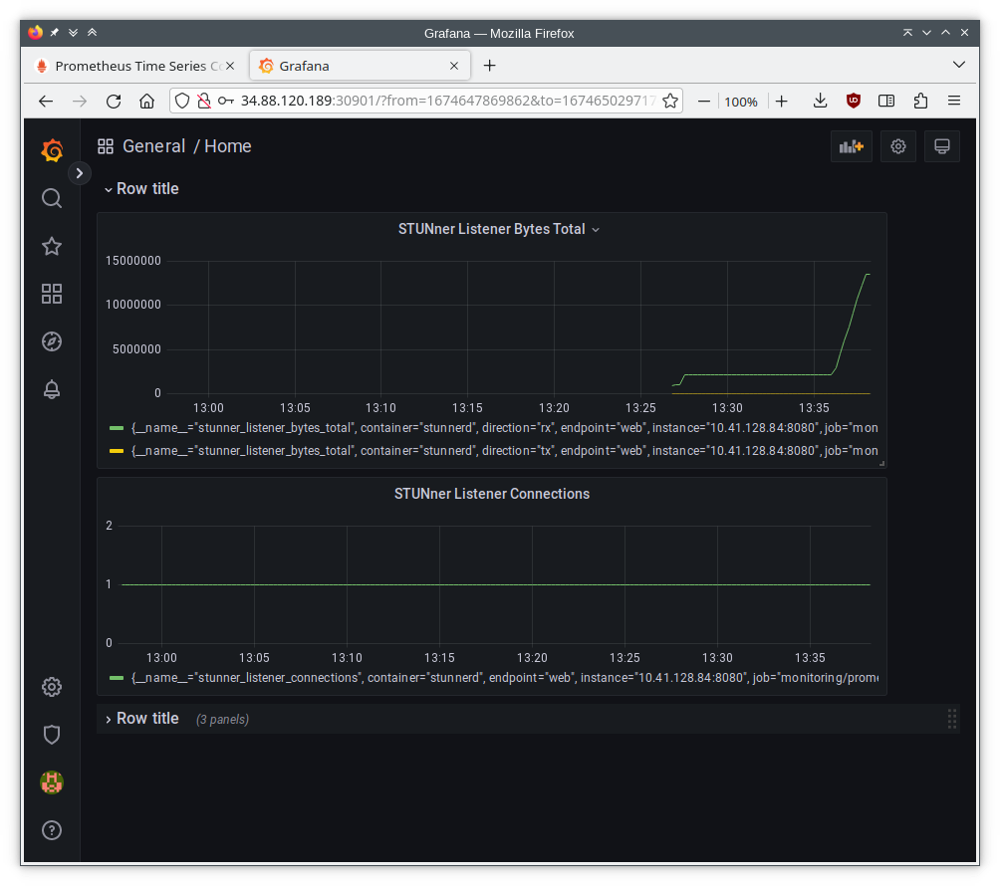
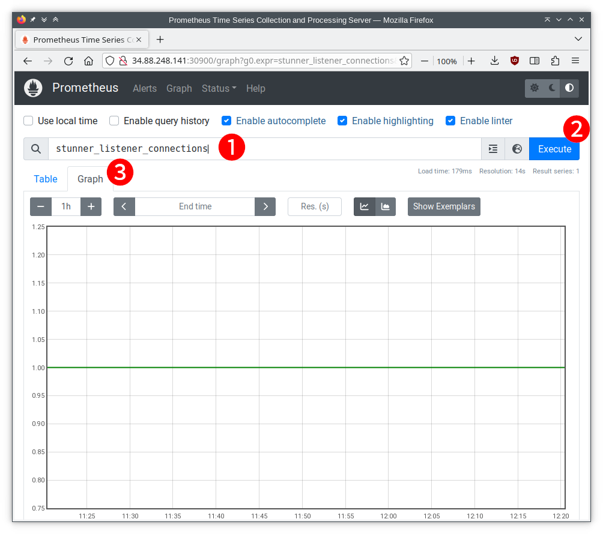
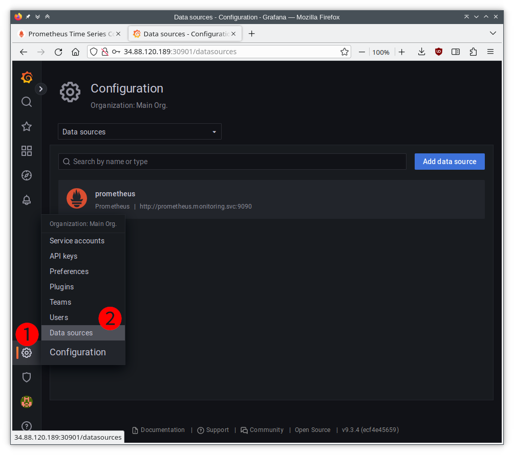
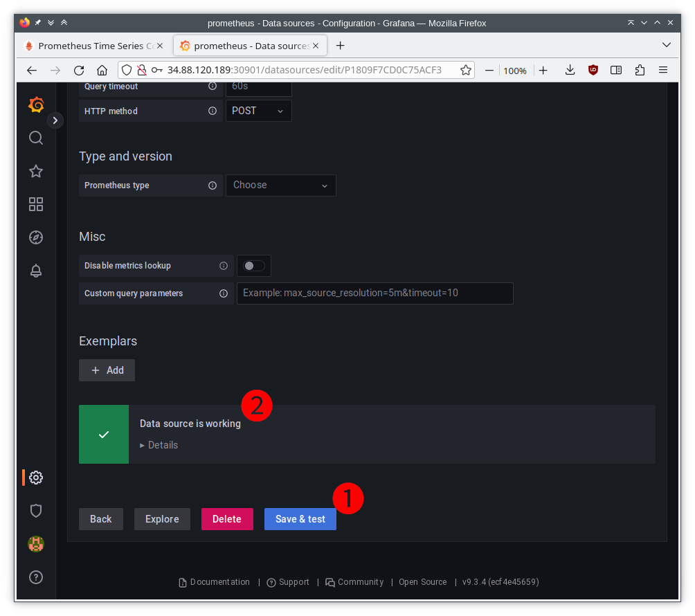

# Monitoring

STUNner can export various statistics into an external timeseries database like
[Prometheus](https://prometheus.io). This allows one to observe the state of the STUNner media
gateway instances, like CPU or memory use, as well as the amount of data received and sent, in
quasi-real-time. These statistics can then be presented to the operator in easy-to-use monitoring
dashboards in [Grafana](https://grafana.com).

## Configuration

Metrics collection is *not* enabled in the default installation. In order to open the
metrics-collection endpoint for a [gateway hierarchy](GATEWAY.md#overview), configure an
appropriate HTTP URL in the `metricsEndpoint` field of corresponding the
[GatewayConfig](GATEWAY.md#gatewayconfig) resource.

For instance, the below GatewayConfig will expose the metrics-collection server on the URL
`http://:8080/metrics` in all the STUNner media gateway instances of the current gateway hierarchy.

```yaml
apiVersion: stunner.l7mp.io/v1alpha1
kind: GatewayConfig
metadata:
  name: stunner-gatewayconfig
  namespace: stunner
spec:
  userName: "my-user"
  password: "my-password"
  metricsEndpoint: "http://:8080/metrics"
```

## Metrics

STUNner exports two types of metrics: the *Go collector metrics* describe the state of the Go
runtime, while the *Connection statistics* expose traffic monitoring data.

### Go collector metrics

Each STUNner gateway instance exports a number of standard metrics that describe the state of the
current Go process runtime. Some notable metrics as listed below, see more in the
[documentation](https://github.com/prometheus/client_golang).

| Metric | Description |
| :--- | :--- |
| `process_cpu_seconds_total` | Total user and system CPU time spent in seconds.|
| `go_memstats_alloc_bytes` | Number of bytes allocated and still in use. |
| `go_goroutines` | Number of goroutines that currently exist. |
| `go_threads`  | Number of OS threads created. |
| `process_open_fds` | Number of open file descriptors.|
| `process_virtual_memory_bytes` | Virtual memory size in bytes. |

### Connection statistics

STUNner provides deep visibility into the amount of traffic sent and received on each listener
(downstream connections) and cluster (upstream connections). The particular metrics are as follows.

| Metric | Description | Type | Labels |
| :--- | :--- | :--- | :--- |
| `stunner_listener_connections` | Number of *active* downstream connections at a listener. | gauge | `name=<listener-name>` |
| `stunner_listener_connections_total` | Number of downstream connections at a listener. | counter | `name=<listener-name>` |
| `stunner_listener_packets_total` | Number of datagrams sent or received at a listener. Unreliable for listeners running on a connection-oriented a protocol (TCP/TLS).  | counter | `direction=<rx\|tx>`, `name=<listener-name>`|
| `stunner_listener_bytes_total` | Number of bytes sent or received at a listener. | counter | `direction=<rx\|tx>`, `name=<listener-name>` |
| `stunner_cluster_connections` | Number of *active* upstream connections on behalf of a listener. | gauge | `name=<listener-name>` |
| `stunner_cluster_connections_total` | Number of upstream connections on behalf of a listener. | counter | `name=<listener-name>` |
| `stunner_cluster_packets_total` | Number of datagrams sent to backends or received from backends on behalf of a listener.  Unreliable for clusters running on a connection-oriented a protocol (TCP/TLS).| counter | `direction=<rx\|tx>`, `name=<listener-name>` |
| `stunner_cluster_bytes_total` | Number of bytes sent to backends or received from backends on behalf of a listener. | counter | `direction=<rx\|tx>`, `name=<listener-name>` |

## Integration with Prometheus and Grafana

Collection and visualization of STUNner relies on Prometheus and Grafana services. The STUNer helm repository provides a ready-to-use Prometheus and Grafana stack. See [Installation](#installation) for installation steps. Metrics visualization requires user input on configuring the plots. Refer to [Configuration and Usage](#configuration-and-usage) for details.

### Installation

A full-fledged Prometheus+Grafana helm chart is available in the STUNner helm repo. To use this chart, the installation steps involve enabling monitoring in STUNner, and installing the Prometheus+Grafana stack with helm.

1. **Configure STUNner to expose the metrics**

- Deploy STUNner with monitoring enabled to enable the monitoring port of STUNner pods
```console
helm install stunner stunner/stunner --create-namespace --namespace=stunner --set stunner.deployment.monitoring.enabled=true
```

- [Expose the STUNner metrics-collection server in the GatewayConfig](#configuration)

2. **Install the Prometheus+Grafana stack with a helm chart**

This helm chart creates a ready-to-use Prometheus+Grafana stack in the `monitoring` namespace: installs Prometheus along with the prometheus-operator, and Grafana; configures PodMonitor for monitoring STUNner pods, and sets up Prometheus as a datasource for Grafana.

```console
helm repo add stunner https://l7mp.io/stunner
helm repo update

helm install prometheus stunner/stunner-prometheus
```


### Configuration and Usage

The helm chart deploys a ready-to-use Prometheus and Grafana stack, but leaves the Grafana dashboard empty to let the user pick metrics and configure their visualization. An interactive way to visualize STUNner metrics is to use the Grafana dashboard.

#### Access the Grafana dashboard

To open the Grafana dashboard navigate a web browser to `grafana` NodePort service IP and port 80.

The default username is **admin** with the password **admin**.

At the first login you can change the password or leave as it is (use the *Skip* button).

#### Visualize STUNner metrics

As an example, let us plot the STUNner metric `stunner_listener_connections`. First step is to create a new panel, then to configure the plot parameters.

Click on *Add panel* (1), then *Add a new panel* (2):



The *Add a new panel* will open the panel configuration. The configuration steps are the following.

1. Set the datasource: **prometheus**
2. Choose a metric. In this example, this is the `stunner_listener_connections`.
3. Click on *Run queries* (this will update the figure)
4. Fine-tune plot parameters. For example, set the title.
5. Click *Apply*



The expected outcome is a new panel on the dashboard showing the `stunner_listener_connections` metric.

Below is an example dashboard with data collected from the [simple-tunnel](examples/simple-tunnel/README.md) example:




### Troubleshooting

Prometheus and Grafana both provide a dashboard to troubleshoot a running system, and to check the flow of metrics from STUNner to Prometheus, and from Prometheus to Grafana.

### Check Prometheus operations via its dashboard
The Prometheus dashboard is available as the `prometheus` NodePort service (use the node IP and node port to connect with a web browser).

The dashboard enables checking running Prometheus configuration and testing the metrics collection.

For example, to observe the `stunner_listener_connections` metric on the Prometheus dashboard:

1. Write `stunner_listener_connections` to the marked field (next to the looking glass icon)
2. Click on the `Execute` button
3. Switch to `Graph` view tab.



Note: some STUNner metrics are not available when they are inactive (e.g., there is no active cluster).

#### Check Prometheus data source in Grafana

To configure/check the Prometheus data source in Grafana, first click on *Configuration* (1), then *Data sources* (2), as shown here:



This will open up the datasources page. Scroll down to the bottom, click button *Save & test* (1), and observe the datasource is working (2):


