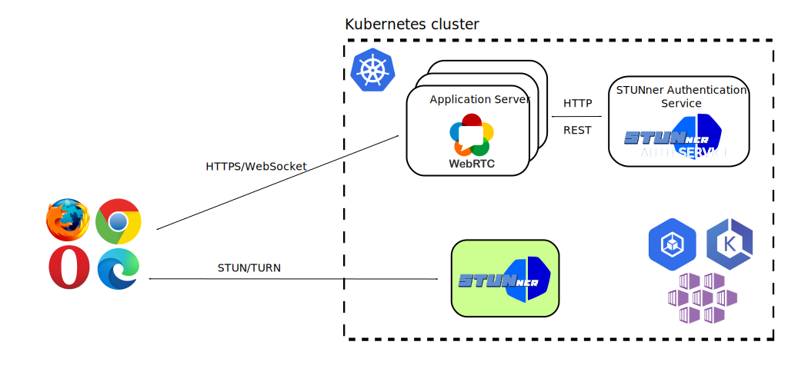
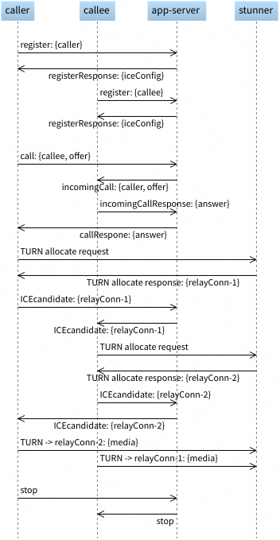

# STUNner Tutorial

## Headless deployment: Direct one to one video call via STUNner

This tutorial showcases the *headless deployment model* of STUNner, that is, when WebRTC clients
connect to each other directly via STUNner, without going through a media server.

In this demo you will learn how to:

- integrate a typical WebRTC application server with STUNner,
- configure STUNner as a headless STUN/TURN server,
- use the STUNner authentication service to generate valid ICE configurations for clients, and
- test STUNner from a browser with live video traffic.

## Installation

### Prerequisites

The tutorial assumes a fresh STUNner installation; see the [STUNner installation and configuration
guide](../../INSTALL.md). Create a namespace called `stunner` if there is none. You need a
WebRTC-compatible browser to run this tutorial. Basically any modern browser will do; we usually
test our WebRTC applications with Firefox.

### Setup

The tutorial has been adopted from the [Kurento](https://www.kurento.org/) [one-to-one video call
tutorial](https://doc-kurento.readthedocs.io/en/latest/tutorials/node/tutorial-one2one.html), but
we have [dropped the media
server](https://github.com/l7mp/kurento-tutorial-node/tree/master/direct-one2one-call) so that
clients will connect to each other directly via STUNner. We will deploy a
[Node.js](https://nodejs.org) application server into Kubernetes: this will serve the main HTML
page with the embedded video viewports and download the client-side JavaScript code to the
browsers.



Note that transcoding/transsizing and other media server goodies are not available in this setup:
the clients must be fully compatible to be able to establish an audio/video session in this
case. Consult the [one to one video call with Kurento](../kurento-one2one-call) tutorial to
learn how to set up a fully-fledged media server behind STUNner.

### Application server

The application server implements a simple JSON/WebSocket API two browser clients can call to
establish a two-party call.  The caller and the callee will connect to each other via STUNner as
the TURN server, without the mediation of a media server.

As the first step, each client registers a unique username with the application server by sending a
`register` message, which the server acknowledges in a `registerResponse` message. To start a call,
the caller sets up a [WebRTC
PeerConnection](https://developer.mozilla.org/en-US/docs/Web/API/RTCPeerConnection), generates an
SDP Offer, and sends it along to the application server in a `call` message. The application server
forwards the SDP Offer to the callee in an `incomingCall` message. If accepting the call, the
callee sets up a WebRTC PeerConnection, generates an SDP Answer, and returns it in an
`incomingCallResponse` message to the application server. The SDP Answer is then forwarded back to
the caller in a `callResponse` message. Meanwhile, the caller and the callee exchange ICE
candidates in the background. Once the ICE process connects, the caller and the callee start to
exchange audio/video frames via STUNner until one of the parties sends a `stop` message to the
application server to terminate the call.

In order start the ICE conversation using STUNner as the STUN/TURN server, the browsers will need
to learn an ICE server configuration from the application server with STUNner's external IP
addresses/ports and the required STUN/TURN credentials. This must happen *before* the
PeerConnection is created in the clients: once the PeerConnection is running we can no longer
change the ICE configuration.

We solve this problem by (1) generating a new ICE configuration every time a new client registers
with the application server and (2) sending the ICE configuration back to the client in the
`regiterResponse` message. Note that this choice is suboptimal for time-locked STUNner
authentication modes (i.e., the `ephemeral` mode, see below), because clients' STUN/TURN
credentials might expire by the time they decide to connect. It is up to the application server
developer to make sure that clients' ICE server configuration is periodically updated.

The default STUNner [install](/doc/INSTALL.md) contains a utility called the [STUNner
authentication service](https://github.com/l7mp/stunner-auth-service) that is purposed specifically
to generate ICE configurations for the application server. The service watches the running STUNner
configuration(s) from the Kubernetes API server and makes sure to generate STUN/TURN credentials
and ICE server configuration from the most recent STUNner config.

The full application server code can be found
[here](https://github.com/l7mp/kurento-tutorial-node/tree/master/direct-one2one-call); below we
summarize the most important steps needed to call the STUNner authentication service in the
application to generate an ICE config for each client.

1. Define the address and the port of the STUNner authentication service as environment variables
   for the application server pod. This will allow the application server to query the STUNner
   authentication server for TURN credentials. By default, the authentication service is available
   at the address `stunner-auth.stunner-system.svc.cluster.local` on port TCP 8088 over HTTP, these
   defaults can be overridden using the `STUNNER_AUTH_ADDR` and `STUNNER_AUTH_PORT` environment
   variables. The ICE configuration returned by the auth service will contain an URI for each
   public STUNner Gateway: you can filter on particular Kubernetes namespaces, gateways or gateway
   listeners by the `STUNNER_NAMESPACE`, `STUNNER_GATEWAY` and `STUNNER_LISTENER` environment
   variables. Since WebRTC media will be ingested into he cluster over the UDP listener called
   `udp-listener` on the STUNner Gateway called `udp-gateway` deployed into the `stunner`
   namespace, the Kubernetes manifest for the application server will look like the below.

   ```yaml
   apiVersion: apps/v1
   kind: Deployment
   metadata:
     name: webrtc-server
   [...]
   spec:
     [...]
     template:
       spec:
         containers:
         - name: webrtc-server
           image: l7mp/direct-one2one-call-server
           command: ["npm"]
           args: ["start", "--", "--as_uri=https://0.0.0.0:8443"]
           env:
           - name: STUNNER_AUTH_ADDR
             value: "stunner-auth.stunner-system.svc.cluster.local"
           - name: STUNNER_AUTH_PORT
             value: "8088"
           - name: STUNNER_NAMESPACE
             value: "stunner"
           - name: STUNNER_GATEWAY
             value: "udp-gateway"
           - name: STUNNER_LISTENER
             value: "udp-listener"
   [...]
   ```

1. Modify the application server code to query the STUNner authentication server every time a a
   valid ICE config in needed. In particular, the code will return the ICE configuration before
   returning a `registerResponse` to the client, so that the generated ICE configuration can be
   piggy-backed on the response message.

   ```js
   function register(id, name, ws, callback) {
     [...]
     try {
        let options = {
          host: process.env.STUNNER_AUTH_ADDR,
          port: process.env.STUNNER_AUTH_PORT,
          method: 'GET',
          path: url.format({
            pathname: '/ice',
            query: {
              service: "turn",
              username: name,
              iceTransportPolicy: "relay",
              namespace: process.env.STUNNER_NAMESPACE,
              gateway: process.env.STUNNER_GATEWAY,
              listener: process.env.STUNNER_LISTENER,
            },
          }),
        };
        var request_data = http.request(options, function (res) {
            var response = '';
            res.on('data', function (chunk) {
                response += chunk;
            });
            res.on('end', function () {
                iceConfData += response;
                const iceConfiguration = JSON.parse(iceConfData);
                ws.send(JSON.stringify({id: 'registerResponse', response: 'accepted', iceConfiguration: iceConfiguration}));
            });
       }
     }
     [...]
   }
   ```

1. Next, modify the client-side JavaScript code to parse the ICE configuration received from the
   application server from the `registerResponse` message.

   ```js
   var iceConfiguration;
   
   function resgisterResponse(message) {
     if (message.response == 'accepted') {
       iceConfiguration = message.iceConfiguration;
     }
     [...]
   }
   ```

1. Then, every time the client calls the PeerConnection constructor pass in the stored [ICE
   configuration](https://developer.mozilla.org/en-US/docs/Web/API/RTCIceServer). Note that
   `kurentoUtils.WebRtcPeer.WebRtcPeerSendrecv` is a small wrapper that makes it more convenient to
   create PeerConnections with Kurento.

   ```js
   var options = {
     [...]
     configuration: iceConfiguration,
   }
   
   webRtcPeer = kurentoUtils.WebRtcPeer.WebRtcPeerSendrecv(options, ...);
   ```

Eventually, the call setup process will look like this.



You can build the application server container locally from the tutorial
[repo](https://github.com/l7mp/kurento-tutorial-node/tree/master/direct-one2one-call), or you can
use the below manifest to fire up the prebuilt container image in a single step. This will deploy
the application server into the `stunner` namespace and exposes it in the Kubernetes LoadBalancer
service called `webrtc-server`.

```console
kubectl apply -f docs/examples/direct-one2one-call/direct-one2one-call-server.yaml
```

### STUNner configuration

Next, we deploy STUNner into Kubernetes. The manifest below will set up a minimal STUNner
gateway hierarchy to do just that: the setup includes two Gateway listeners, one at UDP:3478 and
another one at TCP:3478, plus and a UDPRoute.

```console
kubectl apply -f docs/examples/direct-one2one-call/direct-one2one-call-stunner.yaml
```

The most important component in the STUNner configuration is the TURN Gateway: this will expose a
public TURN server on the UDP port 3478 through which clients will connect to each other.

```yaml
apiVersion: gateway.networking.k8s.io/v1alpha2
kind: Gateway
metadata:
  name: udp-gateway
  namespace: stunner
spec:
  gatewayClassName: stunner-gatewayclass
  listeners:
    - name: udp-listener
      port: 3478
      protocol: UDP
```

For later convenience we also create a TCP Gateway that runs on port TCP:3478.

In order to realize the headless deployment model, we set STUNner's own service as the backend in
the UDPRoute. This way, STUNner will loop back client connections to itself. The rest, that is,
cross-connecting the clients' media streams between each other, is just pure TURN magic.

Here is the corresponding UDPRoute. Note that the route attaches itself to both the UDP and the TCP
Gateway, so no matter on which gateway the client connects via our UDPRoute will apply.

```yaml
apiVersion: gateway.networking.k8s.io/v1alpha2
kind: UDPRoute
metadata:
  name: stunner-headless
  namespace: stunner
spec:
  parentRefs:
    - name: udp-gateway
    - name: tcp-gateway
  rules:
    - backendRefs:
        - name: stunner
          namespace: stunner
```

Note that the `stunner/stunner` service should exist for this to work. The manifest conveniently creates it, but
if you're doing things manually here is how to create the target service.

```console
kubectl expose deployment -n stunner stunner --port 3478 --protocol UDP
```

### Check your configuration

Check whether you have all the necessary objects installed into the `stunner` namespace.

```console
kubectl get gatewayconfigs,gateways,udproutes -n stunner
NAME                                                  REALM             AUTH        AGE
gatewayconfig.stunner.l7mp.io/stunner-gatewayconfig   stunner.l7mp.io   plaintext   4s

NAME                                            CLASS                  ADDRESS   READY   AGE
gateway.gateway.networking.k8s.io/tcp-gateway   stunner-gatewayclass             True    4s
gateway.gateway.networking.k8s.io/udp-gateway   stunner-gatewayclass             True    4s

NAME                                                  AGE
udproute.gateway.networking.k8s.io/stunner-headless   3s
```

You can also use the handy `stunnerctl` CLI tool to dump the running STUNner configuration.

``` console
cmd/stunnerctl/stunnerctl running-config stunner/stunnerd-config
STUN/TURN authentication type:  static
STUN/TURN username:             user-1
STUN/TURN password:             pass-1
Listener 1
        Name:   udp-listener
        Listener:       udp-listener
        Protocol:       UDP
        Public address: 34.118.82.225
        Public port:    3478
Listener 2
        Name:   tcp-listener
        Listener:       tcp-listener
        Protocol:       TCP
        Public address: 34.118.89.139
        Public port:    3478
```

### Run the test

At this point, everything should be set up to make a video-call from your browser via
STUNner. Learn the external IP address Kubernetes assigned to the LoadBalancer service of the
application server.

``` console
export WEBRTC_SERVER_IP=$(kubectl get service -n stunner webrtc-server -o jsonpath='{.status.loadBalancer.ingress[0].ip}')
```

Then, open `https://${WEBRTC_SERVER_IP}:8443` in your browser, accept the self-signed TLS certificate,
register a user, repeat this process in an another browser window using a different user name, then
call one user from the other and enjoy a nice video-conference with yourself.

### What is going on here?

The HTML page served by the application server contains a handy console port, which allows to track
the call setup process. We use the logs from one of the clients to demonstrate call establishment
with STUNner.

- After registering with the application server, the console should show the content of the
  `registerResponse` message. If all goes well, the response should show the ICE configuration
  returned by the application server. The configuration should contain two TURN URIs for the two
  gateways we have created in STUNner: one with UDP transport and another one with TCP. In
  addition, the authentication credentials and the public IP addresses and ports should match
  those in the output of `stunnerctl`.

  ```js
  {
      "id": "registerResponse",
      "response": "accepted",
      "iceConfiguration": {
          "iceServers": [
              {
                  "url": "turn:34.118.82.225:3478?transport=UDP",
                  "username": "user-1",
                  "credential": "pass-1"
              },
              {
                  "url": "turn:34.118.8.3:3478?transport=TCP",
                  "username": "user-1",
                  "credential": "pass-1"
              }
          ],
          "iceTransportPolicy": "relay"
      }
  }
  ```

- Once configured with the above ICE server configuration, the browser will ask STUNner to open a
  TURN transport relay connection for sending/receiving the media stream and generates a local
  ICE candidate for each relay connection it creates. Note that only TURN-relay candidates are
  generated: host and server-reflexive candidates would not work with STUNner anyway. (This is why
  we set the `iceTransportPolicy` to type `relay` in the ICE server configuration above.)  Locally
  generated ICE candidates are sent by the browser to the application server, which in turn passes
  them over verbatim to the other client.

  ```console
  Sending message: {[...] "candidate:0 1 UDP 91889663 10.116.1.21 36930 typ relay raddr 10.116.1.21 rport 36930" [...]}
  ```

  Observe that the ICE candidate contains a private IP address (`10.116.1.21` in this case) as the
  TURN relay connection address: this just happens to be the IP address of the STUNner pod that
  receives the TURN allocation request from the browser.

- The ICE candidate generated by a client is received by the other client as a remote
  ICE candidate. The process is executed in the other direction as well, so that eventually both
  parties will have a set of local and remote ICE candidates they can probe for connectivity.

  ```console
  Received message: { [...] "candidate:0 1 UDP 91889663 10.116.1.21 36930 typ relay raddr 10.116.1.21 rport 36930" [...]}
  ```

- Once ICE candidates are exchanged, the browsers perform a connectivity check on each
  candidate pair. With STUNner this usually succeeds with the first pair.

After connecting, video starts to flow between the two clients via the UDP/TURN connection opened
on STUNner. Note that browsers can be behind any type of NAT: STUNner makes sure that whatever
aggressive middlebox exists between itself and a client, media traffic will still flow seamlessly.

### Troubleshooting

Like in any sufficiently complex application, there are lots of moving parts in a Kubernetes-based
WebRTC service and many things can go wrong. Below is a list of steps to help debugging STUNner.

* Cannot reach the application server: Make sure that the LoadBalancer IP is reachable and the TCP
  port 8443 is available from your client.
* No ICE candidate appears: Most probably this occurs because the browser's ICE configuration does
  not match the running STUNner config. Check that the ICE configuration returned by the
  application server in the `registerResponse` message matches the output of `stunnerctl
  running-config`. Examine the `stunner` pods' logs (`kubectl logs...`): permission-denied messages
  typically indicate that STUN/TURN authentication was unsuccessful.
* No video-connection: This is most probably due to a communication issue between your client and
  STUNner. Try disabling STUNner's UDP Gateway and force the browser to use TCP.
* Still no connection: follow the excellent [TURN troubleshooting
  guide](https://www.giacomovacca.com/2022/05/troubleshooting-turn.html) to track down the
  issue. Remember: your ultimate friends `tcpdump` and `Wireshark` are always there for you to
  help!

## Clean up

Delete the demo deployment using the below command:

```console
kubectl delete -f docs/examples/direct-one2one-call/direct-one2one-call-server.yaml
kubectl delete -f docs/examples/direct-one2one-call/direct-one2one-call-stunner.yaml
```
