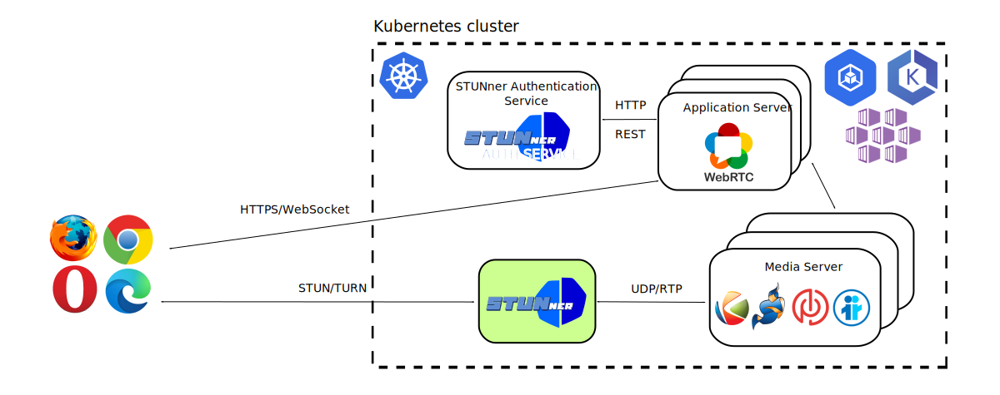

# STUNner Tutorial

## Media-plane mode: One to one video call with Kurento via STUNner

This tutorial demonstrates the *media-plane deployment model* of STUNner, that is, when WebRTC
clients connect to each other via the Kurento media server deployed into Kubernetes. The media
servers are exposed to clients via a STUNner gateway.

In this demo you will learn how to:

- integrate a typical WebRTC application server with STUNner,
- deploy the Kurento media server into Kubernetes,
- use the STUNner authentication service to generate ICE configurations for clients,
- configure STUNner to expose Kurento to clients, and
- update the STUN/TURN credentials used by STUNner to improve security.

## Installation

### Prerequisites

The tutorial assumes a fresh STUNner installation; see the [STUNner installation and configuration
guide](../../INSTALL.md). Create a namespace called `stunner` if there is none. You need a
WebRTC-compatible browser to run this tutorial. Basically any modern browser will do; we usually
test our WebRTC applications with Firefox.

### Setup

The tutorial has been adopted from the [Kurento](https://www.kurento.org/) [one-to-one video call
tutorial](https://doc-kurento.readthedocs.io/en/latest/tutorials/node/tutorial-one2one.html), with
minimal
[modifications](https://github.com/l7mp/kurento-tutorial-node/tree/master/kurento-one2one-call) to
deploy it into Kubernetes and integrate it with STUNner. We will deploy a
[Node.js](https://nodejs.org) application server into Kubernetes for creating a browser-based
two-party WebRTC video-calls, the Kurento media server for media exchange and, potentially,
automatic audio/video transcoding, and configure STUNner to expose the Kurento server pool to
clients.



### Application server

The application server implements a simple JSON/WebSocket API two browser clients can call to
establish a two-party call.  The caller and the callee will connect to each other via STUNner as
the TURN server, using the Kurento media server to mediate audio/video calls.

As the first step, each client registers a unique username with the application server by sending a
`register` message, which the server acknowledges in a `registerResponse` message. To start a call,
the caller sets up a [WebRTC
PeerConnection](https://developer.mozilla.org/en-US/docs/Web/API/RTCPeerConnection), generates an
SDP Offer, and sends it along to the application server in a `call` message. The application server
rings the callee in an `incomingCall` message. If accepting the call, the callee sets up a WebRTC
PeerConnection, generates an SDP Offer and sends it back the application server in an
`incomingCallResponse` message.

At this point the application server has both party's SDP Offer, so the next step is to set up the
media pipeline in Kurento and process the SDP Offers through the media server. This is done by
opening a WebSocket connection to the URI `ws://kms.default.svc.cluster.local:8888/kurento`
(this is set on the server's command line in the Deployment
[manifest](kurento-one2one-call-server.yaml)): here,
`kms.default.svc.cluster.local` is the DNS name assigned by Kubernetes to the `kms` service
(recall, this is the service associated with the media server Deployment) and Kurento listens on
the TCP port 8888 for control connections. Note that this call gets load-balanced through the
Kubernetes CNI's service load-balancer so it will hit one random media server replica (if there are
more). This ensures that new calls are distributed evenly across media servers.

The media server responds with an SDP Answer for both the callee and the caller, which the
application server immediately sends back to the appropriate clients: the caller receives the SDP
Answer in a `callResponse` message while the callee receives it in a `startCommunication`
message. Meanwhile, the caller and the callee generate local ICE candidates and send them over to
the application server, which forwards the candidates to Kurento. Kurento also generates a set of
ICE candidates, these will be passed by the application server to the clients. Note that the media
will flow between the clients and Kurento; the application server is there just to mediate the call
setup. Once the ICE process connects, the caller and the callee start to exchange audio/video
frames with Kurento via STUNner, until one of the parties sends a `stop` message to the application
server to terminate the call. For more info on the application server protocol, consult the
[Kurento
documentation](https://doc-kurento.readthedocs.io/en/latest/tutorials/node/tutorial-one2one.html).

In order to start the ICE conversation using STUNner as the STUN/TURN server, the browsers will
need to learn an ICE server configuration from the application server with STUNner's external IP
addresses/ports and the required STUN/TURN credentials. This must happen *before* the
PeerConnection is created in the clients: once the PeerConnection is running we can no longer
change the ICE configuration.

We solve this problem by (1) generating a new ICE configuration every time a new client registers
with the application server and (2) sending the ICE configuration back to the client in the
`regiterResponse` message. Note that this choice is suboptimal for time-locked STUNner
authentication modes (i.e., the `ephemeral` mode, see below), because clients' STUN/TURN
credentials might expire by the time they decide to connect. It is up to the application server
developer to make sure that clients' ICE server configuration is periodically updated.

The default STUNner [install](/doc/INSTALL.md) contains a utility called the [STUNner
authentication service](https://github.com/l7mp/stunner-auth-service) that is purposed specifically
to generate ICE configurations for the application server. The service watches the running STUNner
configuration(s) from the Kubernetes API server and makes sure to generate STUN/TURN credentials
and ICE server configuration from the most recent STUNner config.

The full application server code can be found
[here](https://github.com/l7mp/kurento-tutorial-node/tree/master/kurento-one2one-call); below we
summarize the most important steps needed to call the STUNner authentication service in the
application to generate an ICE config for each client.

1. Define the address and the port of the STUNner authentication service as environment variables
   for the application server pod. This will allow the application server to query the STUNner
   authentication server for TURN credentials. By default, the authentication service is available
   at the address `stunner-auth.stunner-system.svc.cluster.local` on port TCP 8088 over HTTP, these
   defaults can be overridden using the `STUNNER_AUTH_ADDR` and `STUNNER_AUTH_PORT` environment
   variables. The ICE configuration returned by the auth service will contain an URI for each
   public STUNner Gateway: you can filter on particular Kubernetes namespaces, gateways or gateway
   listeners by the `STUNNER_NAMESPACE`, `STUNNER_GATEWAY` and `STUNNER_LISTENER` environment
   variables. Since WebRTC media will be ingested into he cluster over the UDP listener called
   `udp-listener` on the STUNner Gateway called `udp-gateway` deployed into the `stunner`
   namespace, the Kubernetes manifest for the application server will look like the below.

   ```yaml
   apiVersion: apps/v1
   kind: Deployment
   metadata:
     name: webrtc-server
   [...]
   spec:
     [...]
     template:
       spec:
         containers:
         - name: webrtc-server
           image: l7mp/kurento-one2one-call-server
           command: ["npm"]
           args: ["start", "--", "--as_uri=https://0.0.0.0:8443"]
           env:
           - name: STUNNER_AUTH_ADDR
             value: "stunner-auth.stunner-system.svc.cluster.local"
           - name: STUNNER_AUTH_PORT
             value: "8088"
           - name: STUNNER_NAMESPACE
             value: "stunner"
           - name: STUNNER_GATEWAY
             value: "udp-gateway"
           - name: STUNNER_LISTENER
             value: "udp-listener"
   [...]
   ```

1. Modify the application server code to query the STUNner authentication server every time a a
   valid ICE config in needed. In particular, the code will return the ICE configuration before
   returning a `registerResponse` to the client, so that the generated ICE configuration can be
   piggy-backed on the response message.

   ```js
   function register(id, name, ws, callback) {
     [...]
     try {
        let options = {
          host: process.env.STUNNER_AUTH_ADDR,
          port: process.env.STUNNER_AUTH_PORT,
          method: 'GET',
          path: url.format({
            pathname: '/ice',
            query: {
              service: "turn",
              username: name,
              iceTransportPolicy: "relay",
              namespace: process.env.STUNNER_NAMESPACE,
              gateway: process.env.STUNNER_GATEWAY,
              listener: process.env.STUNNER_LISTENER,
            },
          }),
        };
        var request_data = http.request(options, function (res) {
            var response = '';
            res.on('data', function (chunk) {
                response += chunk;
            });
            res.on('end', function () {
                iceConfData += response;
                const iceConfiguration = JSON.parse(iceConfData);
                ws.send(JSON.stringify({id: 'registerResponse', response: 'accepted', iceConfiguration: iceConfiguration}));
            });
       }
     }
     [...]
   }
   ```

1. Next, modify the [client-side JavaScript
   code](https://github.com/l7mp/kurento-tutorial-node/blob/master/kurento-one2one-call/static/js/index.js)
   to parse the ICE configuration received from the application server from the `registerResponse`
   message.

   ```js
   var iceConfiguration;
   
   function resgisterResponse(message) {
     if (message.response == 'accepted') {
       iceConfiguration = message.iceConfiguration;
     }
     [...]
   }
   ```

1. Then, every time the client calls the [PeerConnection
   constructor](https://developer.mozilla.org/en-US/docs/Web/API/RTCPeerConnection/RTCPeerConnection),
   pass in the stored [ICE
   configuration](https://developer.mozilla.org/en-US/docs/Web/API/RTCIceServer). Note that
   `kurentoUtils.WebRtcPeer.WebRtcPeerSendrecv` is a small wrapper that makes it more convenient to
   create PeerConnections with Kurento.

   ```js
   var options = {
     [...]
     configuration: iceConfiguration,
   }
   
   webRtcPeer = kurentoUtils.WebRtcPeer.WebRtcPeerSendrecv(options, ...);
   ```

You can build the application server container locally from the tutorial
[repo](https://github.com/l7mp/kurento-tutorial-node/tree/master/kurento-one2one-call), or you can
use the below manifest to fire up the prebuilt container image in a single step. This will deploy
the application server into the `stunner` namespace and exposes it in the Kubernetes LoadBalancer
service called `webrtc-server`.

```console
kubectl apply -f docs/examples/kurento-one2one-call/kurento-one2one-call-server.yaml
```

Note that we disable STUN/TURN in Kurento: STUNner will make sure that your media servers will not
need to use NAT traversal (despite running with a private IP) and everything should still work just
fine. Below is the corresponding snippet from the [manifest](kurento-one2one-call-server.yaml), which sets
Kurento's environment variables accordingly:

```yaml
spec:
  containers:
  - name: kms
    image: kurento/kurento-media-server:latest
    env:
      - name: "KMS_ICE_TCP"
        value: "0"
      - name: "KMS_STUN_IP"
        value: ""
      - name: "KMS_STUN_PORT"
        value: ""
      - name: "KMS_TURN_URL"
        value: ""
      - name: "KMS_EXTERNAL_IPV4"
        value: ""
        [...]
```

And that's all. We added roughly 10-20 lines of fairly trivial code to the Kurento demo to make it
work with STUNner, with most of the changes needed to return the public STUN/TURN URI and
credentials to clients. If you allocate STUNner to a stable IP and domain name, you don't even need
to modify *anything* in the demo and it will just work.

### STUNner configuration

Next, we deploy STUNner into the Kubernetes. The manifest below will set up a minimal STUNner
gateway hierarchy to do just that: the setup includes a Gateway listener at UDP:3478 and a
UDPRoute to forward incoming calls into the cluster.

```console
kubectl apply -f docs/examples/kurento-one2one-call/kurento-one2one-call-stunner.yaml
```

The most important component in the STUNner configuration is the TURN Gateway: this will expose a
public TURN server on the UDP port 3478 through which clients will connect to the Kurento media
server pods.

```yaml
apiVersion: gateway.networking.k8s.io/v1alpha2
kind: Gateway
metadata:
  name: udp-gateway
  namespace: stunner
spec:
  gatewayClassName: stunner-gatewayclass
  listeners:
    - name: udp-listener
      port: 3478
      protocol: UDP
```

In order to realize the media-plane deployment model we set the `kms` service, which wraps the
Kurento media server deployment, as the target in the UDPRoute. Note that the target service lives
in another namespace (the UDPRoute is in `stunner` whereas the `kms` service is in the `default`
namespace), STUNner will still be able to forward connections (this is a small departure from the
[Kubernetes Gateway API](https://gateway-api.sigs.k8s.io) spec, which requires you to install a
TargetRef into the target namespace; currently STUNner ignores this for simplicity). The rest, that
is, cross-connecting the clients' media streams with Kurento's WebRTC endpoints, is just pure TURN
magic.

Below is the corresponding UDPRoute.

```yaml
apiVersion: gateway.networking.k8s.io/v1alpha2
kind: UDPRoute
metadata:
  name: stunner-headless
  namespace: stunner
spec:
  parentRefs:
    - name: udp-gateway
  rules:
    - backendRefs:
        - name: kms
          namespace: default
```

### Check your configuration

Check whether you have all the necessary objects installed into the `stunner` namespace.
```console
kubectl get gatewayconfigs,gateways,udproutes -n stunner
NAME                                                  REALM             AUTH        AGE
gatewayconfig.stunner.l7mp.io/stunner-gatewayconfig   stunner.l7mp.io   plaintext   95m

NAME                                            CLASS                  ADDRESS   READY   AGE
gateway.gateway.networking.k8s.io/udp-gateway   stunner-gatewayclass             True    95m

NAME                                                 AGE
udproute.gateway.networking.k8s.io/kms-media-plane   95m
```

You can also use the handy `stunnerctl` CLI tool to dump the running STUNner configuration.

```console
cmd/stunnerctl/stunnerctl running-config stunner/stunnerd-config
STUN/TURN authentication type:  plaintext
STUN/TURN username:             user-1
STUN/TURN password:             pass-1
Listener 1
        Name:   udp-listener
        Listener:       udp-listener
        Protocol:       UDP
        Public address: 34.118.18.210
        Public port:    3478
```

### Run the test

At this point, everything should be set up to make a video-call from your browser via
STUNner. Learn the external IP address Kubernetes assigned to the LoadBalancer service of the
application server.

``` console
export WEBRTC_SERVER_IP=$(kubectl get service -n stunner webrtc-server -o jsonpath='{.status.loadBalancer.ingress[0].ip}')
```

Then, open `https://${WEBRTC_SERVER_IP}:8443` in your browser, accept the self-signed TLS certificate,
register a user, repeat this process in an another browser window using a different user name, then
call one user from the other and enjoy a nice video-conference with yourself.

### What is going on here?

The HTML page served by the application server contains a handy console port, which allows to track
the call setup process. We use the logs from one of the clients to demonstrate call establishment
with STUNner.

- After registering with the application server, the console should show the content of the
  `registerResponse` message. If all goes well, the response should show the ICE configuration
  returned by the application server. The configuration should contain a TURN URI for the UDP
  Gateway we have created in STUNner. In addition, the authentication credentials and the public
  IP addresses and ports should match those in the output of `stunnerctl`.

  ```js
  {
    "iceServers": [
      {
        "url": "turn:34.118.18.210:3478?transport=UDP",
        "username": "user-1",
        "credential": "pass-1"
      }
    ],
    "iceTransportPolicy": "relay"
  }
  ```

- Once bootstrapped with the above ICE server configuration, the browser will ask STUNner to open
  a TURN transport relay connection for exchanging the video stream with Kurento and generates a
  local ICE candidate for each relay connection it creates. Note that only TURN-relay candidates
  are generated: host and server-reflexive candidates would not work with STUNner anyway. (This is
  why we set the `iceTransportPolicy` to type `relay` in the ICE server configuration above.)
  Locally generated ICE candidates are sent by the browser over to the application server, which
  in turn passes them over verbatim to Kurento.

  ```console
  Sending message: {[...] "candidate:0 1 UDP 91889663 10.116.1.42 51510 typ relay raddr 10.116.1.42 rport 51510" [...]}
  ```

  Observe that the ICE candidate contains a private IP address (`10.116.1.42` in this case) as the
  TURN relay connection address: this just happens to be the IP address of the STUNner pod that
  receives the TURN allocation request from the browser.

- The media server generates ICE candidates as well. Since we disabled STUN/TURN in Kurento, only
  host-type ICE candidates are generated by the media server. These will be sent back to the
  clients as remote ICE candidates.

  ```console
  Received message: {[...] "candidate:1 1 UDP 2015363327 10.116.2.44 17325 typ host" [...]}
  ```

  Observe that the ICE candidate again contains a private IP: in fact, `10.116.2.44` is the pod IP
  address belonging to the Kurento media server instance that received the call setup request from
  the application server.

- Once ICE candidates are exchanged, both clients have a set of local and remote ICE candidates
  they can start to probe for connectivity. Local candidates were obtained from STUNner, these are
  all relay-candidates and contain a pod IP address as the transport relay address, and the remote
  candidates were generated by the media server. These are of host-type and likewise contain a pod
  IP address. Since in the Kubernetes networking model ["pods can communicate with all other pods
  on any other node without NAT"](https://kubernetes.io/docs/concepts/services-networking), all
  local-remote ICE candidate pairs will have direct connectivity and ICE connectivity check will
  succeed on the first candidate pair!

After connecting, video starts to flow between the each client and the media server via the
UDP/TURN connection opened by STUNner, and the media server can perform all audio- and
video-processing the tasks a media server is expected to perform. Note that browsers may be behind
any type of NAT: STUNner makes sure that whatever aggressive middlebox exists between itself and a
client, media traffic will still flow seamlessly.

### Troubleshooting

Like in any sufficiently complex application, there are lots of moving parts in a Kubernetes-based
WebRTC service and many things can go wrong. Below is a list of steps to help debugging WebRTC
applications with STUNner.

* Cannot reach the application server: Make sure that the LoadBalancer IP is reachable and the TCP
  port 8443 is available from your client.
* No ICE candidate appears: Most probably this occurs because the browser's ICE configuration does
  not match the running STUNner config. Check that the ICE configuration returned by the
  application server in the `registerResponse` message matches the output of `stunnerctl
  running-config`. Examine the `stunner` pods' logs (`kubectl logs...`): permission-denied messages
  typically indicate that STUN/TURN authentication was unsuccessful.
* No video-connection: This is most probably due to a communication issue between your client and
  STUNner. Try disabling STUNner's UDP Gateway and force the browser to use TCP.
* Still no connection: follow the excellent [TURN troubleshooting
  guide](https://www.giacomovacca.com/2022/05/troubleshooting-turn.html) to track down the
  issue. Remember: your ultimate friends `tcpdump` and `Wireshark` are always there for you to
  help!

## Update STUN/TURN credentials

As exemplified by `stunnerctl` output, STUNner currently runs with fairly poor security: using
`static` authentication (note that `static` is an alias to the legacy `plaintext` authentication
type you see above), sharing a single username/password pair between all active sessions.

``` console
cmd/stunnerctl/stunnerctl running-config stunner/stunnerd-config
STUN/TURN authentication type:  plaintext
STUN/TURN username:             user-1
STUN/TURN password:             pass-1
...
```

Since static credentials are just what they are, static, it is easy to extract the STUN/TURN
credentials on the client side for potentially nefarious purposes. Note that attackers should not
be able to make too much harm with these credentials, since the only Kubernetes service they can
reach via STUNner is the Kurento media server pool. This is why we have installed the UDPRoute:
STUNner will allow clients to connect *only* to the backend service(s) of the UDPRoute, and nothing
else. Then, the attackers would need access to the application-server to open WebRTC endpoints on
the media server for their own purposes, but application servers should be secure by default no?

In other words, *STUNner's default security model is exactly the same as if we put the application
servers and media servers on public-facing physical servers*.

Still, it would be nice to use per-session passwords. STUNner allows you to do that, by changing
the authentication type to `ephemeral` (the legacy alias is `longterm`, but this is deprecated)
instead of `static`. Even better: STUNner's ephemeral TURN credentials are valid only for a
specified time (one day by default, but you can override this querying the [authentication
service](https://github.com/l7mp/stunner-auth-service)), after which they expire and attackers can
no longer reuse them. And to make things even better we don't even have to work too much to switch
STUNner to the `ephemeral` authentication mode: it is enough to update the GatewayConfig and
everything should happen from this point automagically.

```console
kubectl apply -f - <<EOF
apiVersion: stunner.l7mp.io/v1alpha1
kind: GatewayConfig
metadata:
  name: stunner-gatewayconfig
  namespace: stunner
spec:
  realm: stunner.l7mp.io
  authType: ephemeral
  sharedSecret: "my-very-secure-secret"
EOF
```

Here is what happens: the [STUNner gateway
operator](https://github.com/l7mp/stunner-gateway-operator) watches the Kubernetes API server for
GateayConfig updates and re-renders STUNner's running config in response. STUNner pods in turn
watch their own configuration file, and whenever there is a change they reconcile the TURN server
for the new setup. In this case, STUNner will switch to `ephemeral` authentication mode, and all
this goes without having to restart the server.

Check that the running config indeed is updated correctly.

```console
cmd/stunnerctl/stunnerctl running-config stunner/stunnerd-config
STUN/TURN authentication type:  longterm
STUN/TURN secret:               my-very-secure-secret
Listener 1
        Name:   udp-listener
        Listener:       udp-listener
        Protocol:       UDP
        Public address: 34.118.18.210
        Public port:    3478
```

Reload the browser client and re-register: you should see an updated ICE configuration with the
new, per-session STUN/TURN credentials.

``` console
{
  "iceServers": [
    {
      "url": "turn:34.118.18.210:3478?transport=UDP",
      "username": "1659124224",
      "credential": "EetxP554IRvTeHIm433GPMq+7Rw="
    }
  ],
  "iceTransportPolicy": "relay"
}
```

Ephemeral credentials expire in one day, after which they are either refreshed (e.g., by forcing
the users to re-register) or become useless.

## Clean up

Delete the demo deployment using the below command:

```console
kubectl delete -f docs/examples/kurento-one2one-call/kurento-one2one-call-server.yaml
kubectl delete -f docs/examples/kurento-one2one-call/kurento-one2one-call-stunner.yaml
```
