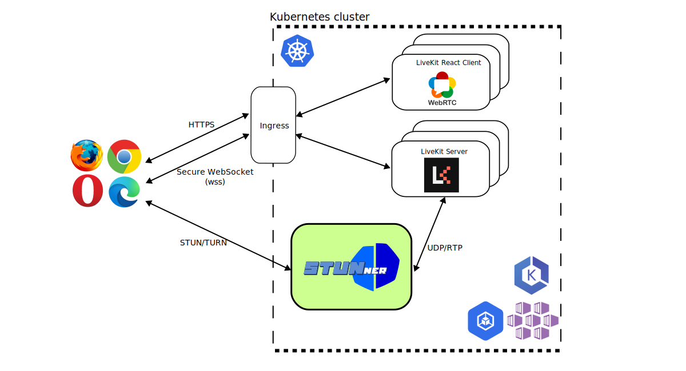

# STUNner demo: Video-conferencing with LiveKit

This document guides you through the installation of [LiveKit](https://livekit.io/) into Kubernetes, when it is used together with the STUNner WebRTC media gateway.

In this demo you will learn to:

- integrate a typical WebRTC application with STUNner,
- obtain a valid TLS certificate to secure the signaling plane,
- deploy the LiveKit server into Kubernetes, and
- configure STUNner to expose LiveKit to clients.

## Prerequisites

To run this example, you need:
* a [Kubernetes cluster](../../INSTALL.md#prerequisites),
* a [deployed STUNner](../../INSTALL.md#installation-1) (presumably the latest stable version),
* an [Ingress controller](../TLS.md#ingress) to ingest traffic into the cluster,
* a [Cert-manager](../TLS.md#cert-manager) to secure traffic.

> [!NOTE]
>
> If you have your own TLS certificate, put it in a `Secret` [resource](https://kubernetes.io/docs/concepts/configuration/secret/) and deploy it into the `default` namespace under the `livekit-secret-tls` name.


## Setup

The recommended way to install LiveKit into Kubernetes is deploying the media servers into the host-network namespace of the Kubernetes nodes (`hostNetwork: true`). This deployment model, however, comes with a set of uncanny [operational limitations and security concerns](../../WHY.md). Using STUNner, however, media servers can be deployed into ordinary Kubernetes pods and run over a private IP network, like any "normal" Kubernetes workload.

The figure below shows LiveKit deployed into regular Kubernetes pods behind STUNner without the host-networking hack. Here, LiveKit is deployed behind STUNner in the [*media-plane deployment model*](../../DEPLOYMENT.md), so that STUNner acts as a "local" STUN/TURN server for LiveKit, saving the overhead of using public a 3rd party STUN/TURN server for NAT traversal.



In this tutorial we deploy a video room example using [LiveKit's React SDK](https://github.com/livekit/livekit-react/tree/master/example), the [LiveKit server](https://github.com/livekit/livekit) for media exchange, a Kubernetes Ingress gateway to secure signaling connections and handle TLS, and STUNner as a media gateway to expose the LiveKit server pool to clients.


### STUNner

Now comes the fun part. The simplest way to run this demo is to clone the [STUNner git repository](https://github.com/l7mp/stunner) and deploy (after some minor modifications) the [manifest](livekit-server.yaml) packaged with STUNner.

Configure STUNner to act as a STUN/TURN server to clients, and route all received media to the LiveKit server pods.

```console
git clone https://github.com/l7mp/stunner
cd stunner
kubectl apply -f docs/examples/livekit/livekit-call-stunner.yaml
```

The relevant parts here are the STUNner [Gateway definition](../../GATEWAY.md), which exposes the STUNner STUN/TURN server over UDP:3478 to the Internet, and the [UDPRoute definition](../../GATEWAY.md), which takes care of routing media to the pods running the LiveKit service.

```yaml
apiVersion: gateway.networking.k8s.io/v1
kind: Gateway
metadata:
  name: udp-gateway
  namespace: stunner
spec:
  gatewayClassName: stunner-gatewayclass
  listeners:
    - name: udp-listener
      port: 3478
      protocol: UDP
---
apiVersion: stunner.l7mp.io/v1
kind: UDPRoute
metadata:
  name: livekit-media-plane
  namespace: stunner
spec:
  parentRefs:
    - name: udp-gateway
  rules:
    - backendRefs:
        - name: livekit-server
```

Once the Gateway resource is installed into Kubernetes, STUNner will create a Kubernetes LoadBalancer for the Gateway to expose the TURN server on UDP:3478 to clients. It can take up to a minute for Kubernetes to allocate a public external IP for the service.

Wait until Kubernetes assigns an external IP and store the external IP assigned by Kubernetes to
STUNner in an environment variable for later use.

```console
until [ -n "$(kubectl get svc udp-gateway -n stunner -o jsonpath='{.status.loadBalancer.ingress[0].ip}')" ]; do sleep 1; done
export STUNNERIP=$(kubectl get service udp-gateway -n stunner -o jsonpath='{.status.loadBalancer.ingress[0].ip}')
```

### LiveKit

The crucial step of integrating *any* WebRTC media server with STUNner is to ensure that the server instructs the clients to use STUNner as the STUN/TURN server. In order to achieve this, first we path the public IP address of the STUNner STUN/TURN server we have learned above into our LiveKit deployment manifest:

```console
sed -i "s/stunner_ip/$STUNNERIP/g" docs/examples/livekit/livekit-server.yaml
```

Assuming that Kubernetes assigns the IP address 1.2.3.4 to STUNner (i.e., `STUNNERIP=1.2.3.4`), the relevant part of the LiveKit config would be something like the below:

```yaml
...
rtc:
  ...
  turn_servers:
  - host: 1.2.3.4
    username: user-1
    credential: pass-1
    protocol: udp
    port: 3478
```

This will make sure that LiveKit is started with STUNner as the STUN/TURN server. If unsure about the STUNner settings to use, you can always use the handy [`stunnerctl` CLI tool](/cmd/stunnerctl/README.md) to dump the running STUNner configuration.

``` console
stunnerctl -n stunner config udp-gateway
Gateway: stunner/udp-gateway (loglevel: "all:INFO")
Authentication type: static, username/password: user-1/pass-1
Listeners:
  - Name: stunner/udp-gateway/udp-listener
    Protocol: TURN-UDP
    Public address:port: 34.118.88.91:3478
    Routes: [stunner/iperf-server]
    Endpoints: [10.76.1.4, 10.80.4.47]
```

Note that LiveKit itself will not use STUNner (that would amount to a less efficient [symmetric ICE mode](../../DEPLOYMENT.md)); with the above configuration we are just telling LiveKit to instruct its clients to use STUNner to reach the LiveKit media servers.

We also need the Ingress external IP address we have stored previously: this will make sure that the TLS certificate created by cert-manager will be bound to the proper `nip.io` domain and IP address.

```console
sed -i "s/ingressserviceip/$INGRESSIP/g" docs/examples/livekit/livekit-server.yaml
```

Finally, fire up LiveKit.

```console
kubectl apply -f docs/examples/livekit/livekit-server.yaml
```

The demo installation bundle includes a lot of resources to deploy LiveKit:

- a LiveKit-server,
- a web server serving the landing page using [LiveKit react example](https://github.com/livekit/livekit-react)
- a cluster issuer for the TLS certificates,
- an Ingress resource to terminate the secure connections between your browser and the Kubernetes cluster.

Wait until all pods become operational and jump right into testing!

## Test

After installing everything, execute the following command to retrieve the URL of your fresh LiveKit demo app:

```console
echo client-$INGRESSIP.nip.io
```

Copy the URL into your browser, and now you should be greeted with the LiveKit Video title. On the landing page you must set the LiveKit URL, which is the LiveKit server's IP address, or in our case the other subdomain we set earlier in the Ingress manifest.

Executing the following command shall get you the required URL:

```console
echo wss://mediaserver-$INGRESSIP.nip.io:443
```

To obtain a valid token, install the [livekit-cli](https://github.com/livekit/livekit-cli#installation) and issue the below command.

```console
livekit-cli create-token \
    --api-key access_token --api-secret secretsecretsecretsecretsecretsecret \
    --join --room room --identity user1 \
    --valid-for 24h
```

Copy the access token into the token field and hit the Connect button. If everything is set up correctly, you should be able to connect to a room. If you repeat the procedure in a separate browser tab you can enjoy a nice video-conferencing session with yourself, with the twist that all media between the browser tabs is flowing through STUNner and the LiveKit-server deployed in you Kubernetes cluster.

# Help

STUNner development is coordinated in Discord, feel free to [join](https://discord.gg/DyPgEsbwzc).