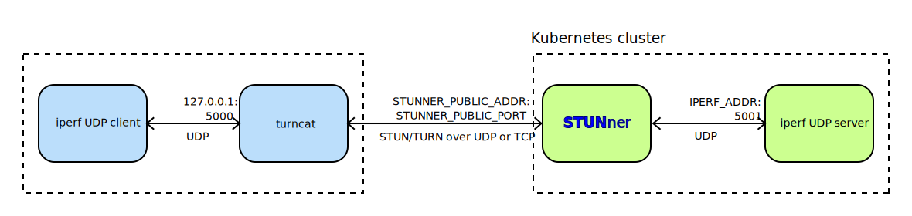

# STUNner Tutorial

# Open a tunnel via STUNner

This tutorial shows how to tunnel an external connection via STUNner to a UDP service deployed into Kubernetes. The tutorial can also be used to quickly check a STUNner installation.

In this tutorial you will learn how to:
* configure a UDP service in Kubernetes,
* configure STUNner to expose the service to clients,
* use [`turncat`](../../cmd/turncat.md) to connect to the UDP service via STUNner,
* benchmark your cloud-setup with [`iperfv2`](https://iperf.fr).

## Installation

### Prerequisites

The tutorial assumes a fresh STUNner installation; see the [STUNner installation and configuration guide](../../INSTALL.md). Create a namespace called `stunner` if there is none. You must have [`iperfv2`](https://iperf.fr) installed locally to run this tutorial.

### Setup

In this tutorial we perform a quick Kubernetes/STUNner benchmark: we fire up an iperf server inside the cluster and perform a speed test from the local console. We will use the [`turncat`](../../cmd/turncat.md) client utility to tunnel test traffic to the iperf server via STUNner acting as a STUN/TURN gateway.



You can easily implement a makeshift VPN with STUNner using a similar setup.

### Server configuration

Set up an iperf server in the `default` Kubernetes namespace and wrap it in a Kubernetes
service called `iperf-server`.
```console
cd stunner
kubectl apply -f docs/examples/simple-tunnel/iperf-server.yaml
```

This will start an Deployment that runs the iperf server and wraps it in a Kubernetes service called `iperf-server` of type ClusterIP. Check this service and make sure that it is not exposed to the outside world (i.e., `EXTERNAL-IP` is set to `<none>` by Kubernetes); this makes sure that the only way to reach this service from the local iperf speed-test client is through STUNner.

```console
kubectl get service iperf-server  -o wide
NAME           TYPE        CLUSTER-IP    EXTERNAL-IP   PORT(S)             AGE   SELECTOR
iperf-server   ClusterIP   10.120.5.36   <none>        5001/UDP,5001/TCP   19s   app=iperf-server
```

### STUNner configuration

Expose the service via the STUNner. The pre-compiled manifest below will create the required GatewayClass and GateayConfig resources, fire up a Gateway listener at UDP:3478 and another one on TCP:3478, and route client connections received on the gateways to the `iperf-server` service.

```console
kubectl apply -f docs/examples/simple-tunnel/iperf-stunner.yaml
```

For convenience, below is a dump of the Gateway and UDPRoute resources the manifests create. Note that the UDPRoute specifies the `iperf-server` service as the `backendRef`, which makes sure that STUNner will forward the client connections received in any of the Gateways to the iperf server.

```yaml
apiVersion: gateway.networking.k8s.io/v1
kind: Gateway
metadata:
  name: udp-gateway
  namespace: stunner
spec:
  gatewayClassName: stunner-gatewayclass
  listeners:
    - name: udp-listener
      port: 3478
      protocol: TURN-UDP

---
apiVersion: gateway.networking.k8s.io/v1
kind: Gateway
metadata:
  name: tcp-gateway
  namespace: stunner
spec:
  gatewayClassName: stunner-gatewayclass
  listeners:
    - name: tcp-listener
      port: 3478
      protocol: TURN-TCP

---
apiVersion: stunner.l7mp.io/v1
kind: UDPRoute
metadata:
  name: iperf-server
  namespace: stunner
spec:
  parentRefs:
    - name: udp-gateway
    - name: tcp-gateway
  rules:
    - backendRefs:
        - name: iperf-server
          namespace: default
```

### Check your configuration

Check whether you have all the necessary STUNner resources installed namespace.

```console 
kubectl get gatewayconfigs,gateways,udproutes.stunner.l7mp.io -n stunner 
NAME                                                  REALM             DATAPLANE   AGE
gatewayconfig.stunner.l7mp.io/stunner-gatewayconfig   stunner.l7mp.io   default     139m

NAME                                            CLASS                  ADDRESS         PROGRAMMED   AGE
gateway.gateway.networking.k8s.io/tcp-gateway   stunner-gatewayclass   35.187.97.94    True         139m
gateway.gateway.networking.k8s.io/udp-gateway   stunner-gatewayclass   35.205.10.190   True         139m

NAME                                    AGE
udproute.stunner.l7mp.io/iperf-server   139m
```

You can also use the handy [`stunnerctl` CLI tool](/cmd/stunnerctl/README.md) to dump the running STUNner configuration for the UDP gateway. Make sure to issue `make build` first to build `stunnerctl`, along with a set of other handy STUNner utilities, in the `bin/` directory. 

``` console
bin/stunnerctl -n stunner config udp-gateway
Gateway: stunner/udp-gateway (loglevel: "all:INFO")
Authentication type: static, username/password: user-1/pass-1
Listeners:
  - Name: stunner/udp-gateway/udp-listener
    Protocol: TURN-UDP
    Public address:port: 34.118.88.91:3478
    Routes: [stunner/iperf-server]
    Endpoints: [10.76.1.4, 10.80.4.47]
```

Likewise, the below will dump the config for the TCP gateway.

``` console
bin/stunnerctl -n stunner config tcp-gateway
Gateway: stunner/tcp-gateway (loglevel: "all:INFO")
Authentication type: static, username/password: user-1/pass-1
Listeners:
  - Name: stunner/tcp-gateway/tcp-listener
    Protocol: TURN-TCP
    Public address:port: 34.116.180.89:3478
    Routes: [stunner/iperf-server]
    Endpoints: [10.76.1.4, 10.80.4.47]
```

NOTE: It usually takes 30-60 seconds for Kubernetes to assign an external IP address to STUNner gateways. As long as the external address is in `<PENDING>` status, STUNner exposes the Gateway on a NodePort.  Once Kubernetes finishes the exposition of the Gateway service, STUNner will pick up the new address/port and update the config accordingly.

If in doubt, you can always query Kubernetes for the service statuses.

``` console
kubectl get -n stunner services
NAME          TYPE           CLUSTER-IP    EXTERNAL-IP     PORT(S)          AGE
stunner       ClusterIP      10.0.9.70     <none>          3478/UDP         15m
tcp-gateway   LoadBalancer   10.0.3.91     35.187.97.94    3478:31781/TCP   143m
udp-gateway   LoadBalancer   10.0.14.218   35.205.10.190   3478:31048/UDP   143m
```

### Run the benchmark

We will need to learn the ClusterIP assigned by Kubernetes to the `iperf-server` service: this will be the peer address to which `turncat` will ask STUNner to relay the iperf test traffic.

``` console
export IPERF_ADDR=$(kubectl get svc iperf-server -o jsonpath="{.spec.clusterIP}")
```

Next, set up `turncat` to listen on `UDP:127.0.0.1:5000` and tunnel connections from this listener via the STUNner STUN/TURN listener `udp-listener` to the iperf server. Luckily, `turncat` is clever enough to [parse the running STUNner configuration](../../cmd/turncat) from Kubernetes and set the STUN/TURN server public address/port and the authentication credentials accordingly.

``` console
bin/turncat --log=all:INFO udp://127.0.0.1:5000 k8s://stunner/udp-gateway:udp-listener \
     udp://$IPERF_ADDR:5001
```

The most important part here is the TURN meta-URI: `k8s://stunner/udp-gateway:udp-listener` instructs `turncat` to look for the Gateway called `udp-gateway` in the `stunner` namespace and create a connection to the TURN listener called `udp-listener` of the Gateway.

Fire up an iperf client from another terminal that will connect to STUNner via `turncat` and start the benchmark.

```console
iperf -c localhost -p 5000 -u -i 1 -l 100 -b 800000 -t 10
```

If successful, the iperf server logs should contain the benchmark results.

```console
kubectl logs $(kubectl get pods -l app=iperf-server -o jsonpath='{.items[0].metadata.name}')
------------------------------------------------------------
Server listening on UDP port 5001 with pid 1
Read buffer size: 1.44 KByte (Dist bin width= 183 Byte)
UDP buffer size:  208 KByte (default)
------------------------------------------------------------
[  1] local 10.116.2.30%eth0 port 5001 connected with 10.116.1.21 port 56439 (peer 2.1.7)
[ ID] Interval            Transfer     Bandwidth        Jitter   Lost/Total   Latency avg/min/max/stdev PPS  inP NetPwr
...
[  1] 0.0000-9.9204 sec   977 KBytes   807 Kbits/sec    1.426 ms 0/10003 (0%) 14.256/10.791/97.428/ 4.993 ms 1008 pps 1.40 KByte 7.07
```

The results show that we have managed to send 1000 packets/sec through STUNner to the iperf server without packet loss, at an average one-way latency of 14.2 ms and 1.426 ms jitter. Not bad from a Kubernetes cluster running in some remote datacenter!

Repeating the test, this time with a STUN/TURN over TCP, casts a somewhat different picture. Notice the new meta-URI: `k8s://stunner/tcp-gateway:tcp-listener` to select the TURN server exposed on TCP for`turncat`.

``` console
bin/turncat --log=all:INFO udp://127.0.0.1:5000 k8s://stunner/tcp-gateway:tcp-listener \
     udp://$IPERF_ADDR:5001
```

Run the benchmark again at 10kpps and watch the logs.

``` console
iperf -c localhost -p 5000 -u -l 100 -b 8000000 -o /dev/null -t 10 && \
    kubectl logs $(kubectl get pods -l app=iperf-server -o jsonpath='{.items[0].metadata.name}') | tail -n 1
[  3] 0.0000-9.9365 sec  9.41 MBytes  7.94 Mbits/sec   0.085 ms 1361/100003 (1.4%) 148.261/21.098/454.266/73.704 ms 9927 pps  144 KByte 6.70
```

It seems that average latency has jumped to 148 ms, with a max latency of close to 460 ms! That's why you should [avoid TCP at all cost](https://bloggeek.me/why-you-should-prefer-udp-over-tcp-for-your-webrtc-sessions) in real-time communications.

### Cleaning up

Stop `turncat` and wipe all Kubernetes configuration.

```console
kubectl delete -f docs/examples/simple-tunnel/iperf-server.yaml
kubectl delete -f docs/examples/simple-tunnel/iperf-stunner.yaml
```
