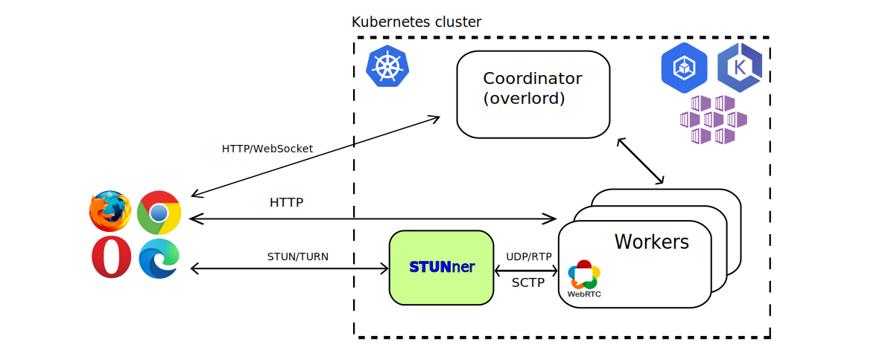

# STUNner & CloudRetro: Cloudgaming and their nasty UDP streams in Kubernetes

In this demo, we will install [CloudRetro](https://github.com/giongto35/cloud-game) on an existing Kubernetes cluster, and use STUNner to establish and redirect the UDP connection to its proper endpoint.

CloudRetro is a simplified cloud-gaming service using WebRTC for multimedia, thus with the need of UDP-forwarding, which can be a pain under RTP.
With STUNner, this issue can be solved.



The upcoming steps are the following:
* Install CloudRetro demo on your cluster
* Install and configure STUNner with Gateway Operator
* Configure CloudRetro to use STUNner

## Installation

### Prerequisities

* A functional Kubernetes cluster (autopilot works as well)
* kubectl
* Docker
* git
* helm

### Additional preparations

This demo provides some helpful scripts for the setup, so this repository should be cloned;

```console
git clone https://github.com/l7mp/stunner
cd stunner/examples/CloudRetro
```

### Quick-installing CLoudRetro

The included script sets up a demo CloudRetro service, with it's enviroment.
For a more-detailed setup and architecture-overview, please visit the [CloudRetro](https://github.com/giongto35/cloud-game) repository.
For this demo, we are going to use a forked-image, you can find it [here](https://github.com/l7mp/cloudretro-demo-build).

```console
kubectl apply -f cloudretro-setup.yaml
```

After it's complete, configuring and restarting the Worker deployment is needed, for that purpose a script is included:

```console
chmod +x apply-config-w.sh
./apply-config-w.sh
```

This will configure our Workers to successfully find their Coordinator.

In the CloudRetro demo, we will be having multiple HTTPS web services, one linked to port 8000, and the other is to port 9000.
From this, port 8000 is essential, while without port 9000 which is neccessary for CloudRetro to work as intended, the demo should still work.

If everything is successful, Kubernetes should assign an external address to the exposed service of the Coordinator, which clients will connect to.
Running to following command will result the assigned address in a decimal four-octet format:

```console
# Cat is present because some terminals don't breakline  ^._.^ 
cat | kubectl get service -n cloudretro coordinator-lb-svc -o jsonpath='{.status.loadBalancer.ingress[0].ip}'
```

In cases Kubernetes won't assign an external IP to your service, You will need to use NodePort service instead.

Clients connecting to this URL on a browser; `hhtp://<service-ip>:8000` (don't forget to swap <service-ip> with the one mentioned above) will be presented a console-looking website, with seemingly no active additional service. The CloudRetro is running and working, but the endpoints can not establish an ICE connection. You can take a look at it in the console as well, this is because ICE can not create acceptable candidates through Kubernetes NATs, and not even a STUN server would help. RTP is unfit to handle this issue.
That's why we need STUNner to make it work.


### Installing STUNner

To install STUNner with a Gateway Operator, a helm chart is used. STUNner comes with an Operatorless Mode as well, for that please refer to [STUNner installation](https://github.com/l7mp/stunner#getting-started).
For more details about Gateway Operator and it's use, please visit [here](https://github.com/l7mp/stunner-gateway-operator).

```console
helm repo add stunner https://l7mp.io/stunner
helm repo update

helm install stunner-gateway-operator stunner/stunner-gateway-operator

helm install stunner stunner/stunner
```

By default, it will install STUNner with a Gateway Operator, which consists additionally a GatewayClass what we are going to instantiate, and a default GatewayConfig for it.
This default config has the 'username' as 'user-1' and 'password' as 'pass-1'. Feel free to modify these values from the config.

Now we are going to apply an instance of a Gateway, which will serve as a... yes, you got it right, a gateway for our WebRTC streams.
The below Gateway specification will expose the STUNner gateway over the STUN/TURN listener service running on the UDP listener port 3478. STUnner will await clients to connect to this listener port and, once authenticated, let them connect to the services running inside the Kubernetes cluster; meanwhile, the NAT traversal functionality implemented by the STUN/TURN server embedded into STUNner will make sure that clients can connect from behind even the most over-zealous enterprise NAT or firewall.

```console
kubectl apply -f - <<EOF
apiVersion: gateway.networking.k8s.io/v1alpha2
kind: Gateway
metadata:
  name: udp-gateway
  namespace: stunner
spec:
  gatewayClassName: stunner-gatewayclass
  listeners:
    - name: udp-listener
      port: 3478
      protocol: UDP
EOF
```

With this, our Gateway Operator will create us a whole new LoadBalancer service for this Gateway, from which we can establish connection with STUNner. Although, this does not specify an endpoint for the UDP streams, so we are going to need an attached UDProute as well.

Attaching an UDP route to the Gateway, so that clients will be able to connect via the public STUN/TURN listener UDP:3478 to the Worker LoadBalancer service we`ve created earlier (optionally with the cloudretro-setup.yaml).
In our case, we named it worker-ci-udp-svc. Don`t forget to specify the namespace, even if its in the default one.
This is where we are connecting CloudRetro and STUNner.

```console
kubectl apply -f - <<EOF
apiVersion: gateway.networking.k8s.io/v1alpha2
kind: UDPRoute
metadata:
  name: worker-udp-route
  namespace: stunner
spec:
  parentRefs:
    - name: udp-gateway
  rules:
    - backendRefs:
        - name: worker-ci-udp-svc
          namespace: cloudretro
EOF
```

### Configure CloudRetro to use STUNner

Now that we've set up STUNner, it is ready for action. Although, for this to work, we have to configure CloudRetro to use it as well.
Running the following, minimalistic script will do it for You;

```console
chmod +x apply-config-c.sh
./apply-config-c.sh
```

It will configure the Coordinator to provide STUNner as a TURN server for the clients, with the proper credentials for authentication.

### Joy

And now everything is set as it should be, You are able to play SuperMario on Your CloudRetro installed in Kubernetes.
Thanks STUNner.


## Clean up

Delete the demo deployments and services created using the below command:

```console
kubectl delete -f cloudretro-setup.yaml
```

## Help

STUNner development is coordinated in Discord, send [us](/AUTHORS) an email to request invitation.

## License

Copyright 2021-2022 by its authors. Some rights reserved. See [AUTHORS](/AUTHORS).

MIT License - see [LICENSE](/LICENSE) for full text.

## Acknowledgments

Demo adopted from [CloudRetro](https://github.com/giongto35/cloud-game).

Please note that this demo is only for showcasing STUNner in this enviroment.
Many CloudRetro functions does not work; shared-save, shared-roms, areas, etc.


