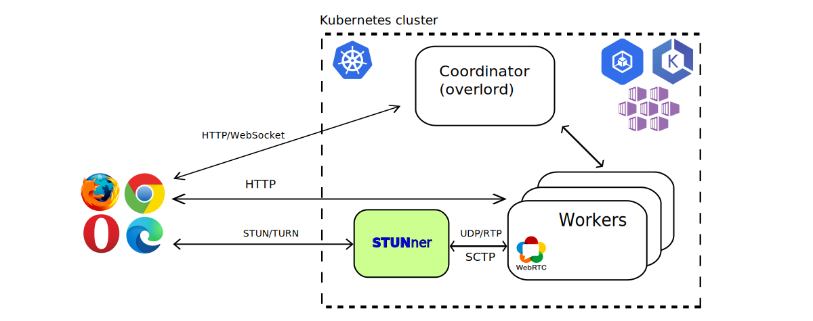

# STUNner demo: Cloud-gaming in Kubernetes with CloudRetro

In this demo, we will install [CloudRetro](https://github.com/giongto35/cloud-game) into a
Kubernetes cluster. CloudRetro is a simplified cloud-gaming service using WebRTC for rendering live
audio/video gaming content in the client browser. In this demo, we use STUNner to establish the UDP
media streams between clients and the CloudRetro media servers deployed into Kubernetes.



In this demo you will learn how to:
- integrate a typical WebRTC application with STUNner,
- install the CloudRetro demo into your Kubernetes cluster,
- configure STUNner to expose CloudRetro to clients.

## Prerequisites

The below installation instructions require an operational cluster running a supported version of
Kubernetes (>1.22). Most hosted or private Kubernetes cluster services will work, but make sure
that the cluster comes with a functional load-balancer integration (all major hosted Kubernetes
services should support this). Otherwise, STUNner will not be able to allocate a public IP address
for clients to reach your WebRTC infra.

You will need a basic familiarity [with the CloudRetro
architecture](https://webrtchacks.com/open-source-cloud-gaming-with-webrtc), especially the concept
of Coordinators and Workers will be important below. Note further that this demo showcases only the
barebones CloudRetro setup and so certain CloudRetro functions, like shared-save, shared-rooms,
areas, etc., may not work.

## Single-cluster setup

In the first part of the demo, we use a single Kubernetes cluster. In the next section we extend
this basic mode to a multi-cluster setup, which allows to deploy your game servers as close as
possible to the clients and minimize latency.

To simplify the setup, clone the STUNner git repository.

```console
git clone https://github.com/l7mp/stunner
cd stunner/examples/cloudretro
```

### CloudRetro

The included script sets up a demo CloudRetro service.  For a more-detailed setup and
architecture-overview, please visit the [CloudRetro](https://github.com/giongto35/cloud-game)
docs.  For this demo, we are going to use a forked-image, you can find it
[here](https://github.com/l7mp/cloudretro-demo-build).

```console
kubectl apply -f cloudretro-setup-coordinator.yaml
kubectl apply -f cloudretro-setup-workers.yaml
```

After complete, you need to restart the Worker deployment:

```console
./worker-config.sh
```

This will configure our Workers to successfully find their Coordinator.

In the CloudRetro demo we will be use multiple HTTPS web services, one linked to port 8000 and the
other is to port 9000. If everything is successful, Kubernetes should assign an external address to
the exposed service of the Coordinator, which clients will connect to.  Running to following
command will result the IP address assigned by the Kubernetes load-balancer:

```console
export EXTERNAL_IP=$(kubectl get service -n cloudretro coordinator-lb-svc -o jsonpath='{.status.loadBalancer.ingress[0].ip})'
```

If Kubernetes refuses to assign an external IP to your service after a couple of minutes, you will
need to use the NodePort service instead.

Clients connecting to this URL on a browser; `http://${EXTERNAL-IP}:8000` will be presented a with
a CloudRetro dashboard showing no active services: CloudRetro is running, but clients cannot
establish an ICE connection. This is because clients cannot find a workable ICE candidate pair due to
the CloudRetro servers running on a private pod IP address. That is where STUNner can help.

### STUNner

Use the official [Helm charts](../../docs/INSTALL.md#installation) to install STUNner.

```console
helm repo add stunner https://l7mp.io/stunner
helm repo update
helm install stunner-gateway-operator stunner/stunner-gateway-operator --create-namespace --namespace stunner-system
helm install stunner stunner/stunner --namespace stunner
```

Next, register STUNner with the Kubernetes Gateway API.

```console
kubectl apply -f stunner-gwcc.yaml
```

The default configuration uses the `plaintext` STUN/TURN authentication mode with the
username/password pair `user-1/pass-1`; make sure to [customize](../../docs/AUTH.md) these defaults.

Next, we expose the CloudRetro media services over STUNner.  The below Gateway specification will
expose the CloudRetro worker service over the STUNner STUN/TURN gateway running on the UDP
port 3478. STUNner will await clients to connect to this listener port and, once authenticated, let
them connect to the services running inside the Kubernetes cluster; meanwhile, the NAT traversal
functionality implemented by the STUN/TURN server embedded into STUNner will make sure that clients
can connect from behind even the most over-zealous enterprise NAT or firewall.

```console
kubectl apply -f - <<EOF
apiVersion: gateway.networking.k8s.io/v1alpha2
kind: Gateway
metadata:
  name: udp-gateway
  namespace: stunner
spec:
  gatewayClassName: stunner-gatewayclass
  listeners:
    - name: udp-listener
      port: 3478
      protocol: UDP
EOF
```

In order to make sure clients can connect to the CloudRetro workers, we need to attach a UDPRoute
to this Gateway.  In our case, the worker Kubernetes service is called `worker-ci-udp-svc` deployed
into the `cloudretro` namespace by the default installation scripts.

```console
kubectl apply -f - <<EOF
apiVersion: gateway.networking.k8s.io/v1alpha2
kind: UDPRoute
metadata:
  name: worker-udp-route
  namespace: stunner
spec:
  parentRefs:
    - name: udp-gateway
  rules:
    - backendRefs:
        - name: worker-ci-udp-svc
          namespace: cloudretro
EOF
```

### Configure CloudRetro to use STUNner

Finally, we need to configure CloudRetro to instruct clients to use STUNner as the STUN/TURN
service to connect to it.  This is done automatically by the below script, which will read the
running STUNner configuration from Kubernetes, set the `CLOUD_GAME_WEBRTC_ICESERVERS` parameter in
the CloudRetro config accordingly and restart CloudRetro to pick up the new configuration.

```console
./coordinator-config.sh
```

### Test

At this point, you should be able to play SuperMario on CloudRetro installed in Kubernetes.


## Multi-cluster setup

Next, we extend the basic single-cluster setup to a multi-cluster deployment. Here, CloudRetro is
installed into two Kubernetes clusters, preferably deployed in different geographic locations so
that clients can always connect to the cloud-gaming servers closest to their location. STUNner will
make sure that the mutli-cluster setup still works smoothly. We assume that the `primary` cluster
already has CloudRetro and STUNner installed and configured as above, and we are going to add a
`secondary` cluster with additional worker capability. We assume that `kubectl` is configured with
two
[contexts](https://kubernetes.io/docs/tasks/access-application-cluster/configure-access-multiple-clusters/)
called `primary` and `secondary`.

### CloudRetro

Deploy a CloudRetro worker service to the secondary cluster, but this time without the Coordinator
service since that is already running in the primary cluster.

```console
kubectl apply -f cloudretro-setup-workers.yaml --context secondary
```

In order for the workers in the secondary cluster to connect to the coordinator in the primary
cluster, we are going to need the Coordinator's address from the primary cluster. (Remember, this
time we don't have a coordinator locally.) This address is the same as the one your clients use to
connect to CloudRetro, that is, the external IP of your `coordinator-lb-svc` LoadBalancer service
on the primary cluster.  The script below will configure the workers in the secondary cluster to
connect to the remote cluster coordinator.

```console
./worker-config.sh primary secondary
```

### STUNner

The following script will repeat the same steps as above to install STUNner into the secondary
cluster.

```console
./stunner-setup-for-cloudretro.sh secondary
```

### Configure the Coordinator

We use the fact that CloudRetro supports multiple ICE-servers. The only step remained is therefore
to add the external address of the STUNner gateway deployed into the secondary cluster to the
Coordinator in the primary.

```console
./coordinator-config.sh primary secondary
```

### Test

At this CloudRetro should be officially a multicluster service: whenever you start a new game you
will automatically be connected to the closest Worker service. Note that you can also manually
choose workers by clicking the `w` button under `options`.

As a quick test, we have recorded a game session from a client started in the European region to a
*local* CloudRetro deployment running in the [European
one](https://github.com/l7mp/stunner/blob/main/examples/cloudretro/cloudretro_eu.mp4) and a
*remote* cluster in the [US-region
worker](https://github.com/l7mp/stunner/blob/main/examples/cloudretro/cloudretro_us.mp4). There is
a visible improvement in the gaming experience when using a local CloudRetro worker: for the local
cluster the latency between invoking an action and observing the corresponding action in the video
is only 20 frames (roughly 80ms), while for a remote cluster the round-trip time is more than 48
frames (about 200ms).

<!-- ### Problems for the future -->

<!-- Even with this setup, STUNner is working like an UDP Gateway for our services. In case of failure, all the control-info exchange must happen again, taking precious time, resulting in delay. If we want to provide our UDP service "seamlessly", basically a whole new connection must be built in case of worker-pod failure, with no "ture" load-balancing. -->

<!-- This reconnection takes plenty of time, for example, a [demo video](https://github.com/l7mp/stunner/blob/main/examples/cloudretro/cloudretro_reconnect_delay.mp4) included for this case. -->
<!-- Even so, in this example much of the delay is the client realizing that the connection is no more. -->

## Clean up

Delete the demo deployments and services created, and also the gateway and UDPRoute we have made
for STUNner using the below commands.

```console
kubectl delete -f cloudretro-setup-coordinator.yaml
kubectl delete -f cloudretro-setup-workers.yaml
kubectl delete -f cloudretro-stunner-cleanup.yaml
```

## Help

STUNner development is coordinated in Discord, feel free to [join](https://discord.gg/DyPgEsbwzc).

## License

Copyright 2021-2023 by its authors. Some rights reserved. See [AUTHORS](../../AUTHORS).

MIT License - see [LICENSE](../../LICENSE) for full text.

## Acknowledgments

Demo adopted from [CloudRetro](https://github.com/giongto35/cloud-game).
