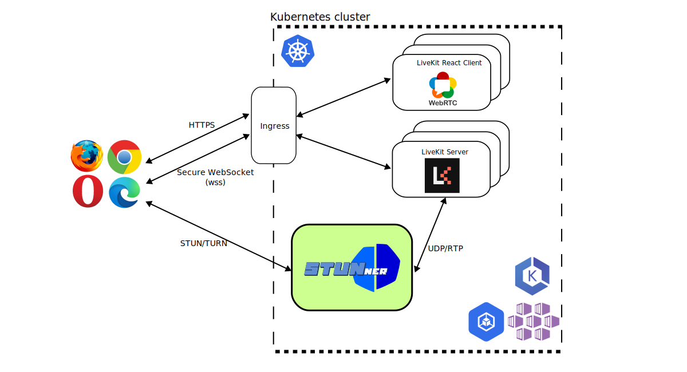

# Using Livekit with STUNner

This document guides you through the installation of [LiveKit](https://livekit.io/) into Kubernetes, when it is used together with the STUNner gateway to ingest WebRTC media into the cluster.

In this demo you will learn to:
- integrate a typical WebRTC application server with STUNner,
- deploy the LiveKit server into Kubernetes, and
- configure STUNner to expose LiveKit to clients.

## Prerequisites

The below installation instructions require an operational cluster running a supported version of Kubernetes (>1.22). You can use any supported platform, any hosted or private Kubernetes cluster, but make sure that the cluster comes with a functional load-balancer integration (all major hosted Kubernetes services should support this). Otherwise, STUNner will not be able to allocate a public IP address for clients to reach your WebRTC infra.

Unfortunately, Minikube is not supported for this demo. The reason is that [Let's Encrypt certificate is not available with nip.io](https://medium.com/@EmiiKhaos/there-is-no-possibility-that-you-can-get-lets-encrypt-certificate-with-nip-io-7483663e0c1b). Later on you will learn more about this certificate.

## Setup

The recommended way to intall LiveKit into Kubernetes is deploying the LiveKit servers into the host network namespace of the Kubernetes nodes  (`hostNetwork: true`). This deployment model, however, comes with a set of uncanny [operational limitations and securoty concerns](/doc/WHY.md). 

The figure below shows LiveKit deployed into regular Kubernetes pods, that is, without the host-networking hack. Here, setup LiveKit ide deployed behind STUNner in the [*media-plane deplpyment model*](/doc/DEPLOYMENT.md), so that STUNner acts as a 'local' STUN/TURN server for LiveKit, saving the overhead of using public a 3rd party STUN/TURN server for NAT traversal. 



In this tutorial we deploy a video room example using [LiveKit's React SDK](https://github.com/livekit/livekit-react/tree/master/example), [LiveKit server](https://github.com/livekit/livekit) for media exchange, a Kubernetes Ingress gateway to secure signaling connections, and STUNner as a media gateway to expose the LiveKit server pool to clients. 

## Installation

Let's start with a disclaimer. The LiveKit client example browser must work over a secure HTTPS connection, because [getUserMedia](https://developer.mozilla.org/en-US/docs/Web/API/MediaDevices/getUserMedia#browser_compatibility) is available only in secure contexts. This implies that the client-server signaling connection must be secure too. Unfottunately, self-signed TLS certs [will not work](https://docs.livekit.io/deploy/#domain,-ssl-certificates,-and-load-balancer), so we have to come up with a way to provide our clients with a valid TLS cert. This will have the infortunate consequence that the majority of the below installation will be about securing client connections to LiveKit; as it turns out, integrtating LiveKit with STUNner once HTTPS is correctly working is very simple.

### TLS certificates

As mentioned above, the LiveKit server will need a valid TLS cert, which means it must run behind an existing DNS domain name backed by a CA signed TLS certificate. This is simple if you have your own domain, but if you don't then [nip.io](nip.io) provides a dead simple wildcard DNS for any IP address. We will use this to "own a domain" and obtain a CA signed certificate for LiveKit. This will allow us to point the domain name `client-<ingress-IP>.nip.io` to an ingress HTTP gateway in our Kubernetes cluster, which will then use some automation (namely, cert-manager) to obtain a valid CA signed cert.

Note that public wildcard DNS domains might run into [rate limiting](https://letsencrypt.org/docs/rate-limits/) issues. If this occurs you can try [alternative services](https://moss.sh/free-wildcard-dns-services/) instead of `nip.io`.

### Ingress

The first step of obtaining a valid cert is to install a Kubernetes Ingress: this will be used during the validation of our cert. 

Install an ingress controller into your cluster. We used the official [nginx ingress](https://github.com/kubernetes/ingress-nginx), but this is not required. 

```console
helm repo add ingress-nginx https://kubernetes.github.io/ingress-nginx
helm repo update
helm install ingress-nginx ingress-nginx/ingress-nginx
```

Wait until Kubernetes assignes an exetnal IP to the Ingress.

```console
until [ -n "$(kubectl get service ingress-nginx-controller -n default -o jsonpath='{.status.loadBalancer.ingress[0].ip}')" ]; do sleep 1; done
```

Store the Ingress IP address Kubernetes assigned to our Ingress; this will be needed later when we configure the validation pipeline for our TLS certs.

```console
kubectl get service ingress-nginx-controller -n default -o jsonpath='{.status.loadBalancer.ingress[0].ip}'
INGRESSIP=$(kubectl get service ingress-nginx-controller -n default -o jsonpath='{.status.loadBalancer.ingress[0].ip}')
INGRESSIP=$(echo $INGRESSIP | sed 's/\./-/g')
```

### Cert manager

We use the official [cert-manager](https://cert-manager.io) to automate TLS certificate management. 

First, Install cert-manager's CRDs.

```console
kubectl apply -f https://github.com/cert-manager/cert-manager/releases/download/v1.8.0/cert-manager.crds.yaml
```

Create a cert-manager namespace.

```console
kubectl create namespace cert-manager
```

Add the Helm repository which contains the cert-manager Helm chart and install the charts

```console
helm repo add cert-manager https://charts.jetstack.io
helm repo update
helm install my-cert-manager cert-manager/cert-manager \
    --namespace cert-manager \
    --version v1.8.0
```

### STUNner

Now comes the fun part. The simplest way to run this demo is to clone the [STUNner git repository](https://github.com/l7mp/stunner) and deploy the [manifest](/examples/livekit-server.yaml) packaged with STUNner.

Install the STUNner gateway operator and STUNner via [Helm](https://github.com/l7mp/stunner-helm):

```console
helm repo add stunner https://l7mp.io/stunner
helm repo update
helm install stunner-gateway-operator stunner/stunner-gateway-operator --create-namespace --namespace=stunner
helm install stunner stunner/stunner --create-namespace --namespace=stunner
```

Here, we installed STUNner into the identically named namespace. You can choose your own namespace, but then don't forget to adjust the below instuctions that assume STUNner lives in the `stunner` namespace.

Configure STUNner to act as a STUN/TURN server to clients, and route all received media to the LiveKit server pods.

```console
git clone https://github.com/l7mp/stunner
cd stunner
kubectl apply -f /examples/livekit/livekit-call-stunner.yaml
```

The relavant parts here are the STUNner [Gateway definition](/doc/GATEWAY.md), which exposes the STUNner TURN server over UDP:3478, and the [UDPRoute definition](/doc/GATEWAY.md), which takes care of routing media to the LiveKit service. 

```yaml
apiVersion: gateway.networking.k8s.io/v1beta1
kind: Gateway
metadata:
  name: udp-gateway
  namespace: stunner
spec:
  gatewayClassName: stunner-gatewayclass
  listeners:
    - name: udp-listener
      port: 3478
      protocol: UDP
---
apiVersion: gateway.networking.k8s.io/v1alpha2
kind: UDPRoute
metadata:
  name: livekit-media-plane
  namespace: stunner
spec:
  parentRefs:
    - name: udp-gateway
  rules:
    - backendRefs:
        - name: livekit-server
```

Once the Gateway resouce is installed into Kubernetes, STUNner will create a Kubernetes LoadBalancer for the Gateway to expose the TURN server on UDP:3478 to clients. It can take up to a minute for Kubernetes to allocate a public external IP for the service. 

Wait until Kubernetes assignes an exetnal IP.

```console
until [ -n "$(kubectl get svc stunner-gateway-udp-gateway-svc -n stunner -o jsonpath='{.status.loadBalancer.ingress[0].ip}')" ]; do sleep 1; done
```

### LiveKit

Store the external IP assigned by Kubernetes to STUNner in an environment variable and write it into the LiveKit deployment manifest.

```console
STUNNERIP=$(kubectl get service stunner-gateway-udp-gateway-svc -n stunner -o jsonpath='{.status.loadBalancer.ingress[0].ip}')
sed -i "s/stunner_ip/$STUNNERIP/g" livekit-server.yaml
```

This will make sure that LiveKit is started with STUNner as the STUN/TURN server. Assuming that Kubernetes assignes the IP address 1.2.3.4 to STUNner (i.e., `STUNNERIP=1.2.3.4`), the relevant part of the LiveKit config would be something like the below:

```yaml
...
rtc:
  ...
  turn_servers:
  - host: 1.2.3.4
    username: user-1
    credential: pass-1
    protocol: udp
    port: 3478
```

We also need the Ingress external IP address we have stored previously for later use: this will make sure that the TLS certificate created by cert-manager will be bound to the proper `nip.io` domain and IP address.  

```console
sed -i "s/ingressserviceip/$INGRESSIP/g" livekit-server.yaml
```

Finally, fire up LiveKit. 

```console
kubectl apply -f livekit-server.yaml
```

The demo installation bundle includes a lot of resources to deploy LiveKit:
* a LiveKit-server,
* a web server serving the landing page using [LiveKit react example](https://github.com/livekit/livekit-react)
* a cluster issuer for the TLS certificates,
* an Ingress resource to terminate the secure connections between your browser and the Kubernetes cluster.

Wait until all pods become operational and jump right into testing!

## Test

After installing everything, execute the following command to retrieve the URL of your fresh LiveKit demo app:

```console
echo client-$INGRESSIP.nip.io
```

Copy the URL into your browser, and now you should be greeted with the 'LiveKit Video' title.

On the landing page you must set the LiveKit URL, which is the LiveKit server's address, or in our case the other subdomain we set earlier in the Ingress' manifest.

Executing the following command shall get you the required URL:

```console
echo wss://mediaserver-$INGRESSIP.nip.io:443
```

To obtain a valid token, you must install the [livekit-cli](https://github.com/livekit/livekit-cli#installation) and issue the below command.

```console
livekit-cli create-token \
    --api-key access_token --api-secret secret \
    --join --room room --identity user1 \
    --valid-for 24h
```

Copy the access token into the token field and hit the Connect button. If everything is set up correctly, you should be able to connect to a room. If you repeat the procedure in a seperate browser tab you can enjoy a nice video-conferencing session with yourself, with the twist that all media between the broswer tabs is flowing through STUNner and the LiveKit-server deployed in you Kubernetes cluster.

## Help

STUNner development is coordinated in Discord, feel free to [join](https://discord.gg/DyPgEsbwzc).

## License

Copyright 2021-2022 by its authors. Some rights reserved. See [AUTHORS](../../AUTHORS).

MIT License - see [LICENSE](../../LICENSE) for full text.
