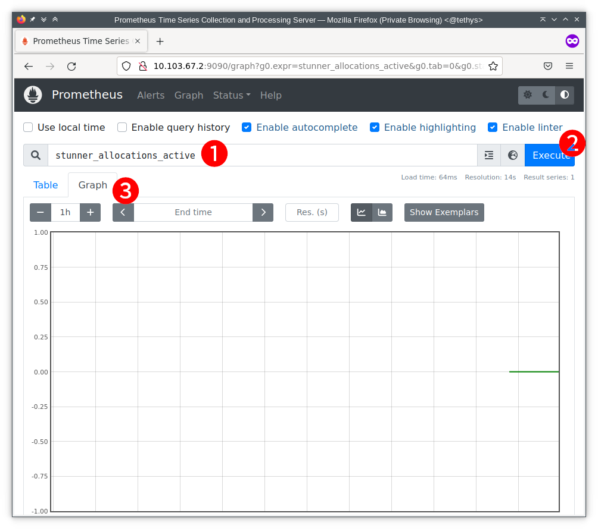
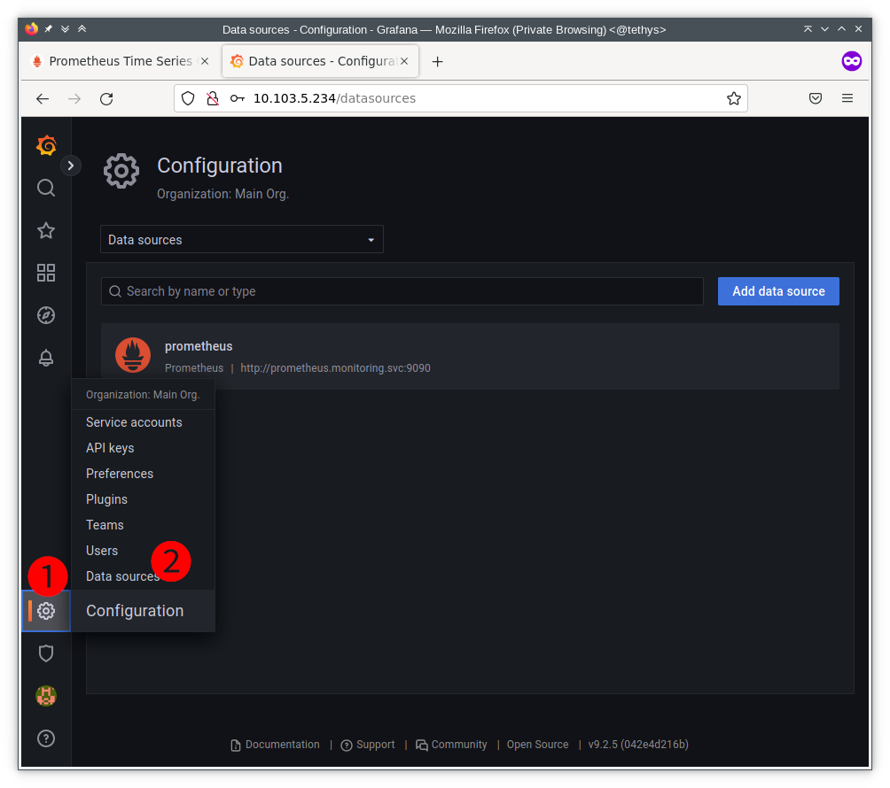
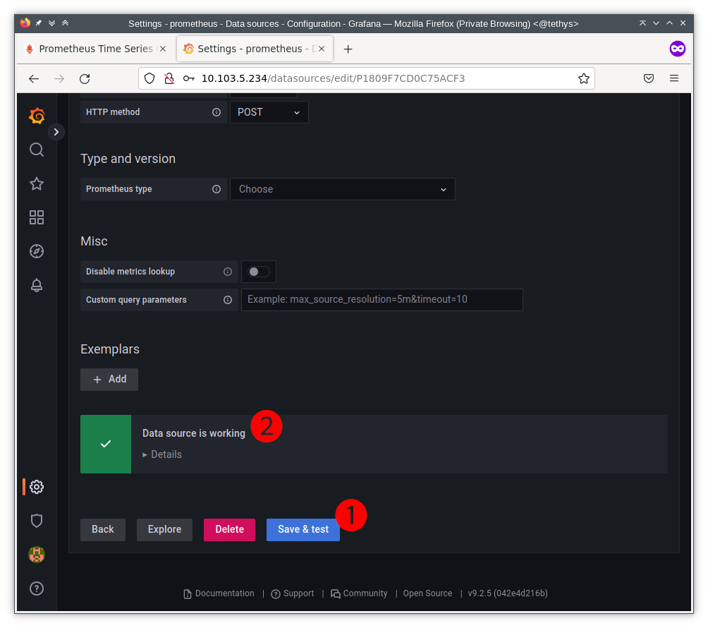
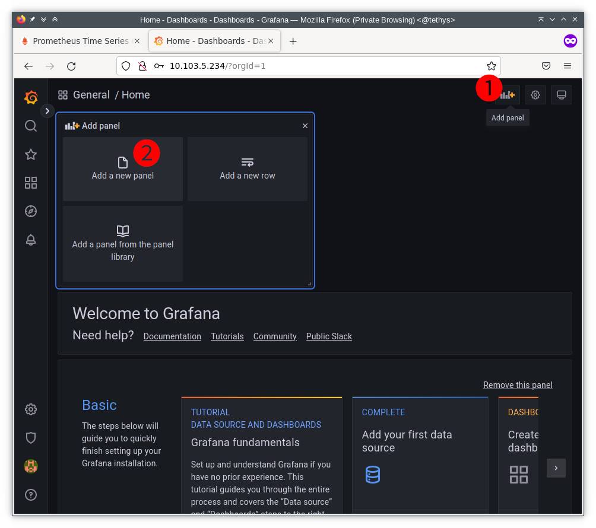
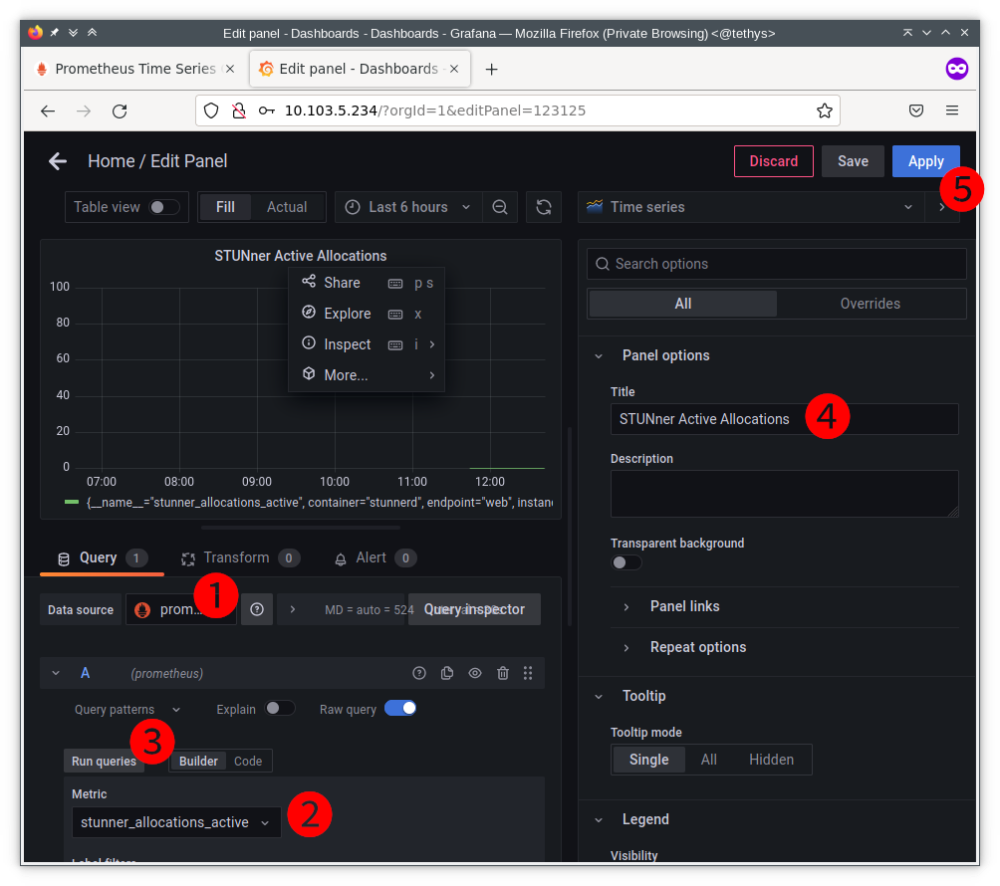
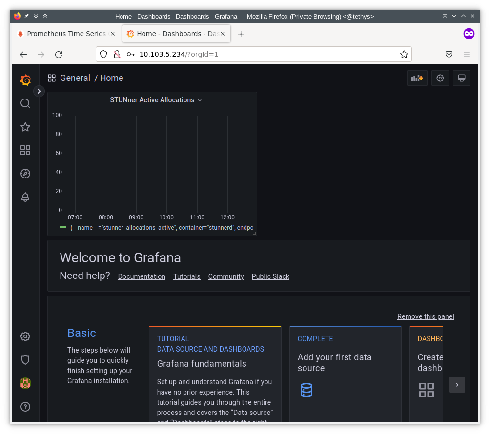

# Monitoring STUNner with Prometheus and Grafana

This tutorial demonstrates monitoring of a STUNner instance with [Prometheus](https://prometheus.io/) and [Grafana](https://grafana.com/).

In this demo you will learn how to:
* monitor STUNner with [Prometheus](https://prometheus.io/)
* how to visualize STUNner metrics using [Grafana](https://grafana.com/)

## Installation

### Prerequisites

* The tutorial assumes a fresh STUNner installation in a namespace called `stunner`; see the [STUNner installation and configuration guide](/doc/INSTALL.md).
* You need a web browser to run this tutorial.

### Enable STUNner metrics endpoint

1. Install STUNner:
```console
helm install stunner stunner/stunner --create-namespace --namespace=stunner --set stunner.deployment.monitoring.enabled=true
```
2. [Configure STUNner](https://github.com/l7mp/stunner#configuration)

3. Enable the STUNner metrics endpoint via the stunner-gateway-operator:
```console
kubectl -n stunner patch gatewayconfigs.stunner.l7mp.io stunner-gatewayconfig --patch '{"spec": {"metricsEndpoint": "http://0.0.0.0:8080/metrics" }}' --type=merge
```

In case of an existing STUNner deployment you can enable the monitoring port (be careful: this restarts running pods!):
```console
kubectl -n stunner patch deployment stunner --patch '{"spec":{"template":{"spec":{"containers":[{"name":"stunnerd","ports":[{"name": "web","containerPort": 8080 }]}]}}}}'
```

### Deploy Prometheus and Grafana

Our helm chart creates the namespace `monitoring` and installs Prometheus along with the prometheus-operator, and Grafana.

Deploy Prometheus with `helm`:
```console
helm install prometheus stunner/stunner-prometheus
```

## Usage

### Observe metrics on the Prometheus dashboard (optional)
By default Prometheus dashboard is not accessible outside of the cluster. No worries if that is the case -- you can still observe the metrics with Grafana.

In certain deployments (e.g., local minikube) you can open the Prometheus dashboard by navigating your browser to prometheus service IP and port `9090`.  For example, if the prometheus service cluster-IP is `10.103.67.2`, navigate to `http://10.103.67.2:9090`.

To get the service IP, use this command: `kubectl get svc -n monitoring prometheus -o custom-columns=:.spec.clusterIP --no-headers`; to have a clickable link: `echo -n "http://$(kubectl get svc -n monitoring prometheus -o custom-columns=:.spec.clusterIP --no-headers):9090"`

Next, we observe the `stunner_allocations_active` metrics:

1. Write `stunner_allocations_active` to the marked field (next to the looking glass icon)
2. Click on the `Execute` button
3. Switch to `Graph` view tab.



### Setup Grafana dashboard

We use Grafana to visualize STUNner metrics.

To get the Grafana service IP, use this command: `kubectl get svc -n monitoring grafana -o custom-columns=:.spec.clusterIP --no-headers`; to have a clickable link: `echo -n "http://$(kubectl get svc -n monitoring grafana -o custom-columns=:.spec.clusterIP --no-headers)"`

#### 1. Login

The default username is **admin**.

The password is **admin**.

At the first login you can change the password or leave as it is (use the Skip button).

#### 2. Check Prometheus data source (optional)

The helm chart configures Prometheus as a data source. You can double check the data source at any time.

To do this click on *Configuration* (1), then *Data sources* (2), as shown here:



This will open up the datasources page. Scroll down to the bottom, click button *Save & test* (1), and observe the datasource is working (2):



#### 3. Visualize a STUNner metric

Next, we plot a STUNner metric. For this purpose, we create a new panel presenting the active allocations metric.

Click on *Add panel* (1), then *Add a new panel* (2):



This will open a panel configuration window.

1. Set the datasource: prometheus
2. Choose a metric. In this example we use `stunner_allocations_active`.
3. Click on *Run queries* (this will update the fig)
4. Fine-tune plot parameters. In this example, we set the title.
5. Click *Apply*



Finally, take a look at the Grafana dashboard with the new panel showing `stunner_allocations_active`:



This ends the Prometheus/Grafana example.

### Generate allocations (optional)

To observe metric changes, generate STUNner connections and thus modify the `stunner_allocations_active` metric. For this purpose, we recommend [our examples](https://github.com/l7mp/stunner/tree/main/examples).

## Troubleshooting

| Problem | Solution |
| :--- | :--- |
|Cannot access prometheus and grafana services in minikube | Run `minikube tunnel` |
|Pod monitor not showing up in Prometheus | Patch stunner deployment to open monitoring port + enable stunner monitoring |

## Clean up

Uninstall prometheus with `helm`:
```console
helm uninstall prometheus
```

## Help

STUNner development is coordinated in Discord, feel free to [join](https://discord.gg/DyPgEsbwzc).

## License

Copyright 2021-2022 by its authors. Some rights reserved. See [AUTHORS](../../AUTHORS).

MIT License - see [LICENSE](../../LICENSE) for full text.

## Acknowledgments

Prometheus helm chart is based on the [l7mp-prometheus chart](https://github.com/l7mp/l7mp/tree/master/helm-charts/l7mp-prometheus).
